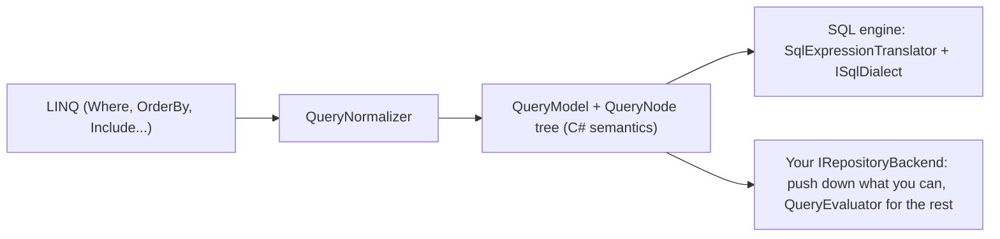

<div align="center">
  
</div>

# Durable

A lightweight .NET ORM with full LINQ support. Typed queries, CRUD, relationships, transactions, optimistic concurrency and lightweight migrations, without a DbContext or change tracking, and with SQL you can always see. One API runs on SQLite, PostgreSQL, MySQL, SQL Server, an in-memory store, LiteDB and LiteGraph.

[](https://github.com/jchristn/Durable/actions/workflows/ci.yml)

| Package | NuGet | Downloads |
|---|---|---|
| Durable | [](https://www.nuget.org/packages/Durable/) | [](https://www.nuget.org/packages/Durable/) |
| Durable.Sql | [](https://www.nuget.org/packages/Durable.Sql/) | [](https://www.nuget.org/packages/Durable.Sql/) |
| Durable.Sqlite | [](https://www.nuget.org/packages/Durable.Sqlite/) | [](https://www.nuget.org/packages/Durable.Sqlite/) |
| Durable.Postgres | [](https://www.nuget.org/packages/Durable.Postgres/) | [](https://www.nuget.org/packages/Durable.Postgres/) |
| Durable.MySql | [](https://www.nuget.org/packages/Durable.MySql/) | [](https://www.nuget.org/packages/Durable.MySql/) |
| Durable.SqlServer | [](https://www.nuget.org/packages/Durable.SqlServer/) | [](https://www.nuget.org/packages/Durable.SqlServer/) |
| Durable.InMemory | [](https://www.nuget.org/packages/Durable.InMemory/) | [](https://www.nuget.org/packages/Durable.InMemory/) |
| Durable.LiteDb | [](https://www.nuget.org/packages/Durable.LiteDb/) | [](https://www.nuget.org/packages/Durable.LiteDb/) |
| Durable.LiteGraph | [](https://www.nuget.org/packages/Durable.LiteGraph/) | [](https://www.nuget.org/packages/Durable.LiteGraph/) |
| Durable.Conformance | [](https://www.nuget.org/packages/Durable.Conformance/) | [](https://www.nuget.org/packages/Durable.Conformance/) |
| Durable.Tool | [](https://www.nuget.org/packages/Durable.Tool/) | [](https://www.nuget.org/packages/Durable.Tool/) |

> **Durable is in alpha.** The API may change between minor versions; every breaking change is listed in the [CHANGELOG](CHANGELOG.md). Feedback, issues and constructive criticism are welcome in [Issues](https://github.com/jchristn/durable/issues) and [Discussions](https://github.com/jchristn/durable/discussions).

## Table of Contents

- [Quick Start](#quick-start)
- [Why Durable?](#why-durable)
- [Packages](#packages)
- [Requirements](#requirements)
- [Installation](#installation)
- [Backends Compared](#backends-compared)
- **Using Durable**
  - [Connecting to a SQL Database](#connecting-to-a-sql-database)
  - [Defining Entities](#defining-entities)
  - [CRUD Operations](#crud-operations)
  - [Querying](#querying)
  - [String Matching](#string-matching)
  - [Relationships and Include](#relationships-and-include)
  - [Query Filters and Soft Delete](#query-filters-and-soft-delete)
  - [Transactions](#transactions)
  - [Optimistic Concurrency](#optimistic-concurrency)
  - [Raw SQL, Procedures and Multiple Result Sets](#raw-sql-procedures-and-multiple-result-sets)
  - [Creating Tables](#creating-tables)
  - [Migrations](#migrations)
  - [Command-Line Tool](#command-line-tool)
  - [Diagnostics](#diagnostics)
  - [Connections](#connections)
- **Guidance**
  - [Async, Streaming and Cancellation](#async-streaming-and-cancellation)
  - [Error Handling](#error-handling)
  - [Thread Safety](#thread-safety)
  - [Dependency Injection](#dependency-injection)
  - [Unit Testing with the In-Memory Backend](#unit-testing-with-the-in-memory-backend)
- **Non-SQL Backends**
  - [Non-SQL Backend Conventions](#non-sql-backend-conventions)
  - [In-Memory Backend](#in-memory-backend)
  - [LiteDB Backend](#litedb-backend)
  - [LiteGraph Backend](#litegraph-backend)
  - [Writing a Custom Backend](#writing-a-custom-backend)
- **Reference**
  - [API Overview](#api-overview)
  - [Supported LINQ](#supported-linq)
  - [Type Mapping](#type-mapping)
  - [Performance](#performance)
  - [Native AOT](#native-aot)
  - [Troubleshooting and FAQ](#troubleshooting-and-faq)
  - [Versioning and Stability](#versioning-and-stability)
- **Project**
  - [Continuous Integration and Tests](#continuous-integration-and-tests)
  - [Contributing](#contributing)
  - [License](#license)
  - [Contributors](#contributors)

## Quick Start

```bash
dotnet new console -n Hello && cd Hello
dotnet add package Durable.Sqlite
```

Replace `Program.cs` with:

```csharp
using Durable;
using Durable.Sqlite;

using SqliteRepository<Person> people = new SqliteRepository<Person>("Data Source=hello.db");
await people.InitializeTableAsync(typeof(Person));   // CREATE TABLE IF NOT EXISTS

await people.CreateManyAsync(new[]
{
    new Person { FirstName = "Ada",   LastName = "Lovelace", Born = new DateTime(1815, 12, 10) },
    new Person { FirstName = "Grace", LastName = "Hopper",   Born = new DateTime(1906, 12, 9) },
    new Person { FirstName = "Alan",  LastName = "Turing",   Born = new DateTime(1912, 6, 23) }
});

await foreach (Person p in people.Query().Where(p => p.Born.Year > 1900).OrderBy(p => p.Born).ExecuteAsyncEnumerable())
    Console.WriteLine($"{p.FirstName} {p.LastName} ({p.Born:yyyy})");

Person ada = (await people.ReadFirstAsync(p => p.FirstName == "Ada"))!;
ada.Email = "ada@example.com";
await people.UpdateAsync(ada);

Console.WriteLine($"{await people.CountAsync(p => p.Email != null)} with email, {await people.CountAsync()} total");
Console.WriteLine($"Deleted {await people.DeleteAllAsync()}");

[Entity("people")]
public class Person
{
    [Property("id", Flags.PrimaryKey | Flags.AutoIncrement)]
    public int Id { get; set; }

    [Property("first_name", Flags.String, 64)]
    public string FirstName { get; set; } = "";

    [Property("last_name", Flags.String, 64)]
    public string LastName { get; set; } = "";

    [Property("email", Flags.String, 128)]
    public string? Email { get; set; }

    [Property("born")]
    public DateTime Born { get; set; }
}
```

`dotnet run` prints:

```text
Grace Hopper (1906)
Alan Turing (1912)
1 with email, 3 total
Deleted 3
```

The same code runs on PostgreSQL, MySQL or SQL Server by swapping `SqliteRepository<Person>` for `PostgresRepository<Person>`, `MySqlRepository<Person>` or `SqlServerRepository<Person>`, and on the non-SQL backends through `IRepository<Person>`. Larger examples are in `src/Sample.BlogApp.Sqlite`, `.Postgres`, `.MySql` and `.SqlServer`.

## Why Durable?

Durable sits between Dapper and Entity Framework.

- **No configuration overhead**: no DbContext or model builder; attributes when you want control, conventions when you don't.
- **Predictable, parameterized SQL**: every value is a parameter; `BuildSql()`, SQL capture, logging and tracing show exactly what runs.
- **No change tracking**: entities are plain objects. Optimistic concurrency is opt-in with version columns.
- **One engine, four databases**: SQLite, PostgreSQL, MySQL and SQL Server share one SQL engine (`Durable.Sql`) behind a small dialect interface, so behavior and fixes are identical across providers.
- **Fast materialization**: cached per-type metadata and compiled, typed row readers. Reads are on par with Dapper ([Performance](#performance)).
- **Async first**: true streaming with `IAsyncEnumerable<T>`, and a `CancellationToken` on every async method.
- **Backend-neutral core**: `IRepository<T>` and `IQueryBuilder<T>` contain no SQL. LINQ is normalized once into a neutral query tree, so document stores, graph stores and in-memory stores implement a small storage contract and get the whole repository API.
- **Proven by a conformance kit**: the same capability-gated suites run against every backend in CI.

## Packages

| Package | Contents | Depends on |
|---|---|---|
| `Durable` | Backend-neutral core: `IRepository<T>`, `IQueryBuilder<T>`, attributes, `EntityMetadata`, transactions (`AmbientTransactionScope`), conflict resolvers, `DurableJson`, the neutral query model (`Durable.Query`), `RepositoryBase<T>`, `QueryEvaluator<TRow>` | Microsoft.Extensions.Logging.Abstractions |
| `Durable.Sql` | Shared SQL engine: `ISqlRepository<T>`, `ISqlQueryBuilder<T>`, `ISqlDialect`, `RepositorySettings`, LINQ-to-SQL translation, includes, migrations, interceptors | Durable |
| `Durable.Sqlite` | SQLite provider | Durable.Sql, Microsoft.Data.Sqlite 10.0.12, SQLitePCLRaw.bundle_e_sqlite3 3.0.5 |
| `Durable.Postgres` | PostgreSQL provider | Durable.Sql, Npgsql 10.0.3 |
| `Durable.MySql` | MySQL provider | Durable.Sql, MySqlConnector 2.6.2 |
| `Durable.SqlServer` | SQL Server provider | Durable.Sql, Microsoft.Data.SqlClient 7.0.2 |
| `Durable.InMemory` | In-memory backend for tests and prototypes; the reference non-SQL backend | Durable |
| `Durable.LiteDb` | LiteDB (embedded document database) backend | Durable, LiteDB 5.0.21 |
| `Durable.LiteGraph` | LiteGraph (property graph) backend | Durable, LiteGraph 10.1.0 (and its ~20 transitive packages) |
| `Durable.Conformance` | Conformance kit: capability-gated suites any `IRepository<T>` backend runs to prove itself | Durable, Touchstone.Core, xunit.assert |
| `Durable.Tool` | The `durable` command-line tool (.NET tool): migrations, schema diff/sync, scaffolding | the four SQL providers |

### Which package do I need?

| You want to... | Install |
|---|---|
| Use SQLite, PostgreSQL, MySQL or SQL Server | `Durable.Sqlite`, `Durable.Postgres`, `Durable.MySql` or `Durable.SqlServer` (brings in `Durable.Sql` and `Durable`) |
| Use an embedded document database with no native dependencies | `Durable.LiteDb` |
| Store entities as nodes and edges in a property graph | `Durable.LiteGraph` |
| Unit-test code written against `IRepository<T>` without a database | `Durable.InMemory` (test project only) |
| Program against the interfaces only (a library that callers give a repository) | `Durable` (or `Durable.Sql` for `ISqlRepository<T>`) |
| Write your own `ISqlDialect` for another SQL database | `Durable.Sql` |
| Write your own non-SQL backend and prove it | `Durable` + `Durable.Conformance` (test project) |
| Run migrations, diff/sync schemas or scaffold entities from the command line | `dotnet tool install --global Durable.Tool` |

## Requirements

- **.NET 8.0** or later. Libraries target `net8.0` and are tested on .NET 8 and .NET 10; `Durable.Conformance` and `Durable.Tool` target `net8.0` and `net10.0`. Every library except `Durable.LiteGraph` (whose LiteGraph dependency is not AOT-compatible yet) and the `Durable.Tool` executable works in trimmed and Native AOT applications ([Native AOT](#native-aot)).
- **SQLite native library**: `Durable.Sqlite` references Microsoft.Data.Sqlite 10.0.12 with **SQLitePCLRaw 3.x** (`SQLitePCLRaw.bundle_e_sqlite3` 3.0.5), the same SQLite stack `Durable.LiteGraph` uses. If your application references SQLitePCLRaw 2.x packages directly (for example another bundle or provider), update them to 3.x so every SQLitePCLRaw package resolves to the same major version.
- **Databases**:

| Database | Minimum version | Driver | Why that minimum |
|---|---|---|---|
| SQLite | 3.35 (bundled by SQLitePCLRaw.bundle_e_sqlite3) | Microsoft.Data.Sqlite 10.0.12 + SQLitePCLRaw 3.0.5 | `INSERT ... RETURNING` for generated keys |
| PostgreSQL | 12 | Npgsql 10.0.3 | |
| MySQL | 8.0.31 (8.0.19 without set operations) | MySqlConnector 2.6.2 | `INTERSECT`/`EXCEPT` need 8.0.31; the upsert row alias needs 8.0.19 |
| SQL Server | 2017 | Microsoft.Data.SqlClient 7.0.2 | `OFFSET`/`FETCH` paging, `OUTPUT INSERTED`, `MERGE` |
| LiteDB | 5.0.21 | LiteDB (managed, no native code) | |
| LiteGraph | 10.1.0 | LiteGraph | |

CI tests against SQLite (bundled), `postgres:16`, `mysql:8.4` and `mcr.microsoft.com/mssql/server:2022-latest`.

## Installation

```bash
dotnet add package Durable.Sqlite       # or Durable.Postgres / Durable.MySql / Durable.SqlServer
dotnet add package Durable.LiteDb       # LiteDB backend
dotnet add package Durable.LiteGraph    # LiteGraph backend
dotnet add package Durable.InMemory     # in-memory backend (tests)
dotnet add package Durable.Conformance  # conformance kit (backend authors)
dotnet tool install --global Durable.Tool   # the durable CLI
```

## Backends Compared

Every backend implements `IRepository<T>` and `IQueryBuilder<T>`. The SQL providers also implement `ISqlRepository<T>`/`ISqlQueryBuilder<T>`. `IRepository<T>.Capabilities` reports the optional features a backend supports; calling an unsupported one throws `NotSupportedException` at the call site.

| | SQLite | PostgreSQL | MySQL | SQL Server | In-Memory | LiteDB | LiteGraph |
|---|---|---|---|---|---|---|---|
| Repository type | `SqliteRepository<T>` | `PostgresRepository<T>` | `MySqlRepository<T>` | `SqlServerRepository<T>` | `InMemoryRepository<T>` | `LiteDbRepository<T>` | `LiteGraphRepository<T>` |
| Storage | File or memory | Server | Server | Server | Process memory | Single file or memory | LiteGraph (SQLite file) or memory |
| `Capabilities` | All | All | All | All | All (maskable) | All | All |
| Full LINQ, Include, grouping, projections, aggregates | Yes | Yes | Yes | Yes | Yes | Yes | Yes |
| Where queries run | Database | Database | Database | Database | Client (C#) | Comparisons/IN pushed to LiteDB, rest client-side | Labels, keys, exact equality pushed, rest client-side |
| Transactions | Database | Database | Database | Database | Snapshot isolation | LiteDB transactions | Atomic graph commit, first committer wins |
| Savepoints | Yes | Yes | Yes | Yes | No | No | No |
| Upsert, `BatchUpdate`, `UpdateField` | Yes | Yes | Yes | Yes | Yes | Yes | Yes |
| `StringMatchMode.Database` behaves as | Collation (`=` exact; `LIKE` ignores ASCII case) | Collation | Collation (case/accent-insensitive by default) | Collation (case-insensitive by default) | Ordinal | Ordinal (new files) | Ordinal |
| Raw SQL, `QueryMultiple` | Yes | Yes | Yes | Yes | - | - | - |
| Stored procedures | No | Yes | Yes | Yes | - | - | - |
| `BulkInsert` | Prepared inserts | Binary `COPY` | `MySqlBulkCopy` (needs `AllowLoadLocalInfile=true`) or multi-row `INSERT` | `SqlBulkCopy` | - | - | - |
| Set operations, CTEs, window functions | Yes | Yes | Yes (8.0.31+) | Yes | - | - | - |
| `InitializeTable`, migrations, `durable` CLI | Yes | Yes | Yes (DDL not transactional) | Yes | Not needed | Not needed | Not needed |
| SQL capture, interceptors, OpenTelemetry | Yes | Yes | Yes | Yes | - | Query plans (`QueryPlanned`, `LastQueryPlan`) | Query plans (`QueryPlanned`, `LastQueryPlan`) |
| Native AOT | Yes (verified) | Durable yes; driver not verified | Durable yes; driver not verified | Durable yes; driver not verified | Yes (verified) | Yes (verified) | Not yet |
| Best for | Embedded apps, tests against real SQL | Production servers | Production servers | Production servers | Unit tests, prototypes | Embedded, no native deps | Data that is also a graph |

"-" means the member does not exist on that backend's type (it is on `ISqlRepository<T>`).

---

## Connecting to a SQL Database

Snippets in this guide assume `using Durable;`, the provider namespace (`Durable.Sqlite`, `Durable.Postgres`, `Durable.MySql`, `Durable.SqlServer`), and `Durable.Sql` for SQL-specific types (`ISqlRepository<T>`, `SqlRepositoryOptions`, `SqlMigrator`, ...). A comment at the top of a snippet names the variables it assumes. Entities used in the examples are defined in [Defining Entities](#defining-entities) (`Person`), [Relationships](#relationships-and-include) (`Author`, `Book`, `Publisher`, `Category`), [Query Filters](#query-filters-and-soft-delete) (`Order`, `OrderLine`) and [Optimistic Concurrency](#optimistic-concurrency) (`Document`).

Each provider's repository has three constructors: a connection string, a strongly-typed settings object, or a shared `IConnectionFactory`. All take optional `SqlRepositoryOptions`. Each connection factory can likewise be built from a connection string or a settings object (plus an optional `maxConcurrentConnections`).

```csharp
using Durable.Sqlite;

// Connection string: the repository creates and owns its connection factory
SqliteRepository<Person> people = new SqliteRepository<Person>("Data Source=app.db");

// Settings object
SqliteRepository<Person> fromSettings = new SqliteRepository<Person>(new SqliteRepositorySettings { DataSource = "app.db" });

// Shared factory (recommended for applications): one factory per database, many repositories
SqliteConnectionFactory factory = new SqliteConnectionFactory("Data Source=app.db");
SqliteRepository<Person> shared = new SqliteRepository<Person>(factory);
SqliteRepository<Author> authors = new SqliteRepository<Author>(factory);

// A factory from a settings object
SqliteConnectionFactory fromSettingsFactory = new SqliteConnectionFactory(new SqliteRepositorySettings { DataSource = "app.db", Pooling = true });
```

PostgreSQL, MySQL and SQL Server work the same way:

```csharp
using Durable.MySql;
using Durable.Postgres;
using Durable.SqlServer;

PostgresRepository<Person> pg = new PostgresRepository<Person>("Host=localhost;Database=mydb;Username=postgres;Password=password");
MySqlRepository<Person> my = new MySqlRepository<Person>("Server=localhost;Database=mydb;User=root;Password=password");
SqlServerRepository<Person> ms = new SqlServerRepository<Person>("Server=localhost;Database=mydb;User Id=sa;Password=YourStrong@Passw0rd;TrustServerCertificate=true");

PostgresRepositorySettings pgSettings = new PostgresRepositorySettings
{
    Hostname = "localhost", Port = 5432, Database = "mydb", Username = "postgres", Password = "password", MaxPoolSize = 50
};
PostgresRepository<Person> pgFromSettings = new PostgresRepository<Person>(pgSettings);
PostgresConnectionFactory pgFactory = new PostgresConnectionFactory(pgSettings, maxConcurrentConnections: 20);

MySqlRepository<Person> myFromSettings = new MySqlRepository<Person>(new MySqlRepositorySettings
{
    Hostname = "localhost", Database = "mydb", Username = "root", Password = "password", MinPoolSize = 0, MaxPoolSize = 100
});
```

| Settings class | Properties (besides `Hostname`, `Port`, `Username`, `Password`, `Database`, `AdditionalProperties`) |
|---|---|
| `SqliteRepositorySettings` | `DataSource`, `Mode`, `CacheMode`, `Pooling` |
| `PostgresRepositorySettings` | `ConnectionTimeout`, `MinPoolSize`, `MaxPoolSize`, `Pooling`, `SslMode` (Npgsql `SslMode`) |
| `MySqlRepositorySettings` | `ConnectionTimeout`, `MinPoolSize`, `MaxPoolSize`, `Pooling`, `SslMode` (`MySqlSslMode`) |
| `SqlServerRepositorySettings` | `ConnectionTimeout`, `MinPoolSize`, `MaxPoolSize`, `Pooling`, `Encrypt`, `TrustServerCertificate`, `IntegratedSecurity` |

All settings properties are nullable and init-only; null leaves the driver default (`ConnectionTimeout` is in seconds). The settings base class `RepositorySettings` and `RepositoryType` live in the `Durable.Sql` namespace. Each settings class has `Parse(connectionString)` and `BuildConnectionString()`; For the server providers, `Parse` leaves `SslMode` null when the string selects the driver default and keeps keys it does not model in `AdditionalProperties`. The command timeout is not a connection setting: use `SqlRepositoryOptions.CommandTimeoutSeconds`. `CreateDatabaseIfNotExistsAsync()` creates the database (or, for SQLite, the file's directory).

Disposable local databases for development:

```bash
docker run -d -p 5432:5432 -e POSTGRES_PASSWORD=password -e POSTGRES_DB=mydb postgres:16
docker run -d -p 3306:3306 -e MYSQL_ROOT_PASSWORD=password -e MYSQL_DATABASE=mydb mysql:8.4
docker run -d -p 1433:1433 -e ACCEPT_EULA=Y -e MSSQL_SA_PASSWORD=YourStrong@Passw0rd mcr.microsoft.com/mssql/server:2022-latest
```

## Defining Entities

Map a class with `[Entity]` and `[Property]`. Entities must be classes with a public parameterless constructor.

```csharp
using Durable;

[Entity("people")]
public class Person
{
    [Property("id", Flags.PrimaryKey | Flags.AutoIncrement)]
    public int Id { get; set; }

    [Property("first_name", Flags.String, 64)]
    public string FirstName { get; set; } = "";

    [Property("last_name", Flags.String, 64)]
    public string LastName { get; set; } = "";

    [Property("email", Flags.String, 128)]
    [Index("ix_people_email", true)]
    public string? Email { get; set; }

    [Property("department", Flags.String, 64)]
    public string Department { get; set; } = "";

    [Property("salary")]
    public decimal Salary { get; set; }

    [Property("birth_date")]
    public DateTime? BirthDate { get; set; }

    [Property("status")]                       // enums are stored by name...
    public Status Status { get; set; }

    [Property("priority", Flags.Integer)]      // ...or as integers with Flags.Integer
    public Priority Priority { get; set; }

    [Property("tags", Flags.Json)]             // JSON column (jsonb on PostgreSQL)
    public List<string> Tags { get; set; } = new List<string>();
}

public enum Status { Active, Inactive, Pending }
public enum Priority { Low = 1, Normal = 2, High = 3 }
```

| Attribute | Purpose |
|---|---|
| `[Entity("table")]` | Table (or collection / node label) name |
| `[Property("column", Flags, MaxLength)]` | Maps a property. `Flags`: `PrimaryKey`, `AutoIncrement`, `String`, `Integer` (enum as number), `Json`. `KeyOrder` orders composite keys |
| `[Index]`, `[Index("name", isUnique)]` | Single-column index (created by `InitializeTable`, schema sync and migrations) |
| `[CompositeIndex("name", "col1", "col2")]` | Multi-column index, on the class |
| `[DefaultValue(...)]` | Value applied on create when the property is null/default (static value, `DefaultValueType`, or a provider type) |
| `[ForeignKey(typeof(T), "Property")]` | Foreign key to another entity |
| `[NavigationProperty]`, `[InverseNavigationProperty]`, `[ManyToManyNavigationProperty]` | Relationships ([see below](#relationships-and-include)) |
| `[VersionColumn]`, `[VersionColumn(VersionColumnType)]` | Optimistic concurrency token (type inferred from the property when omitted) |
| `[SoftDelete]` | Soft-delete marker column |
| `[ValueConverter(typeof(...))]` | Per-property value conversion |
| `[NotMapped]` | Excludes a property from convention mapping |

### Conventions

A class with no `[Property]` attributes maps every public read/write scalar property by name. `Id` (or `{TypeName}Id`) is the key, auto-increment when it is an integer. `[NotMapped]` skips a property. `DurableMapping.NamingConvention = NamingConvention.SnakeCase` maps `FirstName` to `first_name` (`Lowercase` is also available); set it once at startup, before any entity is used.

```csharp
public class Note            // table "Note", columns Id, Title, CreatedUtc
{
    public int Id { get; set; }
    public string Title { get; set; } = "";
    public DateTime CreatedUtc { get; set; }
    [NotMapped] public string Preview => Title.Length > 20 ? Title[..20] : Title;
}
```

### Composite keys

Mark several properties `Flags.PrimaryKey` and order them with `KeyOrder`. Key arguments are then an `object[]` in key order:

```csharp
[Entity("enrollments")]
public class Enrollment
{
    [Property("student_id", Flags.PrimaryKey, KeyOrder = 0)] public int StudentId { get; set; }
    [Property("course_id", Flags.PrimaryKey, KeyOrder = 1)] public int CourseId { get; set; }
    [Property("grade", Flags.String, 2)] public string? Grade { get; set; }
}

// enrollments: IRepository<Enrollment>
Enrollment? e = await enrollments.ReadByIdAsync(new object[] { 42, 7 });
```

### Value converters

```csharp
public class CsvListConverter : ValueConverter<List<string>, string>
{
    public override string ConvertToProvider(List<string> value) => string.Join(",", value);
    public override List<string> ConvertFromProvider(string value) => value.Split(',', StringSplitOptions.RemoveEmptyEntries).ToList();
}

[Entity("articles")]
public class Article
{
    [Property("id", Flags.PrimaryKey | Flags.AutoIncrement)] public int Id { get; set; }

    [Property("labels")]
    [ValueConverter(typeof(CsvListConverter))]
    public List<string> Labels { get; set; } = new List<string>();
}
```

Converters also apply to values compared with the column in `Where` predicates.

## CRUD Operations

Every operation has a sync and an async form; the async form takes a `CancellationToken`. Every method takes an optional `ITransaction`.

```csharp
// people: IRepository<Person> (any backend)
Person created = await people.CreateAsync(new Person { FirstName = "John", Department = "Sales", Salary = 75000m });
Person? found = await people.ReadByIdAsync(created.Id);
bool exists = await people.ExistsAsync(p => p.Email == "john@example.com");
long engineers = await people.CountAsync(p => p.Department == "Engineering");
decimal payroll = await people.SumAsync(p => p.Salary, p => p.Status == Status.Active);

found!.Salary = 80000m;
await people.UpdateAsync(found);

await people.DeleteByIdAsync(found.Id);
int removed = await people.DeleteManyAsync(p => p.Salary < 1000);

// Set-based updates in one statement (no entities loaded)
int raised = await people.BatchUpdateAsync(p => p.Status == Status.Pending, p => new Person { Salary = p.Salary * 1.05m });
int parked = await people.UpdateFieldAsync(p => p.Email == null, p => p.Status, Status.Inactive);

// Inserts with generated keys written back, in input order
List<Person> batch = new List<Person> { new Person { FirstName = "A" }, new Person { FirstName = "B" } };
IEnumerable<Person> inserted = await people.CreateManyAsync(batch);

// Insert or update by primary key (ON CONFLICT / ON DUPLICATE KEY / MERGE on SQL)
Person saved = await people.UpsertAsync(new Person { Id = 7, FirstName = "Seven" });
```

`ReadFirst` returns the first match or null (there is no separate `ReadFirstOrDefault`). `ReadSingle`/`ReadSingleOrDefault` mirror LINQ: `ReadSingle` throws `InvalidOperationException` when zero or several rows match, `ReadSingleOrDefault` returns null for zero and throws for several. Predicate deletes use `DeleteMany` (there is no separate `BatchDelete`).

The SQL providers add `BulkInsertAsync`, the fastest path, without key write-back:

```csharp
// people: SqliteRepository<Person> (or any ISqlRepository<Person>); many: IEnumerable<Person>
long rows = await people.BulkInsertAsync(many);
```

## Querying

`Query()` returns an `IQueryBuilder<T>` (`ISqlQueryBuilder<T>` on SQL providers):

```csharp
// people: IRepository<Person>
IEnumerable<Person> page = await people.Query()
    .Where(p => p.Salary > 100000 && p.Email != null)
    .Where(p => p.FirstName.StartsWith("Jo"))
    .OrderByDescending(p => p.Salary)
    .ThenBy(p => p.LastName)
    .Skip(20).Take(10)
    .ExecuteAsync();

// Streaming: rows are materialized as they are read
await foreach (Person p in people.Query().Where(p => p.Status == Status.Active).ExecuteAsyncEnumerable())
    Console.WriteLine(p.FirstName);

// Aggregates and existence over the filtered query
decimal average = await people.Query().Where(p => p.Department == "Sales").AverageAsync(p => p.Salary);
bool anyPending = await people.Query().Where(p => p.Status == Status.Pending).AnyAsync();
int purged = await people.Query().Where(p => p.Status == Status.Inactive).DeleteAsync();
```

### Projections

`Select` projects into a class with a parameterless constructor (anonymous types are not supported). On SQL providers the projection is computed by the database, and later `Where`/`OrderBy` calls apply to the projected members:

```csharp
public class PersonSummary
{
    public string Name { get; set; } = "";
    public decimal Monthly { get; set; }
}

// people: IRepository<Person>
IEnumerable<PersonSummary> summaries = await people.Query()
    .Select(p => new PersonSummary { Name = p.FirstName + " " + p.LastName, Monthly = p.Salary / 12 })
    .Where(s => s.Monthly > 5000)
    .OrderBy(s => s.Name)
    .ExecuteAsync();
```

### Grouping

```csharp
public class DepartmentStats
{
    public string Department { get; set; } = "";
    public int Headcount { get; set; }
    public decimal Payroll { get; set; }
}

// people: IRepository<Person>
IEnumerable<DepartmentStats> stats = await people.Query()
    .GroupBy(p => p.Department)
    .Having(g => g.Count() > 2)
    .Select(g => new DepartmentStats { Department = g.Key, Headcount = g.Count(), Payroll = g.Sum(p => p.Salary) })
    .ExecuteAsync();
```

`GroupBy(...).ExecuteAsync()` without `Select` returns `IGrouping<TKey, T>` groups; `Count()` on a grouped query counts groups.

### Navigation predicates

Reference navigations and collection `Any`/`All`/`Count` can be used in predicates (subqueries on SQL). Entities are defined in [Relationships](#relationships-and-include):

```csharp
// authors: IRepository<Author>; books: IRepository<Book>
IEnumerable<Author> prolific = await authors.Query().Where(a => a.Books.Count() > 3).ExecuteAsync();
IEnumerable<Author> recent = await authors.Query().Where(a => a.Books.Any(b => b.Year >= 2020)).ExecuteAsync();
IEnumerable<Book> byAcme = await books.Query().Where(b => b.Publisher!.Name == "Acme").ExecuteAsync();
```

### SQL-only query features

`ISqlQueryBuilder<T>` adds set operations, subqueries, raw fragments, CTEs, window functions and CASE expressions:

```csharp
// people, authors, books: SqliteRepository<Person>, SqliteRepository<Author>, SqliteRepository<Book> (any ISqlRepository<T>)
IEnumerable<Person> union = await people.Query().Where(p => p.Department == "Sales")
    .Union(people.Query().Where(p => p.Salary > 150000))
    .ExecuteAsync();

decimal low = 50000m, high = 90000m;
IEnumerable<Person> band = await people.Query().WhereSql($"salary BETWEEN {low} AND {high}").ExecuteAsync();   // holes become parameters
IEnumerable<Person> raw = await people.Query().WhereRaw("salary BETWEEN {0} AND {1}", 50000, 90000).ExecuteAsync();  // {n} placeholders become parameters

IEnumerable<Author> withBooks = await authors.Query()
    .WhereExists(books.Query(), (a, b) => b.AuthorId == a.Id)
    .ExecuteAsync();

string sql = people.Query().Where(p => p.Salary > 25).OrderBy(p => p.LastName).BuildSql();
```

Also: `UnionAll`, `Intersect`, `Except`, `WhereIn`/`WhereNotIn` (subquery), `WhereInRaw`/`WhereNotInRaw`, `WhereNotExists`, `SelectRaw`, `FromRaw`, `JoinRaw`, `WithCte`, `WithRecursiveCte`, `WithWindowFunction(...)` (`RowNumber`, `Rank`, `DenseRank`, `Lead`, `Lag`, `FirstValue`, `LastValue`, `NthValue`, `Sum`, `Avg`, `Count`, `Min`, `Max`, frames), `SelectCase()` and `BuildStatement()`. SQL Server has no `NTH_VALUE` and no numeric `RANGE` frame offsets, so `NthValue` and `Range(int, int)` throw `NotSupportedException` there when called (the dialect reports `SupportsNthValue` / `SupportsRangeFrameOffsets`).

## String Matching

By default string comparisons follow the database collation, as in EF Core: SQL Server's default collation is case-insensitive and MySQL's is also accent-insensitive, so `x.Name == "cafe"` can match different rows on different databases. Choose a `StringMatchMode` to get the same results everywhere:

| Mode | Behavior | Like C# |
|---|---|---|
| `Database` (default) | The database collation decides (non-SQL backends: ordinal) | Culture comparisons |
| `Ordinal` | Exact: case- and accent-sensitive | `StringComparison.Ordinal` |
| `IgnoreCase` | Case-insensitive, accent-sensitive | `StringComparison.OrdinalIgnoreCase` |

```csharp
// connectionString, input: strings
// Repository default for ==, !=, <, >, IN, Contains/StartsWith/EndsWith, Replace and IndexOf
SqlRepositoryOptions options = new SqlRepositoryOptions { StringMatching = StringMatchMode.Ordinal };
PostgresRepository<Person> people = new PostgresRepository<Person>(connectionString, options);

// Per call: an explicit StringComparison always wins
List<Person> mcs = people.ReadMany(p => p.LastName.StartsWith("Mc", StringComparison.Ordinal)).ToList();
Person? match = people.ReadFirst(p => p.Email!.Equals(input, StringComparison.OrdinalIgnoreCase));
```

The SQL dialects apply a binary collation for the non-default modes: `"C"` on PostgreSQL, `utf8mb4_bin` on MySQL, `Latin1_General_100_BIN2` on SQL Server, and `BINARY` with `INSTR`/`SUBSTR` on SQLite, whose `LIKE` ignores collations. The collation names are constructor parameters of the MySQL, PostgreSQL and SQL Server dialects. MySQL columns that use a character set other than `utf8mb4` need a matching binary collation. Ordering (`OrderBy`) is not affected. SQLite's `lower()` folds ASCII letters only, so `IgnoreCase` on SQLite does not fold non-ASCII letters such as `É`.

## Relationships and Include

```csharp
[Entity("authors")]
public class Author
{
    [Property("id", Flags.PrimaryKey | Flags.AutoIncrement)] public int Id { get; set; }
    [Property("name", Flags.String, 100)] public string Name { get; set; } = "";

    [InverseNavigationProperty("AuthorId")]                                    // one-to-many
    public List<Book> Books { get; set; } = new List<Book>();

    [ManyToManyNavigationProperty(typeof(AuthorCategory), "AuthorId", "CategoryId")]
    public List<Category> Categories { get; set; } = new List<Category>();
}

[Entity("books")]
public class Book
{
    [Property("id", Flags.PrimaryKey | Flags.AutoIncrement)] public int Id { get; set; }
    [Property("title", Flags.String, 200)] public string Title { get; set; } = "";
    [Property("year")] public int Year { get; set; }

    [Property("author_id")] [ForeignKey(typeof(Author), "Id")] public int AuthorId { get; set; }
    [NavigationProperty("AuthorId")] public Author? Author { get; set; }       // many-to-one

    [Property("publisher_id")] [ForeignKey(typeof(Publisher), "Id")] public int? PublisherId { get; set; }
    [NavigationProperty("PublisherId")] public Publisher? Publisher { get; set; }
}

[Entity("publishers")]
public class Publisher
{
    [Property("id", Flags.PrimaryKey | Flags.AutoIncrement)] public int Id { get; set; }
    [Property("name", Flags.String, 100)] public string Name { get; set; } = "";
}

[Entity("categories")]
public class Category
{
    [Property("id", Flags.PrimaryKey | Flags.AutoIncrement)] public int Id { get; set; }
    [Property("name", Flags.String, 100)] public string Name { get; set; } = "";
}

[Entity("author_categories")]                                                  // junction entity
public class AuthorCategory
{
    [Property("id", Flags.PrimaryKey | Flags.AutoIncrement)] public int Id { get; set; }
    [Property("author_id")] [ForeignKey(typeof(Author), "Id")] public int AuthorId { get; set; }
    [Property("category_id")] [ForeignKey(typeof(Category), "Id")] public int CategoryId { get; set; }
}
```

```csharp
// authors: IRepository<Author>
IEnumerable<Author> withBooks = await authors.Query()
    .Include(a => a.Books).ThenInclude<Book, Publisher?>(b => b.Publisher)
    .Include(a => a.Categories)
    .OrderBy(a => a.Name).Take(20)          // 20 authors, each with all of their books
    .ExecuteAsync();
```

- Includes load as split queries: the root query runs (with its paging), then one query per navigation fetches related rows by key (`IN` lists chunked to the dialect's parameter limit). There is no cartesian explosion, and `Skip`/`Take` count root rows only.
- `Include(x => x.A.B)` is shorthand for `Include(x => x.A).ThenInclude(...)`; multiple `Include` calls load siblings.
- Navigation properties are populated only by `Include`. Writes never cascade: create, update and delete related entities through their own repositories.
- Soft-deleted related rows are excluded from includes and navigation predicates.

## Query Filters and Soft Delete

```csharp
[Entity("orders")]
public class Order
{
    [Property("id", Flags.PrimaryKey | Flags.AutoIncrement)] public int Id { get; set; }
    [Property("tenant_id")] public int TenantId { get; set; }
    [Property("total")] public decimal Total { get; set; }
    [Property("deleted_utc")] [SoftDelete] public DateTime? DeletedUtc { get; set; }
}

[Entity("order_lines")]
public class OrderLine
{
    [Property("id", Flags.PrimaryKey | Flags.AutoIncrement)] public int Id { get; set; }
    [Property("order_id")] [ForeignKey(typeof(Order), "Id")] public int OrderId { get; set; }
    [Property("sku", Flags.String, 32)] public string Sku { get; set; } = "";
}

// orders: IRepository<Order>; currentTenantId: an int (captured; evaluated on every query)
orders.AddQueryFilter(o => o.TenantId == currentTenantId);

Order order = (await orders.ReadFirstAsync())!;
await orders.DeleteAsync(order);                      // sets deleted_utc instead of deleting
IEnumerable<Order> everything = await orders.Query().IgnoreQueryFilters().ExecuteAsync();
```

Query filters and soft-delete filtering apply to all predicate-based reads and writes; key-based `Update` and `Delete` of a specific entity are not filtered. A `[SoftDelete]` column may be a nullable `DateTime`/`DateTimeOffset` (set to the time of deletion) or a `bool` (set to true).

## Transactions

```csharp
// orders: SqliteRepository<Order>; lines: SqliteRepository<OrderLine> (same database)
await using (ISqlTransaction tx = await orders.BeginTransactionAsync())
{
    Order order = await orders.CreateAsync(new Order { TenantId = 1, Total = 42m }, tx);
    await lines.CreateAsync(new OrderLine { OrderId = order.Id, Sku = "A-1" }, tx);

    ISavepoint beforeDiscount = await tx.CreateSavepointAsync();
    await orders.UpdateFieldAsync(o => o.Id == order.Id, o => o.Total, 40m, tx);
    await beforeDiscount.RollbackAsync();             // undo just the discount (savepoints are not disposable)

    await tx.CommitAsync();                           // disposing without commit rolls back
}

// Ambient scope: operations without an explicit transaction join it, across awaits
await using (AmbientTransactionScope scope = await AmbientTransactionScope.CreateAsync(orders))
{
    await orders.CreateAsync(new Order { TenantId = 1, Total = 10m });
    await scope.CompleteAsync();                      // disposing an uncompleted scope rolls back
}
```

`IRepository<T>.BeginTransactionAsync()` returns a backend-neutral `ITransaction` (`Commit`/`Rollback`, sync and async). The SQL providers return `ISqlTransaction`, which adds `Connection`, `Transaction` and savepoints; the non-SQL backends' `BeginTransactionAsync` returns their own type (`InMemoryTransaction`, `LiteDbTransaction`, `LiteGraphTransaction`). A transaction belongs to one database: repositories sharing it must use the same provider and database (for non-SQL backends, the same backend instance). Transactions and scopes are `IAsyncDisposable`; prefer `await using` so the rollback of an uncommitted transaction is asynchronous.

Savepoints (`ISavepoint`) are not disposable: call `Rollback`/`RollbackAsync` or `Release`/`ReleaseAsync` explicitly. A savepoint you neither roll back nor release simply ends with its transaction.

`AmbientTransactionScope` is Durable's own ambient scope, carried in an `AsyncLocal` on the current async flow; `AmbientTransactionScope.Current` returns it and `repository.ExecuteInTransactionScopeAsync(...)` wraps a delegate in one. **Durable does not participate in `System.Transactions`**: it never reads `Transaction.Current` and never enlists in a `System.Transactions.TransactionScope`. (A driver that auto-enlists may still enlist a connection Durable opens inside such a scope; do not rely on it.)

To run Durable inside a transaction you opened with ADO.NET, Dapper or EF Core, wrap it. Durable never commits, rolls back or disposes it:

```csharp
// connection: an open NpgsqlConnection; transaction: its NpgsqlTransaction; audit: PostgresRepository<Order>
await audit.CreateAsync(new Order { TenantId = 1 }, SqlTransactionContext.Wrap(connection, transaction, PostgresDialect.Default));
```

## Optimistic Concurrency

```csharp
using Durable.ConcurrencyConflictResolvers;   // ClientWinsResolver, DatabaseWinsResolver, ...

[Entity("documents")]
public class Document
{
    [Property("id", Flags.PrimaryKey | Flags.AutoIncrement)] public int Id { get; set; }
    [Property("body")] public string Body { get; set; } = "";

    [Property("version")]
    [VersionColumn]                                   // int property: an integer counter (VersionColumnType.Integer)
    public int Version { get; set; } = 1;
}

// documents: IRepository<Document>
Document doc = (await documents.ReadByIdAsync(1))!;
doc.Body = "edited";
try
{
    await documents.UpdateAsync(doc);                 // UPDATE ... WHERE id = @id AND version = @expected
}
catch (OptimisticConcurrencyException)
{
    // someone else updated (or deleted) the row since it was read: reload and retry
}

documents.ConflictResolver = new ClientWinsResolver<Document>();   // or DatabaseWinsResolver, MergeChangesResolver

// Merge: properties only one side changed are combined; MergeConflictBehavior decides when both changed one
documents.ConflictResolver = new MergeChangesResolver<Document>(MergeConflictBehavior.ThrowException, "Version");
```

`[VersionColumn]` without an argument infers the type from the property; a declared type that does not fit the property throws `InvalidOperationException` when the entity's metadata is built.

| `VersionColumnType` | Property type (inferred for) | New value on update |
|---|---|---|
| `Integer` | `int`, `long`, `short`, `byte` | Previous + 1 |
| `Guid` | `Guid` | `Guid.NewGuid()` |
| `Timestamp` | `DateTime` | `DateTime.UtcNow` |
| `BinaryCounter` | `byte[]` | 8-byte big-endian counter maintained by Durable. It is not SQL Server's server-generated `rowversion`: map it to an ordinary binary column |

Set-based writes (`UpdateField`, `BatchUpdate`) also write a fresh version to every row they change, so copies read before them become stale.

Without a resolver, a conflict throws `OptimisticConcurrencyException`. A resolver receives the current database row and your entity and returns the entity to save: `ClientWinsResolver` overwrites, `DatabaseWinsResolver` keeps the database row, `MergeChangesResolver` merges changed properties (collections compared element by element; `MergeConflictBehavior.IncomingWins` (default), `CurrentWins` or `ThrowException` for properties both sides changed), and `ThrowExceptionResolver` always fails with a `ConcurrencyConflictException` carrying the current, incoming and original entities. Because there is no change tracking, "original" values are approximated from your entity. To write your own, implement `IConcurrencyConflictResolver<T>`; its async methods take a trailing `CancellationToken`, which the repository passes through (an `OperationCanceledException` from a resolver is not wrapped).

## Raw SQL, Procedures and Multiple Result Sets

SQL providers only (`ISqlRepository<T>`). Every raw-SQL member comes in two forms, and values are always bound as parameters:

- **Interpolated** (`FromSql`, `FromSqlAsync`, `ExecuteSql`, `ExecuteScalar`, `QueryMultiple`, + `Async`): pass an interpolated string; every hole (`{x}`) becomes a parameter, so the call is safe by construction. Holes can never supply identifiers or SQL text.
- **Raw** (`FromSqlRaw`, `ExecuteSqlRaw`, `ExecuteScalarRaw`, `QueryMultipleRaw`, + `Async`): pass SQL text and the values separately; `{0}`, `{1}`, ... are placeholders (an index may repeat), `{{`/`}}` are literal braces, and text with no values is sent verbatim. Use these for DDL and for dynamic identifiers you validate yourself.

The parameters are always `(sql, [values,] transaction = null, token = default)`: the `CancellationToken` is last.

```csharp
// people: SqliteRepository<Person> (any ISqlRepository<Person>)
decimal min = 50000m, max = 100000m;
List<Person> rows = people.FromSql($"SELECT * FROM people WHERE salary BETWEEN {min} AND {max}").ToList();
List<Person> same = people.FromSqlRaw("SELECT * FROM people WHERE salary BETWEEN {0} AND {1}", new object?[] { min, max }).ToList();

// DTO mapping by column name (snake_case columns map to PascalCase properties)
await foreach (TopEarner t in people.FromSqlAsync<TopEarner>($"SELECT first_name, salary FROM people ORDER BY salary DESC"))
    Console.WriteLine(t.FirstName);

long total = people.ExecuteScalar<long>($"SELECT COUNT(*) FROM people");
string department = "Engineering";
int affected = await people.ExecuteSqlAsync($"UPDATE people SET salary = salary * 1.05 WHERE department = {department}");
await people.ExecuteSqlRawAsync("CREATE INDEX IF NOT EXISTS ix_people_department ON people (department)");

using (SqlMultipleResultReader multi = people.QueryMultiple($"SELECT * FROM people; SELECT COUNT(*) FROM people"))
{
    List<Person> everyone = multi.Read<Person>();
    long count = multi.Read<long>()[0];
}

public class TopEarner
{
    public string FirstName { get; set; } = "";
    public decimal Salary { get; set; }
}
```

Stored procedures (PostgreSQL, MySQL, SQL Server) take the procedure name, then the parameters, transaction and token:

```csharp
// people: SqlServerRepository<Person>
List<Person> sales = people.FromProcedure<Person>("get_people_by_department", new[] { new SqlParameterValue("@department", "Sales") });
int changed = await people.ExecuteProcedureAsync("archive_people", new[] { new SqlParameterValue("@before", new DateTime(2020, 1, 1)) });
```

`ISqlQueryBuilder<T>.WhereSql($"...")` and `WhereRaw("... {0}", value)` follow the same rules inside a query, and `RawSql.ToStatement(...)` builds a `SqlStatement` with them for your own commands.

## Creating Tables

For quick starts and tests, the SQL repositories create tables and indexes directly. For evolving schemas, use [migrations](#migrations).

```csharp
// people: SqliteRepository<Person> (any ISqlRepository<Person>)
await people.InitializeTableAsync(typeof(Person));                               // CREATE TABLE if missing, indexes, column validation
await people.InitializeTablesAsync(new[] { typeof(Author), typeof(Book), typeof(Publisher) });
List<string> indexes = await people.GetIndexesAsync(typeof(Person));

TableValidationResult check = await people.ValidateTableAsync(typeof(Person));   // compares the table with the entity
if (!check.IsValid) Console.WriteLine(string.Join(Environment.NewLine, check.Errors));
SchemaValidationResult all = await people.ValidateTablesAsync(new[] { typeof(Author), typeof(Book) });   // .Tables: one result per type
```

`InitializeTable` never alters an existing table; it throws `InvalidOperationException` when the existing table is missing mapped columns. `ValidateTable(s)` reports instead of throwing: `TableValidationResult` has `TableExists`, `Errors`, `Warnings` and `IsValid`; `SchemaValidationResult` adds `Tables` and prefixes each message with the type name. Both accept an optional transaction.

## Migrations

Durable has lightweight migrations without model snapshots: schema sync brings tables up to date with your entities, and versioned migrations run once per database and are recorded in a history table (`__durable_migrations` by default). The [`durable` CLI](#command-line-tool) drives the same API.

```csharp
// Person, Order: entities from the sections above
SqliteConnectionFactory factory = new SqliteConnectionFactory("Data Source=app.db");
SqlMigrator migrator = new SqlMigrator(factory, SqliteDialect.Default)
    .AddMigrationsFromAssembly(typeof(AddPersonEmail).Assembly);   // or .AddMigration(new AddPersonEmail()) (trimming/AOT-safe)

// Additive sync: create tables, add columns, create indexes. Drops only with AllowDestructive.
SchemaSyncResult sync = await migrator.SyncSchemaAsync(new[] { typeof(Person), typeof(Order) });
// AOT-safe overloads take EntityMetadata: migrator.SyncSchemaAsync(new[] { EntityMetadata.For<Person>(), EntityMetadata.For<Order>() })
foreach (SchemaDifference difference in sync.Differences) Console.WriteLine("Manual step: " + difference.Message);
string review = await migrator.GenerateSyncScriptAsync(new[] { typeof(Person) });   // e.g. for CI review

MigrationRunResult result = await migrator.MigrateAsync();      // safe to run from several processes at once
string pending = await migrator.GenerateScriptAsync();          // pending migrations as a reviewable script
string upgrade = await migrator.GenerateScriptAsync("20261001090000_Initial", null);   // a range, regardless of history
await migrator.RollbackToAsync("20261001090000_Initial");      // runs Down of later migrations

public class AddPersonEmail : Migration
{
    public override string Id => "20261005120000_AddPersonEmail";
    public override void Up(MigrationContext context)
    {
        context.EnsureSchema(EntityMetadata.For<Person>());   // additive sync for this entity
        string placeholder = "unknown@example.com";
        context.ExecuteSql($"UPDATE people SET email = {placeholder} WHERE email IS NULL");   // holes are parameters
    }
    public override void Down(MigrationContext context)
    {
        context.ExecuteSqlRaw("DROP INDEX ix_people_email");
        context.ExecuteSqlRaw("ALTER TABLE people DROP COLUMN email");
    }
}
```

- Migrations run in ordinal `Id` order under a database lock (PostgreSQL advisory lock, SQL Server `sp_getapplock`, MySQL `GET_LOCK`, SQLite `BEGIN IMMEDIATE`).
- On PostgreSQL, SQL Server and SQLite each migration commits together with its history row, so a failed migration is rolled back and not recorded. MySQL commits DDL implicitly: a failed migration is not recorded but earlier statements stay applied (`MigrationException.MayBePartiallyApplied`), so keep MySQL migrations small and idempotent.
- A new NOT NULL column needs a constant `[DefaultValue]` or a numeric/bool/enum type (which defaults to its CLR default); otherwise sync reports it as a manual step. Type, length, nullability and key changes are reported, never applied.
- `MigrationContext` follows the [raw SQL rules](#raw-sql-procedures-and-multiple-result-sets): `ExecuteSql`/`ExecuteScalar` take an interpolated string, `ExecuteSqlRaw`/`ExecuteScalarRaw` take text and `{0}`-style values (+ `Async` forms with a trailing token).
- `DatabaseSchemaReader` (`ReadTable`, `ReadTableNames`) and `SchemaDiffer` are public for tooling.

## Command-Line Tool

`Durable.Tool` installs a `durable` command for migrations, schema diff/sync and scaffolding on SQLite, PostgreSQL, MySQL and SQL Server.

```bash
dotnet tool install --global Durable.Tool      # or, per repository: dotnet new tool-manifest && dotnet tool install Durable.Tool
durable --help
durable <command> --help
```

| Command | Purpose | Example |
|---|---|---|
| `migrate [--target <id>]` | Apply pending migrations from your assembly, in Id order, under the database lock | `durable migrate --target 20261005120000_AddOrders` |
| `rollback --target <id\|0>` | Revert applied migrations after `<id>` with their `Down`; `0` reverts all. A migration without `Down` stops the rollback before anything is reverted | `durable rollback --target 0` |
| `status` (alias `migrations list`) | Applied (with time), pending and missing migrations | `durable status` |
| `script [--from <id\|0>] [--to <id>] [--output <file>]` | SQL script for pending migrations, or for a range regardless of history (needs a connection; nothing is executed) | `durable script --from 0 --output full.sql` |
| `migrations add <Name> [--output-dir Migrations] [--namespace <ns>] [--empty] [--allow-destructive]` | New `Migration` class with Id `yyyyMMddHHmmss_<Name>`. With a connection, `Up` applies the schema diff and `Down` reverses it when every step is reversible | `durable migrations add AddOrders` |
| `schema diff [--sql] [--allow-destructive]` | Differences between `[Entity]` types and the database (`+` additive, `-` destructive, `!` manual) | `durable schema diff --sql` |
| `schema sync [--dry-run] [--allow-destructive]` | Create missing tables, columns and indexes | `durable schema sync --dry-run` |
| `scaffold [--tables a,b] [--output-dir Entities] [--namespace <ns>] [--force] [--no-singularize]` | Generate entity classes from existing tables | `durable scaffold --tables customers,orders --namespace Shop.Data` |

Common options:

| Option | Meaning |
|---|---|
| `--provider sqlite\|postgres\|mysql\|sqlserver`, `--connection "<string>"` | Database. Default: `DURABLE_PROVIDER` / `DURABLE_CONNECTION` environment variables, then `./durable.json` |
| `--history-table <name>` | Migration history table (default `__durable_migrations`) |
| `--project <path>` | Project to build (default: the single `.csproj` in the current directory) |
| `--assembly <path>` | Use a built `.dll` instead of building |
| `--framework <tfm>`, `--configuration <name>`, `--no-build` | Build control (multi-targeted projects need `--framework`) |
| `--migrations-namespace <ns>`, `--entities-namespace <ns>`, `--entities A,B` | Limit discovery of migrations and `[Entity]` types |
| `--config <path>` | Settings file (default `./durable.json`) |
| `--verbose` | Build output, executed SQL and stack traces |

`durable.json` (optional; command-line options win):

```json
{
  "provider": "postgres",
  "connection": "Host=localhost;Database=shop;Username=app;Password=secret",
  "project": "src/Shop/Shop.csproj",
  "framework": "net8.0",
  "migrationsNamespace": "Shop.Migrations",
  "entitiesNamespace": "Shop.Entities",
  "historyTable": "__durable_migrations"
}
```

Other keys: `assembly`, `configuration`, `entities` (array). Exit codes: `0` success, `1` command error (message on stderr), `2` unexpected failure. Scaffolded code assumes nullable reference types are enabled; type mapping is approximate for SQLite `TEXT` affinity, unusual decimal precision and JSON columns, and unknown types are emitted as comments.

## Diagnostics

```csharp
// loggerFactory: an ILoggerFactory
SqlRepositoryOptions options = new SqlRepositoryOptions
{
    Logger = loggerFactory.CreateLogger("Durable"),   // Debug per command, Warning when slow, Error on failure
    SlowCommandThreshold = TimeSpan.FromMilliseconds(200),
    CommandTimeoutSeconds = 30
};
options.Interceptors.Add(new TimingInterceptor());
SqliteRepository<Person> people = new SqliteRepository<Person>("Data Source=app.db", options);

// SQL capture (per repository; the last command it ran)
people.CaptureSql = true;
List<Person> rich = people.ReadMany(p => p.Salary > 25).ToList();
Console.WriteLine(people.LastExecutedSql);                 // parameterized SQL
Console.WriteLine(people.LastExecutedSqlWithParameters);   // with values, for debugging only

public class TimingInterceptor : ISqlCommandInterceptor
{
    public void CommandExecuting(SqlCommandContext context) { }
    public void CommandExecuted(SqlCommandContext context, TimeSpan elapsed, long? rowsAffected) =>
        Console.WriteLine($"{context.Operation} on {context.TableName}: {elapsed.TotalMilliseconds} ms");
    public void CommandFailed(SqlCommandContext context, Exception exception, TimeSpan elapsed) { }
}
```

OpenTelemetry: every command is an `Activity` from the `"Durable"` source.

```csharp
// services: IServiceCollection (OpenTelemetry.Extensions.Hosting)
services.AddOpenTelemetry().WithTracing(t => t.AddSource(DurableDiagnostics.ActivitySourceName));
```

`LogParameterValues` (default false) adds parameter values to log entries.

To get the SQL of one specific call together with its results, use the `*WithQuery` methods; they replace the 0.4 "include query in results" switches:

```csharp
// people: SqliteRepository<Person> (any ISqlRepository<Person>)
IDurableResult<Person> created = people.CreateWithQuery(new Person { FirstName = "Kim" });
Console.WriteLine(created.Query);                                       // the INSERT that ran
Person kim = created.AsEntity();

IDurableResult<Person> result = await people.ReadManyWithQueryAsync(p => p.Salary > 25);
Console.WriteLine(result.Query);
foreach (Person p in result.Result) Console.WriteLine(p.FirstName);

// Any backend: the query builder
IDurableResult<Person> page = await people.Query().Where(p => p.Salary > 25).Take(10).ExecuteWithQueryAsync();
```

Also: `UpdateWithQuery`, `DeleteWithQuery`, `DeleteManyWithQuery` (+ `Async`) on SQL repositories (extension methods in `Durable.Sql`) and `ExecuteWithQuery` / `ExecuteAsyncEnumerableWithQuery` on query builders. `AsEntityAsync`, `AsValueAsync` and `AsCountAsync` unwrap a `Task` of a result.

## Connections

Durable uses each driver's connection pooling; it does not pool connections itself. Share one connection factory per database and dispose it at shutdown. A repository disposes the factory only when it created it (connection-string and settings constructors). See [CONNECTION_MGMT.md](CONNECTION_MGMT.md).

```csharp
// connectionString: a PostgreSQL connection string
await using PostgresConnectionFactory factory = new PostgresConnectionFactory(connectionString, maxConcurrentConnections: 50);
PostgresRepository<Person> people = new PostgresRepository<Person>(factory);
PostgresRepository<Order> orders = new PostgresRepository<Order>(factory);

// Or from settings: new PostgresConnectionFactory(new PostgresRepositorySettings { Hostname = "db", Database = "app", ... })
```

- Each operation opens a connection, runs, and returns it to the pool. Streaming reads hold their connection until enumeration finishes or the enumerator is disposed.
- `maxConcurrentConnections` caps connections Durable holds open; when reached, opening waits up to `AcquireTimeout` and then throws `TimeoutException`.
- SQLite: `SqliteConnectionFactory.BusyTimeoutMilliseconds` (default 30 s) sets `PRAGMA busy_timeout` on every connection. A `:memory:` data source becomes a private in-memory database (memdb VFS) that lives as long as its factory. Disposing a SQLite factory releases only that private database; it does not clear the driver's pool for a file or a named in-memory database (call `SqliteConnection.ClearPool`/`ClearAllPools` for that).

---

## Async, Streaming and Cancellation

- Use the `...Async` methods in servers and UI code. The sync methods exist for scripts, tests and console tools; on SQL providers they run real synchronous ADO.NET calls (no sync-over-async).
- Methods returning many rows come in three shapes:

| Shape | Example | Memory |
|---|---|---|
| Streamed `IAsyncEnumerable<T>` | `ReadManyAsync`, `ReadAllAsync`, `ExecuteAsyncEnumerable`, `FromSqlAsync` | One row at a time (SQL); the connection is held until enumeration ends |
| Buffered `Task<IEnumerable<T>>` | `query.ExecuteAsync()`, `CreateManyAsync` | Whole result |
| Streamed `IEnumerable<T>` (sync) | `ReadMany`, `ReadAll`, `FromSql` | One row at a time; dispose or finish the enumeration |

- Every async method takes a `CancellationToken`; it is passed to the driver, and streaming checks it per row.
- With `Include`, streaming loads related rows in batches (`IncludeStreamingBatchSize`, default 256 root rows).
- LiteDB and LiteGraph are synchronous or batch-oriented stores: their queries read all candidates before returning the first row, and LiteDB operations outside a transaction complete synchronously.
- Async disposal: connection factories, transactions (`ITransaction`), `AmbientTransactionScope`, `SqlMultipleResultReader` and the non-SQL backends implement `IAsyncDisposable`; use `await using` in async code. Repositories are `IDisposable` only (they hold no connection between operations).

```csharp
// people: IRepository<Person>; token: a CancellationToken
await foreach (Person p in people.ReadManyAsync(p => p.Status == Status.Active, null, token))
{
    // process p; breaking out of the loop disposes the enumerator and releases the connection
}
```

## Error Handling

| Exception | When |
|---|---|
| `OptimisticConcurrencyException` | Version mismatch on `Update` that the conflict resolver did not resolve, or the row was deleted by someone else. Properties: `Entity`, `ExpectedVersion`, `ActualVersion` |
| `ConcurrencyConflictException` | Raised by a resolver that refuses to choose (`ThrowExceptionResolver`, `MergeChangesResolver` with `MergeConflictBehavior.ThrowException`). Properties: `CurrentEntity`, `IncomingEntity`, `OriginalEntity` |
| `NotSupportedException` | A LINQ construct that cannot be translated; a capability the backend lacks (the message names it); a function a dialect lacks (for example `NthValue` on SQL Server) |
| `InvalidOperationException` | `ReadSingle` with zero or several matches; `Update` of a row that does not exist; duplicate key on the In-Memory and LiteDB backends; `InitializeTable` on an existing table that lacks mapped columns; an invalid mapping such as a `[VersionColumn]` type that does not fit its property (when metadata is built); a non-SQL transaction commit that lost a write conflict |
| `FormatException` | A raw-SQL `{n}` placeholder without a value, or an interpolation hole with an alignment or format specifier |
| `MigrationException` | A migration failed. `MigrationId` and `MayBePartiallyApplied` (MySQL) describe it |
| `TimeoutException` | `maxConcurrentConnections` reached and `AcquireTimeout` elapsed |
| `ArgumentNullException`, `ArgumentException`, `ArgumentOutOfRangeException` | Invalid arguments and option values (validated up front) |
| `ObjectDisposedException` | Using a disposed repository, factory, backend or transaction |
| Driver exceptions (`SqliteException`, `PostgresException`, `MySqlException`, `SqlException`) | Constraint violations, deadlocks, timeouts and other database errors are passed through unwrapped |
| `OperationCanceledException` | The `CancellationToken` was cancelled |

```csharp
// people: SqliteRepository<Person>; email has a unique index
try
{
    await people.CreateAsync(new Person { FirstName = "Dup", Email = "taken@example.com" });
}
catch (Microsoft.Data.Sqlite.SqliteException ex) when (ex.SqliteErrorCode == 19)   // SQLITE_CONSTRAINT
{
    Console.WriteLine("Email already registered");
}
```

## Thread Safety

| Type | Guarantee |
|---|---|
| SQL repositories (`SqliteRepository<T>`, ...) | Safe for concurrent use. Configure (`AddQueryFilter`, `ConflictResolver`, `CaptureSql`) before sharing |
| `RepositoryBase<T>` repositories (In-Memory, LiteDB, LiteGraph) | Same as above |
| Connection factories, dialects, data type converters | Safe for concurrent use |
| `InMemoryBackend`, `LiteDbBackend`, `LiteGraphBackend` | Safe for concurrent use by any number of repositories and threads. `QueryPlanned` handlers run on the querying thread; an exception thrown by a handler is logged, never thrown to the query |
| Query builders (`Query()`) | Not thread-safe; create one per query |
| Transactions (`ITransaction`), savepoints | Use from one logical flow at a time |
| `AmbientTransactionScope` | Flows with the async context (`AsyncLocal`); `Current` is per flow, so concurrent flows never see each other's scope |
| Conflict resolvers | The built-in resolvers are thread-safe and can be shared; set `DefaultConflictResolver.DefaultStrategy` before sharing |
| `SqlRepositoryOptions`, settings classes, `DurableMapping` | Configure before use; not for concurrent mutation |
| `CaptureSql` / `LastExecutedSql` | Reports the last command the repository ran, from any thread; use a repository per flow when capturing under concurrency |

## Dependency Injection

Durable has no container integration package; register the pieces yourself with `Microsoft.Extensions.DependencyInjection`:

```csharp
// services: IServiceCollection; connectionString: string; ITenantContext: your scoped service exposing int TenantId
services.AddSingleton(_ => new PostgresConnectionFactory(connectionString));   // the container disposes it at shutdown
// (or from settings: new PostgresConnectionFactory(PostgresRepositorySettings.Parse(connectionString)))

// Stateless repositories can be singletons: they are thread-safe and hold no connections between operations
services.AddSingleton<IRepository<Person>>(sp => new PostgresRepository<Person>(sp.GetRequiredService<PostgresConnectionFactory>()));
services.AddSingleton<ISqlRepository<Author>>(sp => new PostgresRepository<Author>(sp.GetRequiredService<PostgresConnectionFactory>()));

// Per-request configuration (a tenant filter) needs a scoped repository; disposing it leaves the shared factory alone
services.AddScoped<IRepository<Order>>(sp =>
{
    PostgresRepository<Order> orders = new PostgresRepository<Order>(sp.GetRequiredService<PostgresConnectionFactory>());
    int tenantId = sp.GetRequiredService<ITenantContext>().TenantId;
    orders.AddQueryFilter(o => o.TenantId == tenantId);
    return orders;
});
```

| Component | Lifetime | Why |
|---|---|---|
| Connection factory | Singleton | Owns the driver data source and optional concurrency cap; disposing it ends the in-memory SQLite database |
| Repository built on a shared factory | Singleton, or scoped when configured per request | Cheap and thread-safe; disposal never touches the shared factory |
| Repository built from a connection string or settings | Avoid in containers | It creates and disposes its own factory; for SQLite `:memory:`, every instance is a separate database |
| `InMemoryBackend`, `LiteDbBackend`, `LiteGraphBackend` | Singleton (register the instance from `Create`/`CreateAsync`) | Hold the data (or the database handle) and serve every entity type; the container disposes them at shutdown |

## Unit Testing with the In-Memory Backend

Write services against `IRepository<T>` and give tests an in-memory repository. It supports the full API (LINQ, includes, transactions with snapshot isolation, soft delete, concurrency) with no database:

```csharp
using Durable.InMemory;

public class PayrollService
{
    private readonly IRepository<Person> _People;
    public PayrollService(IRepository<Person> people) => _People = people;

    public async Task<int> GiveRaiseAsync(string department, decimal factor, CancellationToken token = default) =>
        await _People.BatchUpdateAsync(p => p.Department == department, p => new Person { Salary = p.Salary * factor }, null, token);
}

// In a test (any framework):
using InMemoryBackend backend = InMemoryBackend.Create();
InMemoryRepository<Person> people = backend.CreateRepository<Person>();
await people.CreateManyAsync(new[]
{
    new Person { FirstName = "Ann", Department = "Sales", Salary = 100m },
    new Person { FirstName = "Bob", Department = "Ops",   Salary = 100m }
});

int raised = await new PayrollService(people).GiveRaiseAsync("Sales", 1.1m);

Console.WriteLine(raised);                                                   // 1
Console.WriteLine((await people.ReadFirstAsync(p => p.FirstName == "Ann"))!.Salary);   // 110.0
```

What differs from a SQL database:

- String comparisons are ordinal for `StringMatchMode.Database` (SQL Server and MySQL default collations are case-insensitive). Use `StringMatchMode.Ordinal` or `IgnoreCase` in production code if you want identical results.
- No SQL-only members (`FromSql`, `BulkInsert`, migrations). Code that needs them takes `ISqlRepository<T>`; test it against SQLite (`Data Source=:memory:`) instead.
- Decimals keep full precision and `DateTime.Kind` is preserved; SQL columns may round or return `Unspecified`.
- `InMemoryBackend.Create(new InMemoryRepositorySettings { Capabilities = RepositoryCapabilities.None })` simulates a minimal backend: masked features throw `NotSupportedException`, which lets you test code paths for limited backends.
- Reset between tests with `backend.Clear()` / `ClearAsync()` (every table, sequences restart) or `Clear(typeof(T))`, or create a new backend per test.

---

## Non-SQL Backend Conventions

The three non-SQL backends follow one convention, so switching between them (or writing a fourth) changes only the type names:

| | In-Memory | LiteDB | LiteGraph | SQL providers (for comparison) |
|---|---|---|---|---|
| Backend type | `InMemoryBackend` | `LiteDbBackend` | `LiteGraphBackend` | - (the connection factory plays this role) |
| Create | `InMemoryBackend.Create(settings?)` / `CreateAsync(settings?, token)` | `LiteDbBackend.Create(settings?)` / `CreateAsync(...)` | `LiteGraphBackend.Create(settings?)` / `CreateAsync(...)` | `new XConnectionFactory(connectionString \| settings)` |
| Settings | `InMemoryRepositorySettings` | `LiteDbRepositorySettings` | `LiteGraphRepositorySettings` | `XRepositorySettings` |
| Factory methods | `ForInMemory()` | `ForInMemory()`, `ForFile(path)`, `ForDatabase(liteDatabase)` | `ForInMemory()`, `ForFile(path)`, `ForClient(client, tenant?, graph?)` | `Parse(connectionString)` |
| Settings members | `IsInMemory`, `Validate()`, `Capabilities`, `JsonOptions` | `IsInMemory`, `Validate()`, `JsonOptions`, `Logger`, ... | `IsInMemory`, `Validate()`, `JsonOptions`, `Logger`, ... | `BuildConnectionString()` |
| Repositories | `backend.CreateRepository<T>(options?)` or `new InMemoryRepository<T>(backend, options?)` | `backend.CreateRepository<T>(options?)` or `new LiteDbRepository<T>(backend, options?)` | `backend.CreateRepository<T>(options?)` or `new LiteGraphRepository<T>(backend, options?)` | `new XRepository<T>(factory, options?)` |
| Typed `repository.Backend` | `InMemoryBackend` | `LiteDbBackend` | `LiteGraphBackend` | - (`repository.ConnectionFactory`) |
| Ownership | Owns its data (disposing discards it) | Owns the `LiteDatabase` it opened (`OwnsDatabase`); one you pass is never disposed | Owns the client it created (`OwnsClient`); one you pass is never disposed | You dispose a factory you created |
| Disposal | `IDisposable` + `IAsyncDisposable`; `ObjectDisposedException` afterwards. Repositories never dispose their backend | same | same | same (factories) |
| Transactions | `BeginTransaction()` / `BeginTransactionAsync(token)` return `InMemoryTransaction`; `Owns(transaction)` | `LiteDbTransaction` | `LiteGraphTransaction` | `ISqlTransaction` |
| Reset | `Clear()` / `ClearAsync(token)`; `Clear(type)` / `ClearAsync(type, token)` return the row count and restart sequences | same | same | `DeleteAll` / SQL |
| Inspect storage | `GetStoredRows(type)` / `GetStoredRowsAsync` | same (BSON documents) | same | SQL |
| Query plans | - | `QueryPlanned` event, `LastQueryPlan` (`ExplainQueries` adds LiteDB's plan) | `QueryPlanned` event, `LastQueryPlan` | SQL capture, logging, interceptors |
| Native AOT | Yes | Yes | Not yet | Yes (SQLite verified) |

Plan objects (`LiteDbQueryPlan`, `LiteGraphQueryPlan`) derive from `EventArgs` and carry `Operation` and `EntityType`. An exception thrown by a `QueryPlanned` handler is logged and never breaks the query.

## In-Memory Backend

`Durable.InMemory` keeps rows (copies of mapped column values, never your instances) in process memory.

```csharp
using Durable.InMemory;

await using InMemoryBackend backend = await InMemoryBackend.CreateAsync();   // or InMemoryBackend.Create(settings)
InMemoryRepository<Author> authors = backend.CreateRepository<Author>();
InMemoryRepository<Book> books = backend.CreateRepository<Book>();      // same backend: includes and navigations work across them

Author ada = await authors.CreateAsync(new Author { Name = "Ada" });
await books.CreateAsync(new Book { Title = "Notes", Year = 1843, AuthorId = ada.Id });

Author loaded = (await authors.Query().Include(a => a.Books).ExecuteAsync()).Single();
Console.WriteLine($"{loaded.Name}: {loaded.Books.Count} book(s)");       // Ada: 1 book(s)

int removed = await backend.ClearAsync(typeof(Book));                    // 1; ClearAsync() empties every table
```

- Transactions use snapshot isolation; commit fails with `InvalidOperationException` when another writer changed a row the transaction wrote (first committer wins).
- Values are stored as a driver would store them (converter provider values, JSON text, enum names), auto-increment keys are never reused (until `Clear`), unordered reads return insertion order, ordering is stable with nulls first.
- `GetStoredRows(typeof(T))` returns the raw stored rows for assertions.
- `InMemoryRepositorySettings`: `Capabilities` (default `All`; mask features to simulate a limited backend) and `JsonOptions` (JSON columns; see [Native AOT](#native-aot)).
- Disposing the backend discards its data.

## LiteDB Backend

`Durable.LiteDb` stores entities in [LiteDB](https://www.litedb.org/), an embedded single-file document database with no native dependencies.

```csharp
using Durable.LiteDb;

using LiteDbBackend store = LiteDbBackend.Create(LiteDbRepositorySettings.ForFile("library.db"));
// In memory: LiteDbBackend.Create(LiteDbRepositorySettings.ForInMemory())
// Existing LiteDatabase (never disposed by Durable): LiteDbBackend.Create(LiteDbRepositorySettings.ForDatabase(myLiteDatabase))

LiteDbRepository<Author> authors = store.CreateRepository<Author>();
LiteDbRepository<Book> books = store.CreateRepository<Book>();

Author ada = await authors.CreateAsync(new Author { Name = "Ada" });
await using (LiteDbTransaction tx = await store.BeginTransactionAsync())
{
    await books.CreateAsync(new Book { Title = "Notes", Year = 1843, AuthorId = ada.Id }, tx);
    await books.CreateAsync(new Book { Title = "Sketch", Year = 1842, AuthorId = ada.Id }, tx);
    await tx.CommitAsync();
}

store.QueryPlanned += (sender, plan) => Console.WriteLine($"plan: {plan}");
List<Book> early = books.ReadMany(b => b.AuthorId == ada.Id && b.Title.Contains("e")).ToList();
Console.WriteLine($"{early.Count} book(s)");
```

```text
plan: Query books WHERE $.["author_id"] = @p0 {"p0":1} | client: WHERE ((books.author_id = 1) AND (books.title CONTAINS 'e')) | read 2
2 book(s)
```

The author filter was pushed into LiteDB (and its index); `Contains` ran client-side. `LastQueryPlan` holds the most recent plan, and `ExplainQueries = true` adds LiteDB's own explain output to it.

| Setting (`LiteDbRepositorySettings`) | Default |
|---|---|
| `Filename` | `":memory:"` (`ForInMemory()`, `ForFile(path)`) |
| `Database` | None; an existing `LiteDatabase` (`ForDatabase`), never disposed by Durable |
| `ConnectionType` | `Direct` (exclusive file access); `Shared` for several processes |
| `Timeout` | 1 minute (1 second to 1 hour) |
| `Password`, `ReadOnly`, `Upgrade`, `InitialSizeBytes` | None, false, false, 0 |
| `Logger`, `JsonOptions` | None; Durable's default JSON options |

- **Storage**: one collection per entity (`[Entity]` name); each column is a document field. A single primary key is `_id`. Values round-trip exactly (`DateTime` ticks and kind, `DateTimeOffset` offset, decimal scale, `DateOnly`/`TimeOnly`, unsigned integers).
- **Queries**: comparisons, null checks and `IN` between a column and a value, combined with AND/OR, are pushed into LiteDB and use indexes on keys, foreign keys and `[Index]` columns (string indexes only when `MaxLength` is 250 or less; `EnsureIndexes(type)` creates them up front). Everything else (non-ordinal string matching, functions, navigations, ordering, grouping) runs client-side with C# semantics, so push-down never changes results. `Skip`/`Take`/`Count` are pushed down when the filter is fully pushed and the query is unordered.
- **Strings**: new databases use an ordinal collation, so `StringMatchMode.Database` behaves as `Ordinal`.
- **Transactions**: work across `await` (each runs on a dedicated thread). An open transaction blocks other writers of the same collection (of the whole file in `Shared` mode); LiteDB allows at most 100 open transactions per database. If an operation fails inside LiteDB, the transaction is rolled back and further use throws.
- **Limits**: auto-increment requires a single integer primary key; table names must be valid LiteDB collection names (collection and field names are case-insensitive); `[Index(IsUnique = true)]` is not enforced.
- Capabilities: all. Passes the full conformance kit.

## LiteGraph Backend

`Durable.LiteGraph` stores entities in a [LiteGraph](https://github.com/litegraphdb/litegraph) property graph: rows become nodes and foreign keys become edges, so the same data is available to Durable's LINQ API and to graph traversal.

```csharp
using Durable.LiteGraph;

await using LiteGraphBackend backend = await LiteGraphBackend.CreateAsync(LiteGraphRepositorySettings.ForFile("graph.db"));
// In memory (ephemeral): LiteGraphRepositorySettings.ForInMemory(); existing client: LiteGraphRepositorySettings.ForClient(client)

LiteGraphRepository<Author> authors = backend.CreateRepository<Author>();
LiteGraphRepository<Book> books = backend.CreateRepository<Book>();

Author ada = await authors.CreateAsync(new Author { Name = "Ada" });
await books.CreateAsync(new Book { Title = "Notes", Year = 1843, AuthorId = ada.Id });   // also creates the Book -> Author edge

// Durable queries...
long count = await books.CountAsync(b => b.Author!.Name == "Ada");

// ...and graph traversal over the same data
Guid adaNode = backend.GetNodeGuid<Author>(ada.Id);
await foreach (LiteGraph.Node node in backend.Client.Node.ReadParents(backend.TenantGuid, backend.GraphGuid, adaNode))
    Console.WriteLine(node.Name);                                                       // books:1
```

| Setting (`LiteGraphRepositorySettings`) | Default |
|---|---|
| `Client` / `Filename` | Neither: an ephemeral in-memory graph (`IsInMemory`, `ForInMemory`). `ForFile(path)` opens a SQLite file (`LoadIntoMemory` keeps it in memory and writes it back on dispose); `ForClient(client)` uses a `LiteGraphClient` you own, never disposed |
| `TenantGuid`/`TenantName`, `GraphGuid`/`GraphName` | First tenant/graph named `"Durable"`, created when missing |
| `MaintainEdges` | `true`: foreign keys are kept as edges |
| `PushDownDataFilters` | `true`: exact equality filters narrow candidates in LiteGraph |
| `PreserveNodeSubordinates` | `true`: labels, tags and vectors added outside Durable survive updates |
| `MaxOperationsPerTransaction` | 10,000 node and edge operations (1 to 10,000) |
| `TransactionTimeout` | 1 minute (1 second to 1 hour) |
| `Logger`, `JsonOptions` | None; camelCase JSON |

- **Storage model**: each row is a node labelled with the table name, named `table:key`, whose data is a JSON object of the column values (converters, JSON columns and enums applied). Values round-trip exactly: decimals keep their scale, `DateTime`/`DateTimeOffset` use the round-trip `"O"` format, `TimeSpan` the `"c"` format, `DateOnly` `yyyy-MM-dd`, `TimeOnly` `HH:mm:ss.fffffff`, byte arrays base64, non-finite doubles as strings. Node GUIDs are derived from the graph, table and key (`GetNodeGuid`), so key lookups are GUID lookups and keys (including composite keys) are unique.
- **Edges**: an edge from dependent to principal exists exactly when the foreign key references an existing principal row; it is labelled with the navigation name. Many-to-many junction rows are nodes with an edge to each side. `RebuildEdges`/`RebuildEdgesAsync(entities?)` recomputes the edges of every registered relationship (pass `EntityMetadata.For<T>()` values to register types first); `GetRelationships(type)` lists them.
- **Queries**: labels and primary keys are always pushed down; exact (ordinal) string equality/`IN` and non-negative integer equality are pushed as LiteGraph data filters. Everything is re-evaluated client-side, so results follow C# semantics. Every candidate node is read before results are returned. `QueryPlanned`, `LastQueryPlan` and the logger show push-down.
- **Transactions**: interactive with read-your-writes; they commit atomically as one LiteGraph graph transaction, first committer wins. A transaction (including the implicit one in `CreateMany`, `UpsertMany` and `UpdateMany`) is limited to `MaxOperationsPerTransaction` operations: split larger batches.
- **Limits**: auto-increment keys are generated per process, so several processes writing one graph should not rely on generated keys (a collision fails; nothing is overwritten). Do not change key values or data of Durable nodes outside Durable.
- **Native AOT**: not supported yet. The LiteGraph library itself is not AOT-compatible (it uses reflection-based System.Text.Json); `Durable.LiteGraph`'s own code is annotated, and `LiteGraphBackend.Create`/`CreateAsync` carry `[RequiresUnreferencedCode]`/`[RequiresDynamicCode]` so a trimmed or AOT build warns.
- **Dependencies**: LiteGraph 10.1.0 brings about 20 packages (Npgsql, Microsoft.Data.Sqlite, SQLitePCLRaw 3, HnswLite, Pgvector, ...).
- Capabilities: all. Passes the full conformance kit.

## Writing a Custom Backend

To put Durable's API on another store (document database, search engine, key-value or graph store), implement `IRepositoryBackend` and use `RepositoryBase<T>`. The In-Memory, LiteDB and LiteGraph backends are complete examples.



1. **Implement `IRepositoryBackend`**: `Capabilities`, `QueryAsync`, `CountAsync`, `AggregateAsync`, `InsertAsync`, `ReplaceAsync`, `UpdateAsync`, `DeleteAsync`, `BeginTransactionAsync`. Each receives a `QueryModel` (source, filter, orderings, `Skip`/`Take`, distinct) whose filter is a `QueryNode` tree. One backend instance serves every entity type, which is how includes and navigation predicates resolve related rows.
2. **Translate what your store can do natively** with a `QueryNodeVisitor<TResult>` (comparisons, `IN`, null checks...), and **evaluate the rest** with `QueryEvaluator<TRow>`: subclass it for your row type and implement two hooks, and it applies filters, ordering, paging, navigation members, collection predicates and aggregates with exactly the semantics of the SQL providers.
3. **Wrap it in `RepositoryBase<T>`**, which supplies the rest of `IRepository<T>`: includes (split queries through your backend), soft delete, query filters, optimistic concurrency with conflict resolvers, upsert and batch operations. Capabilities you don't declare fail at the call site with a `NotSupportedException` naming the capability.

```csharp
using Durable.Query;

// A row type for a store that holds each entity as a dictionary of column values
public sealed class DictionaryEvaluator : QueryEvaluator<Dictionary<string, object?>>
{
    private readonly Func<EntityMetadata, IEnumerable<Dictionary<string, object?>>> _Rows;
    public DictionaryEvaluator(Func<EntityMetadata, IEnumerable<Dictionary<string, object?>>> rows) => _Rows = rows;

    // Read one column of a row
    protected override object? GetValue(EntityMetadata metadata, Dictionary<string, object?> row, ColumnMetadata column) =>
        row.TryGetValue(column.Name, out object? value) ? value : null;

    // Rows of an entity whose column equals a key (used for navigations and junction entities)
    protected override IEnumerable<Dictionary<string, object?>> FindRows(EntityMetadata metadata, ColumnMetadata column, object key) =>
        _Rows(metadata).Where(r => Equals(GetValue(metadata, r, column), key));
}

// Inside your backend's QueryAsync: push down what you can, then
//   List<Dictionary<string, object?>> result = new DictionaryEvaluator(ReadTable).Apply(model, candidates);
// and materialize each row as an instance of model.Metadata.EntityType.

public sealed class MyRepository<T> : RepositoryBase<T> where T : class, new()
{
    public MyRepository(IRepositoryBackend backend, RepositoryOptions? options = null) : base(backend, options) { }
}
```

Override `NormalizeValue` when stored values differ from model values (enum names, converter provider values, JSON text), and `RelatedRows` to customize related-row lookup. A `QueryEvaluator` is not thread-safe; create one per evaluation.

### Proving it with the conformance kit

`Durable.Conformance` contains the capability-gated suites every backend in this repository passes. Implement `IConformanceTarget` and run `ConformanceSuites.Build(target)` with any [Touchstone](https://www.nuget.org/packages/Touchstone.Core) runner (console, xUnit or NUnit adapter):

```csharp
using Durable.Conformance;
using Durable.InMemory;

public sealed class MyConformanceTarget : IConformanceTarget
{
    private readonly InMemoryBackend _Backend = InMemoryBackend.Create();   // replace with your backend

    public string Name => "My backend";
    public RepositoryCapabilities Capabilities => _Backend.Capabilities;
    public IRepository<T> CreateRepository<T>(RepositoryOptions? options = null) where T : class, new() => _Backend.CreateRepository<T>(options);

    // Empty storage for the given entity types before each case
    public Task ResetAsync(IReadOnlyList<Type> entityTypes, CancellationToken token = default) => _Backend.ClearAsync(token);
}

// Console runner (Touchstone.Cli package); returns 0 when every case passes
int exitCode = await Touchstone.Cli.ConsoleRunner.RunAsync(ConformanceSuites.Build(new MyConformanceTarget()));
```

Cases needing a capability you don't declare are reported as skipped with a reason, and the capabilities suite verifies that each undeclared operation throws at the call site. Never weaken a backend to pass: if a case fails, fix the backend.

---

## API Overview

### `IRepository<T>` (all backends)

Every method has a sync form and an `...Async` form with a trailing `CancellationToken`; every method takes an optional `ITransaction`. Key arguments are a scalar, or an `object[]` for composite keys.

| Family | Methods | Returns (async) |
|---|---|---|
| Read one | `ReadById`, `ReadFirst` (null when nothing matches), `ReadSingle`, `ReadSingleOrDefault` | `Task<T?>` (`ReadSingle`: `Task<T>`) |
| Read many | `ReadMany(predicate?)`, `ReadAll` | `IAsyncEnumerable<T>` (sync: streamed `IEnumerable<T>`) |
| Existence, count | `Exists`, `ExistsById`, `Count(predicate?)` | `Task<bool>`, `Task<long>` |
| Aggregates | `Sum`, `Average`, `Min`, `Max` (selector, predicate?) | `Task<decimal>` (Sum/Average), `Task<TResult>` |
| Create | `Create`, `CreateMany` (generated keys written back, input order) | `Task<T>`, `Task<IEnumerable<T>>` |
| Update | `Update(entity)`, `UpdateMany(predicate, action)`, `UpdateField(predicate, field, value)`, `BatchUpdate(predicate, p => new T { ... })` | `Task<T>`, `Task<int>` |
| Delete | `Delete(entity)`, `DeleteById`, `DeleteMany(predicate)`, `DeleteAll` | `Task<bool>`, `Task<int>` |
| Upsert | `Upsert`, `UpsertMany` | `Task<T>`, `Task<IEnumerable<T>>` |
| Query | `Query(transaction?)` | `IQueryBuilder<T>` |
| Transactions | `BeginTransaction`, `BeginTransactionAsync`; ambient: `AmbientTransactionScope.Create[Async]`, `ExecuteInTransactionScope[Async]` | `ITransaction` |
| Configuration | `Metadata`, `Capabilities`, `ConflictResolver`, `QueryFilters`, `AddQueryFilter`, `ClearQueryFilters` | |
| Results with query text (SQL, extensions) | `CreateWithQuery`, `ReadManyWithQuery`, `UpdateWithQuery`, `DeleteWithQuery`, `DeleteManyWithQuery`; `AsEntity[Async]`, `AsValue[Async]`, `AsCount[Async]` | `IDurableResult<T>` |

### `IQueryBuilder<T>`

| Family | Members |
|---|---|
| Filter, order, page | `Where`, `OrderBy`, `OrderByDescending`, `ThenBy`, `ThenByDescending`, `Skip`, `Take`, `Distinct`, `IgnoreQueryFilters` |
| Shape | `Select<TResult>` (class with parameterless constructor), `GroupBy` → `IGroupedQueryBuilder<T, TKey>` (`Having`, `Select`, aggregates) |
| Related data | `Include`, `ThenInclude` |
| Execute | `Execute` / `ExecuteAsync` (buffered), `ExecuteAsyncEnumerable` (streamed), `ExecuteWithQuery[Async]`, `ExecuteAsyncEnumerableWithQuery` (results plus query text) |
| Scalars | `Count`, `Any`, `Sum`, `Average`, `Min`, `Max` (+ `Async`); `Count` applies `Skip`/`Take` |
| Set-based | `Delete` / `DeleteAsync` |
| Text | `Query` (the generated query text) |

### SQL extras: `ISqlRepository<T>` and `ISqlQueryBuilder<T>`

| Area | Members |
|---|---|
| Raw SQL | Interpolated: `FromSql`, `FromSql<TResult>`, `ExecuteSql`, `ExecuteScalar<TResult>`, `QueryMultiple`; text + `{0}` values: `FromSqlRaw`, `FromSqlRaw<TResult>`, `ExecuteSqlRaw`, `ExecuteScalarRaw<TResult>`, `QueryMultipleRaw` (+ `Async`, token last) |
| Multiple results, procedures | `QueryMultiple[Raw]` → `SqlMultipleResultReader`; `ExecuteProcedure`, `FromProcedure<TResult>` with `IEnumerable<SqlParameterValue>` (input/output) |
| Bulk | `BulkInsert` / `BulkInsertAsync` |
| Schema | `InitializeTable(s)`, `ValidateTable(s)` → `TableValidationResult` / `SchemaValidationResult`, `CreateIndexes`, `DropIndex`, `GetIndexes`, `CreateDatabaseIfNotExists` (+ `Async`) |
| Transactions | `BeginTransaction[Async]` → `ISqlTransaction` (`Connection`, `Transaction`, `CreateSavepoint[Async]` → `ISavepoint`: `Rollback`, `Release`); `SqlTransactionContext.Wrap` |
| Diagnostics | `CaptureSql`, `LastExecutedSql`, `LastExecutedSqlWithParameters`, `Options`, `Dialect`, `ConnectionFactory`, `Settings` |
| Query builder | `Union`, `UnionAll`, `Intersect`, `Except`, `WhereIn`, `WhereNotIn`, `WhereInRaw`, `WhereNotInRaw`, `WhereExists`, `WhereNotExists`, `WhereSql`, `WhereRaw`, `SelectRaw`, `FromRaw`, `JoinRaw`, `WithCte`, `WithRecursiveCte`, `WithWindowFunction`, `SelectCase`, `BuildSql`, `BuildStatement` |
| Migrations | `SqlMigrator`, `Migration`, `MigrationContext`, `DatabaseSchemaReader`, `SchemaDiffer` |
| Raw SQL helpers | `RawSql` (placeholder convention, `ToStatement`), `SqlStatement`, `SqlParameterValue` |

## Supported LINQ

LINQ is translated once by `QueryNormalizer` into a neutral tree, so the table applies to every backend (SQL providers translate the tree to SQL; the others evaluate it with the same semantics). Client-side values (variables, method calls not involving the row) are evaluated once and bound as parameters.

| Expression | Supported | Notes |
|---|---|---|
| `==`, `!=`, `<`, `<=`, `>`, `>=` | Yes | C# null semantics: `x.A != x.B` and `!(x.N > 1)` include rows where a nullable operand is null |
| `&&`, `\|\|`, `!` (and `&`, `\|` on bool) | Yes | |
| `x.Prop == null`, `HasValue`, `.Value`, `??` | Yes | |
| `cond ? a : b` | Yes | |
| `+`, `-`, `*`, `/`, `%`, unary `-` | Yes | Integer division truncates as in C# |
| String `+`, `string.Concat` | Yes | Non-string client values are formatted culture-invariantly |
| Enums | Yes | Compared by name or number depending on `Flags.Integer`; integer constants are converted |
| `char` columns compared with char constants | Yes | |
| `s.Contains(x)`, `StartsWith`, `EndsWith` | Yes | Wildcards escaped; optional `StringComparison` (or `ignoreCase, culture`) argument; a null argument matches nothing |
| `s.Equals(x, StringComparison)`, `string.Equals(a, b, StringComparison)` | Yes | Ordinal/OrdinalIgnoreCase select the [string match mode](#string-matching) |
| `string.Compare(a, b[, ignoreCase \| StringComparison]) op 0`, `a.CompareTo(b) op 0`, `string.CompareOrdinal` | Yes | |
| `ToUpper`, `ToLower` (and `Invariant`), `Trim()`, `TrimStart()`, `TrimEnd()` | Yes | Trim overloads with characters are not supported |
| `Substring(start[, length])`, `Replace(string, string)`, `IndexOf(string[, StringComparison])`, `Length` | Yes | Out-of-range `Substring` arguments are clamped (SQL behavior) |
| `string.IsNullOrEmpty`, `string.IsNullOrWhiteSpace` | Yes | |
| `list.Contains(x.Prop)` (arrays, `List<T>`, `HashSet<T>`, any `IEnumerable<T>`, C# 14 span `Contains`) | Yes | `IN` with parameters; an empty list matches nothing |
| `x.Prop.In(...)`, `NotIn(...)`, `Between(min, max)`, `IsNull()`, `IsNotNull()` | Yes | Helpers in `Durable.ExpressionExtensions` |
| `DateTime`/`DateTimeOffset`/`DateOnly`: `Year`, `Month`, `Day`, `Hour`, `Minute`, `Second`, `DayOfYear`, `DayOfWeek`, `Date` | Yes | |
| `AddYears`, `AddMonths`, `AddDays`, `AddHours`, `AddMinutes`, `AddSeconds` on a column | Yes | |
| `Math.Abs`, `Round`, `Ceiling`, `Floor`, `Pow`, `Sqrt`; `decimal.Round/Floor/Ceiling/Abs` | Yes | `Round` rounds midpoints away from zero (SQL) |
| Reference navigation members: `b.Author.Name` | Yes | `NavigationPredicates` capability; subquery on SQL; soft-deleted related rows ignored |
| Collection navigations: `a.Books.Any()`, `Any(pred)`, `All(pred)`, `Count()`, `Count(pred)`, `.Count` | Yes | Including many-to-many |
| Grouping: `g.Key` (or `g.Key.Member`), `g.Count()`, `g.Sum/Min/Max/Average(selector)` | Yes | In `Having` and grouped `Select` |
| `Select(p => new Dto { ... })` | Yes | Classes with a parameterless constructor; anonymous types are not supported |
| `OrderBy` on expressions | Yes | Nulls first ascending, last descending, on every backend |
| `navigation.Contains(entity)` | No | Use `Any(x => x.Id == id)` |
| `ToString()`, `string.Format`, interpolated strings with non-string parts, regular expressions, custom methods applied to row values | No | Throws `NotSupportedException` naming the construct |
| Navigation used as a value (`x.Author == other`) | No | Compare a member (`x.Author.Id == id`) or the foreign key |

## Type Mapping

Column types created by `InitializeTable`, schema sync and migrations. `MaxLength` from `[Property]` bounds strings; without it, string keys, indexed and foreign key columns get the default length shown, other strings are unbounded.

| CLR type | SQLite | PostgreSQL | MySQL | SQL Server |
|---|---|---|---|---|
| `bool` | `INTEGER` | `BOOLEAN` | `TINYINT(1)` | `BIT` |
| `byte` / `sbyte` | `INTEGER` | `SMALLINT` | `TINYINT UNSIGNED` / `TINYINT` | `TINYINT` / `SMALLINT` |
| `short` / `ushort` | `INTEGER` | `SMALLINT` / `INTEGER` | `SMALLINT` / `SMALLINT UNSIGNED` | `SMALLINT` / `INT` |
| `int` / `uint` | `INTEGER` | `INTEGER` / `BIGINT` | `INT` / `INT UNSIGNED` | `INT` / `BIGINT` |
| `long` / `ulong` | `INTEGER` | `BIGINT` / `NUMERIC(20, 0)` | `BIGINT` / `BIGINT UNSIGNED` | `BIGINT` / `DECIMAL(20, 0)` |
| `float` / `double` | `REAL` | `REAL` / `DOUBLE PRECISION` | `FLOAT` / `DOUBLE` | `REAL` / `FLOAT` |
| `decimal` | `REAL` (stored as double) | `NUMERIC(38, 10)` | `DECIMAL(38, 10)` | `DECIMAL(38, 10)` |
| `string` | `TEXT` | `VARCHAR(n)` / `TEXT` | `VARCHAR(n)` (default 255) / `LONGTEXT` | `NVARCHAR(n)` (default 450) / `NVARCHAR(MAX)` |
| `char` | `TEXT` | `CHAR(1)` | `CHAR(1)` | `NCHAR(1)` |
| `Guid` | `TEXT` | `UUID` | `CHAR(36)` | `UNIQUEIDENTIFIER` |
| `DateTime` | `TEXT` (`yyyy-MM-dd HH:mm:ss.fffffff`) | `TIMESTAMP` | `DATETIME(6)` | `DATETIME2` |
| `DateTimeOffset` | `TEXT` (with offset) | `TIMESTAMPTZ` (UTC) | `DATETIME(6)` (UTC) | `DATETIMEOFFSET` |
| `DateOnly` / `TimeOnly` | `TEXT` | `DATE` / `TIME` | `DATE` / `TIME(6)` | `DATE` / `TIME` |
| `TimeSpan` | `TEXT` (`c` format) | `INTERVAL` | `BIGINT` (ticks) | `BIGINT` (ticks) |
| `byte[]` | `BLOB` | `BYTEA` | `LONGBLOB` | `VARBINARY(MAX)` |
| enum (default, by name) | `TEXT` | `VARCHAR(n)` / `TEXT` | `VARCHAR(64)` | `NVARCHAR(64)` |
| enum with `Flags.Integer` | `INTEGER` | `INTEGER` | `INT` | `INT` |
| `Flags.Json`, collections, complex objects | `TEXT` | `JSONB` | `JSON` | `NVARCHAR(MAX)` |
| Auto-increment integer key | `INTEGER PRIMARY KEY AUTOINCREMENT` | `GENERATED BY DEFAULT AS IDENTITY` | `AUTO_INCREMENT` | `IDENTITY(1,1)` |

A `[ValueConverter]` column uses the mapping of the converter's provider type. On PostgreSQL, `DateTime` values are read and written as `Unspecified` kind (`timestamp` columns); use `DateTimeOffset` for instants. The non-SQL backends store values losslessly (see their sections).

## Performance

`src/Test.Benchmark` compares Durable with Dapper and hand-written ADO.NET using BenchmarkDotNet:

```bash
dotnet run -c Release --project src/Test.Benchmark -- --filter '*'
```

On SQLite, Durable reads 10,000 rows in about 10.9 ms (Dapper 12.1 ms, ADO.NET 10.5 ms), and matches or beats Dapper for filtered reads, DTO mapping and Include. A single-row read by key is within about 5% of Dapper.

## Native AOT

Durable runs in trimmed and Native AOT applications. Every library (except the `Durable.Tool` executable) is marked `IsAotCompatible` and builds with zero trim/AOT warnings, and CI publishes and runs an AOT test application on every push. `Durable.LiteGraph` is annotated too, but the LiteGraph library it depends on is not AOT-compatible yet. Under AOT nothing is generated at runtime: entity accessors and row readers use reflection invokers instead of compiled expression trees (a 10,000-row SQLite read takes about 11 ms under AOT versus 12 ms JIT on .NET 10), and the client-side parts of LINQ run on the expression interpreter.

### Setup

```xml
<PropertyGroup>
  <PublishAot>true</PublishAot>
</PropertyGroup>
```

The `Durable` package also sets `NullabilityInfoContextSupport=true` (through `buildTransitive`), because Durable reads nullable annotations to decide which reference-type columns are nullable; if you turn it off, every reference-type column is treated as nullable.

### Keeping entity types

The trimmer keeps an entity's properties and constructor when the type is used as a repository or query type argument (`SqliteRepository<Book>`, `Select<BookSummary>`, `FromSql<TResult>`) or named in `[ForeignKey(typeof(X), ...)]` or `[ManyToManyNavigationProperty(typeof(J), ...)]`. A type reached **only** through a navigation property must be rooted once at startup:

```csharp
EntityMetadata.For<OrderLine>();   // OrderLine is only reached through Order.Lines
```

If you forget, Durable throws an `InvalidOperationException` naming the type and this fix instead of silently mapping nothing.

### JSON columns

`Flags.Json` columns and collection/complex properties are serialized with System.Text.Json, which under AOT needs a source-generated context. Declare one for your JSON column types (camelCase, matching Durable's default) and pass options created by `DurableJson.CreateOptions`:

```csharp
[JsonSourceGenerationOptions(PropertyNamingPolicy = JsonKnownNamingPolicy.CamelCase)]
[JsonSerializable(typeof(List<string>))]
[JsonSerializable(typeof(BookDetails))]
internal partial class AppJsonContext : JsonSerializerContext { }

public class BookDetails
{
    public int Pages { get; set; }
    public string? Isbn { get; set; }
}

// Startup
JsonSerializerOptions json = DurableJson.CreateOptions(AppJsonContext.Default);

// SQL providers: the data type converter carries the options
SqlRepositoryOptions options = new SqlRepositoryOptions { DataTypeConverter = new SqliteDataTypeConverter(json) };
SqliteRepository<Person> people = new SqliteRepository<Person>("Data Source=app.db", options);

// Non-SQL backends: the settings carry them
InMemoryBackend memory = InMemoryBackend.Create(new InMemoryRepositorySettings { JsonOptions = json });
LiteDbRepositorySettings liteSettings = LiteDbRepositorySettings.ForFile("app.litedb");
liteSettings.JsonOptions = json;
LiteDbBackend lite = LiteDbBackend.Create(liteSettings);
```

`DurableJson.Serialize`/`Deserialize` are the AOT-safe helpers Durable itself uses.

### Schema and migrations

Overloads that take `Type` collections or scan assemblies are marked `[RequiresUnreferencedCode]`, and the trimmer warns where you call them. Use the AOT-safe forms:

| Instead of | Use |
|---|---|
| `migrator.SyncSchema(new[] { typeof(Person) })` (also `DiffSchema`, `GenerateSyncScript`, + `Async`) | `migrator.SyncSchema(new[] { EntityMetadata.For<Person>() })` |
| `context.EnsureSchema(typeof(Person))` | `context.EnsureSchema(EntityMetadata.For<Person>())` |
| `migrator.AddMigrationsFromAssembly(assembly)` | `migrator.AddMigration(new AddPersonEmail())` per migration |
| `repo.InitializeTables(types)`, `repo.ValidateTables(types)` | `InitializeTable(typeof(X))` / `ValidateTable(typeof(X))` per type (a single `typeof` is analyzable) |

`SchemaDiffer.Compare` also takes `EntityMetadata`.

### Provider support

| Package | Native AOT |
|---|---|
| `Durable`, `Durable.Sql`, `Durable.Conformance` | Yes |
| `Durable.Sqlite` | Yes, verified end to end (.NET 8 and 10, Linux and macOS) |
| `Durable.InMemory` | Yes, verified end to end |
| `Durable.LiteDb` | Yes, verified end to end (the test runs on .NET 9+). LiteDB's own `BsonMapper` is not trim-safe and the AOT compiler prints summary warnings (IL2104/IL3053) for the LiteDB assembly; Durable.LiteDb never uses the mapper |
| `Durable.Postgres`, `Durable.MySql`, `Durable.SqlServer` | Durable's code is warning-free; the drivers are not verified by Durable's CI (Npgsql needs its slim data source builder for full AOT; Microsoft.Data.SqlClient has known trim warnings) |
| `Durable.LiteGraph` | Not supported yet: the LiteGraph library itself is not AOT-compatible (reflection-based System.Text.Json); Durable.LiteGraph's own code is annotated, and `LiteGraphBackend.Create`/`CreateAsync` warn in trimmed builds |
| `Durable.Tool` | Not applicable (a .NET tool that builds and loads your assembly) |

### Known limitations

- `Select(x => new Dto { ... })` makes the C# compiler emit `Expression.Bind`, which carries a trim warning (IL2026) at your call site. It is safe when the DTO is the `Select` type argument (its properties are kept); suppress it with `[UnconditionalSuppressMessage("Trimming", "IL2026")]` on the method.
- Client-side LINQ pieces (captured values, method calls on client values) are evaluated by the expression interpreter, which is slower than compiled delegates; database-side translation is unaffected.
- Library authors that annotate their own generic wrappers can use `EntityMetadata.RequiredMemberTypes` with `[DynamicallyAccessedMembers]` on entity type parameters, as Durable does on `IRepository<T>`.

## Troubleshooting and FAQ

| Symptom / question | Cause and fix |
|---|---|
| SQLite: "database is locked" | Another connection holds the write lock. The factory waits `BusyTimeoutMilliseconds` (default 30 s) before failing; keep transactions short, raise the timeout, or share one `SqliteConnectionFactory`. |
| SQLite `:memory:` data disappears, or two repositories see different data | Each factory created from `:memory:` is its own database, alive while the factory lives. Create one `SqliteConnectionFactory` and pass it to every repository; for a database shared by name use `Data Source=file:/name?vfs=memdb`. |
| `Where(x => x.Name == "abc")` returns different rows on SQL Server/MySQL than on PostgreSQL/SQLite | Collations. SQL Server's and MySQL's defaults are case-insensitive. Set `StringMatching = StringMatchMode.Ordinal` (or `IgnoreCase`), or pass a `StringComparison`. |
| `Take(10)` with `Include` returns fewer or more child rows than expected | Paging applies to root rows only; each root gets all of its included children. Filter children with a separate query. |
| `Count()` on a paged query | `Count` applies `Skip`/`Take`, as `IEnumerable.Count` would; build the count without paging for totals. |
| Navigation property is null or empty after a read | Navigations are loaded only with `Include`. |
| "transaction cannot span database providers" | A transaction from one provider (or database) was passed to another repository. Use one transaction per database. |
| SQLite file cannot be deleted after disposing repositories ("file in use", especially on Windows) | The driver's pool still holds connections to the file; disposing a factory or repository does not clear it. Call `SqliteConnection.ClearAllPools()` (or `ClearPool`) before deleting the file. |
| Driver pool timeout | A streamed `ReadMany` enumeration was abandoned without disposing, or transactions are held across slow work. Use `await foreach`/`foreach` (which dispose), `.ToList()`, and short transactions. |
| `NotSupportedException` from a `Where` | The construct is not in [Supported LINQ](#supported-linq), or the backend lacks a capability. Evaluate the value client-side first, or filter after reading. |
| Does a `System.Transactions.TransactionScope` make Durable operations atomic? | No. Durable does not participate in `System.Transactions`. Use an explicit `ITransaction` or Durable's `AmbientTransactionScope`. |
| Upgrading from 0.4: `TransactionScope`, `ReadFirstOrDefault`, `BatchDelete`, `@p0` in raw SQL no longer compile or work | Renamed or consolidated in 0.5.0: `AmbientTransactionScope`, `ReadFirst`, `DeleteMany`, `{0}` placeholders (or interpolated strings). The [CHANGELOG](CHANGELOG.md) lists every change with a migration hint. |
| Trimmed/AOT app: "Type X has no parameterless constructor and no public properties" | The entity is only reachable through a navigation property. Call `EntityMetadata.For<X>()` at startup ([Native AOT](#native-aot)). |
| PostgreSQL `DateTime` comes back with `Kind = Unspecified` | `timestamp` columns have no time zone; use UTC by convention or `DateTimeOffset` (`timestamptz`). |
| MySQL `BulkInsert` is not faster than `CreateMany` | `MySqlBulkCopy` needs `AllowLoadLocalInfile=true` in the connection string and `local_infile` on the server; otherwise it falls back to multi-row `INSERT`. |
| MySQL migration failed half-way | MySQL commits DDL implicitly; check `MigrationException.MayBePartiallyApplied` and write idempotent migrations. |
| Does Durable track changes or have a unit of work? | No. Call `Update` for each changed entity, or `BatchUpdate`/`UpdateField` for set-based changes; group writes with a transaction. |
| Does `Delete` cascade to children? | Only if the database has `ON DELETE CASCADE`. Durable does not cascade. |

## Versioning and Stability

- Durable is **alpha** (0.x). Minor versions may contain breaking changes; each is listed under "Breaking changes" in the [CHANGELOG](CHANGELOG.md).
- All packages in this repository share one version number and are released together; use the same version of every `Durable.*` package.
- The SQL generated for a query is not part of the public contract and may change between versions; results are.

---

## Continuous Integration and Tests

Tests are written once in `src/Test.Shared` with [Touchstone](https://www.nuget.org/packages/Touchstone.Core) and run by three runners: the CLI runner (`src/Test.Automated`), the xUnit adapter (`src/Test.Xunit`) and the NUnit adapter (`src/Test.Nunit`). They cover CRUD, querying and LINQ translation, includes, transactions, concurrency, migrations, the CLI, data-type round-tripping, the in-memory/LiteDB/LiteGraph backends, SQL/in-memory parity, and the conformance kit against every backend.

[GitHub Actions](.github/workflows/ci.yml) runs on every push and pull request:

| Job | What runs |
|---|---|
| Build | `dotnet build src/Durable.sln -c Release` on Linux |
| SQLite | The CLI runner on SQLite (plus in-memory, LiteDB, LiteGraph and the conformance kit) on Linux, Windows and macOS, net8.0 and net10.0 |
| Adapters | The same suites through `dotnet test` with the xUnit and NUnit adapters |
| Databases | PostgreSQL, MySQL and SQL Server in disposable docker containers, net8.0 and net10.0 |
| Native AOT | Publishes `src/Test.Aot` with `PublishAot` for linux-x64 (trim and AOT warnings are errors, including inside the Durable assemblies) and runs the native binary, net8.0 and net10.0 |

Run them locally:

```bash
# xUnit / NUnit adapters (SQLite by default; DURABLE_TEST_DB etc. select another provider)
dotnet test src/Test.Xunit/Test.Xunit.csproj
dotnet test src/Test.Nunit/Test.Nunit.csproj

# CLI runner: SQLite in memory by default
dotnet run --project src/Test.Automated/Test.Automated.csproj -f net8.0

# A disposable database container per run (requires docker); runs can execute in parallel
dotnet run --project src/Test.Automated/Test.Automated.csproj -f net8.0 -- --type postgres --docker
dotnet run --project src/Test.Automated/Test.Automated.csproj -f net8.0 -- --type mysql --docker
dotnet run --project src/Test.Automated/Test.Automated.csproj -f net8.0 -- --type sqlserver --docker

# An existing server: --type <provider> --host <h> --port <p> --user <u> --pass <p> --database <db>; --help lists all options

# Native AOT end-to-end check (needs the platform's native toolchain; use your RID, e.g. osx-arm64, win-x64)
dotnet publish src/Test.Aot/Test.Aot.csproj -c Release -r linux-x64 -f net10.0 -o aot-out
./aot-out/Test.Aot
```

The suites also include `PublicApiConventions`, a reflection check over every Durable assembly (async methods take a defaulted `CancellationToken` as their last parameter, awaitable methods end in `Async`, synchronous I/O members of the repository, query-builder and transaction interfaces have async twins, no tuples and no `out`/`ref` parameters on async-capable types).

## Contributing

Contributions are welcome. For major changes, please open an issue first to discuss what you would like to change.

1. Fork the repository and create a branch (`git checkout -b feature/my-change`).
2. Make your changes, following the conventions in [CLAUDE.md](CLAUDE.md) (code style, layering rules, how to add LINQ support or a provider).
3. Run the tests: SQLite on net8.0 and net10.0 at minimum, and all four databases for engine changes (see [Continuous Integration and Tests](#continuous-integration-and-tests)). CI runs the full matrix on your pull request.
4. Add a CHANGELOG entry for user-visible changes, and open a pull request.

Please follow the [Code of Conduct](CONTRIBUTING.md).

## License

This project is licensed under the MIT License - see the [LICENSE.md](LICENSE.md) file for details.

## Contributors

Special thanks to the following contributors:

- [@joshclopton](https://github.com/JoshClopton) - Josh Clopton
- [@jchristn](https://github.com/jchristn) - Joel Christner
