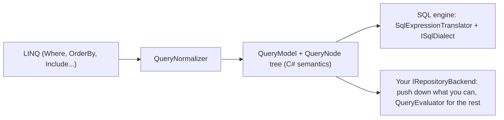

<div align="center">
  
</div>

# Durable

A lightweight .NET ORM with full LINQ support. Typed queries, CRUD, relationships, transactions, optimistic concurrency and lightweight migrations, without a DbContext or change tracking, and with SQL you can always see. One API runs on SQLite, DuckDB, PostgreSQL, MySQL, SQL Server and Oracle (plus MariaDB, CockroachDB and YugabyteDB through the MySQL and PostgreSQL providers), an in-memory store, LiteDB, LiteGraph, MongoDB and Azure Cosmos DB.

[](https://github.com/jchristn/Durable/actions/workflows/ci.yml)

| Package | NuGet | Downloads |
|---|---|---|
| Durable | [](https://www.nuget.org/packages/Durable/) | [](https://www.nuget.org/packages/Durable/) |
| Durable.Sql | [](https://www.nuget.org/packages/Durable.Sql/) | [](https://www.nuget.org/packages/Durable.Sql/) |
| Durable.Sqlite | [](https://www.nuget.org/packages/Durable.Sqlite/) | [](https://www.nuget.org/packages/Durable.Sqlite/) |
| Durable.Postgres | [](https://www.nuget.org/packages/Durable.Postgres/) | [](https://www.nuget.org/packages/Durable.Postgres/) |
| Durable.MySql | [](https://www.nuget.org/packages/Durable.MySql/) | [](https://www.nuget.org/packages/Durable.MySql/) |
| Durable.SqlServer | [](https://www.nuget.org/packages/Durable.SqlServer/) | [](https://www.nuget.org/packages/Durable.SqlServer/) |
| Durable.Oracle | [](https://www.nuget.org/packages/Durable.Oracle/) | [](https://www.nuget.org/packages/Durable.Oracle/) |
| Durable.DuckDb | [](https://www.nuget.org/packages/Durable.DuckDb/) | [](https://www.nuget.org/packages/Durable.DuckDb/) |
| Durable.InMemory | [](https://www.nuget.org/packages/Durable.InMemory/) | [](https://www.nuget.org/packages/Durable.InMemory/) |
| Durable.LiteDb | [](https://www.nuget.org/packages/Durable.LiteDb/) | [](https://www.nuget.org/packages/Durable.LiteDb/) |
| Durable.LiteGraph | [](https://www.nuget.org/packages/Durable.LiteGraph/) | [](https://www.nuget.org/packages/Durable.LiteGraph/) |
| Durable.MongoDb | [](https://www.nuget.org/packages/Durable.MongoDb/) | [](https://www.nuget.org/packages/Durable.MongoDb/) |
| Durable.CosmosDb | [](https://www.nuget.org/packages/Durable.CosmosDb/) | [](https://www.nuget.org/packages/Durable.CosmosDb/) |
| Durable.Conformance | [](https://www.nuget.org/packages/Durable.Conformance/) | [](https://www.nuget.org/packages/Durable.Conformance/) |
| Durable.Tool | [](https://www.nuget.org/packages/Durable.Tool/) | [](https://www.nuget.org/packages/Durable.Tool/) |

> **Durable is in beta.** The API may change between minor versions; every breaking change is listed in the [CHANGELOG](CHANGELOG.md). Feedback, issues and constructive criticism are welcome in [Issues](https://github.com/jchristn/durable/issues) and [Discussions](https://github.com/jchristn/durable/discussions).

## Table of Contents

- [Quick Start](#quick-start)
- [Why Durable?](#why-durable)
- [Packages](#packages)
- [Requirements](#requirements)
- [Installation](#installation)
- [Backends Compared](#backends-compared)
- **Using Durable**
  - [Connecting to a SQL Database](#connecting-to-a-sql-database)
    - [Oracle](#oracle)
    - [DuckDB](#duckdb)
  - [Wire-Compatible Databases](#wire-compatible-databases) (MariaDB, CockroachDB, YugabyteDB)
  - [Defining Entities](#defining-entities)
  - [CRUD Operations](#crud-operations)
  - [Querying](#querying)
  - [String Matching](#string-matching)
  - [Relationships and Include](#relationships-and-include)
  - [Query Filters and Soft Delete](#query-filters-and-soft-delete)
  - [Transactions](#transactions)
  - [Optimistic Concurrency](#optimistic-concurrency)
  - [Raw SQL, Procedures and Multiple Result Sets](#raw-sql-procedures-and-multiple-result-sets)
  - [Creating Tables](#creating-tables)
  - [Migrations](#migrations)
  - [Command-Line Tool](#command-line-tool)
  - [Diagnostics](#diagnostics)
  - [Connections](#connections)
- **Guidance**
  - [Async, Streaming and Cancellation](#async-streaming-and-cancellation)
  - [Error Handling](#error-handling)
  - [Thread Safety](#thread-safety)
  - [Dependency Injection](#dependency-injection)
  - [Unit Testing with the In-Memory Backend](#unit-testing-with-the-in-memory-backend)
- **Non-SQL Backends**
  - [Non-SQL Backend Conventions](#non-sql-backend-conventions)
  - [In-Memory Backend](#in-memory-backend)
  - [LiteDB Backend](#litedb-backend)
  - [MongoDB Backend](#mongodb-backend)
  - [Cosmos DB Backend](#cosmos-db-backend)
  - [LiteGraph Backend](#litegraph-backend)
  - [Writing a Custom Backend](#writing-a-custom-backend)
- **Reference**
  - [API Overview](#api-overview)
  - [Supported LINQ](#supported-linq)
  - [Type Mapping](#type-mapping)
  - [Performance](#performance)
  - [Native AOT](#native-aot)
  - [Troubleshooting and FAQ](#troubleshooting-and-faq)
  - [Versioning and Stability](#versioning-and-stability)
- **Project**
  - [Continuous Integration and Tests](#continuous-integration-and-tests)
  - [Contributing](#contributing)
  - [License](#license)
  - [Contributors](#contributors)

## Quick Start

```bash
dotnet new console -n Hello && cd Hello
dotnet add package Durable.Sqlite
```

Replace `Program.cs` with:

```csharp
using Durable;
using Durable.Sqlite;

using SqliteRepository<Person> people = new SqliteRepository<Person>("Data Source=hello.db");
await people.InitializeTableAsync(typeof(Person));   // CREATE TABLE IF NOT EXISTS

await people.CreateManyAsync(new[]
{
    new Person { FirstName = "Ada",   LastName = "Lovelace", Born = new DateTime(1815, 12, 10) },
    new Person { FirstName = "Grace", LastName = "Hopper",   Born = new DateTime(1906, 12, 9) },
    new Person { FirstName = "Alan",  LastName = "Turing",   Born = new DateTime(1912, 6, 23) }
});

await foreach (Person p in people.Query().Where(p => p.Born.Year > 1900).OrderBy(p => p.Born).ExecuteAsyncEnumerable())
    Console.WriteLine($"{p.FirstName} {p.LastName} ({p.Born:yyyy})");

Person ada = (await people.ReadFirstAsync(p => p.FirstName == "Ada"))!;
ada.Email = "ada@example.com";
await people.UpdateAsync(ada);

Console.WriteLine($"{await people.CountAsync(p => p.Email != null)} with email, {await people.CountAsync()} total");
Console.WriteLine($"Deleted {await people.DeleteAllAsync()}");

[Entity("people")]
public class Person
{
    [Property("id", Flags.PrimaryKey | Flags.AutoIncrement)]
    public int Id { get; set; }

    [Property("first_name", Flags.String, 64)]
    public string FirstName { get; set; } = "";

    [Property("last_name", Flags.String, 64)]
    public string LastName { get; set; } = "";

    [Property("email", Flags.String, 128)]
    public string? Email { get; set; }

    [Property("born")]
    public DateTime Born { get; set; }
}
```

`dotnet run` prints:

```text
Grace Hopper (1906)
Alan Turing (1912)
1 with email, 3 total
Deleted 3
```

The same code runs on DuckDB, PostgreSQL, MySQL, SQL Server or Oracle by swapping `SqliteRepository<Person>` for `DuckDbRepository<Person>`, `PostgresRepository<Person>`, `MySqlRepository<Person>`, `SqlServerRepository<Person>` or `OracleRepository<Person>`, and on the non-SQL backends through `IRepository<Person>`. Larger examples are in `src/Sample.BlogApp.Sqlite`, `.Postgres`, `.MySql` and `.SqlServer`.

## Why Durable?

Durable sits between Dapper and Entity Framework.

- **No configuration overhead**: no DbContext or model builder; attributes when you want control, conventions when you don't.
- **Predictable, parameterized SQL**: every value is a parameter; `BuildSql()`, SQL capture, logging and tracing show exactly what runs.
- **No change tracking**: entities are plain objects. Optimistic concurrency is opt-in with version columns.
- **One engine, many databases**: SQLite, DuckDB, PostgreSQL, MySQL, SQL Server and Oracle (and MariaDB, CockroachDB and YugabyteDB through dialect variants) share one SQL engine (`Durable.Sql`) behind a small dialect interface, so behavior and fixes are identical across providers.
- **Fast materialization**: cached per-type metadata and compiled, typed row readers. Reads are on par with Dapper ([Performance](#performance)).
- **Async first**: true streaming with `IAsyncEnumerable<T>`, and a `CancellationToken` on every async method.
- **Backend-neutral core**: `IRepository<T>` and `IQueryBuilder<T>` contain no SQL. LINQ is normalized once into a neutral query tree, so document stores, graph stores and in-memory stores implement a small storage contract and get the whole repository API.
- **Proven by a conformance kit**: the same capability-gated suites run against every backend in CI.

## Packages

| Package | Contents | Depends on |
|---|---|---|
| `Durable` | Backend-neutral core: `IRepository<T>`, `IQueryBuilder<T>`, attributes, `EntityMetadata`, transactions (`AmbientTransactionScope`), conflict resolvers, `DurableJson`, the neutral query model (`Durable.Query`), `RepositoryBase<T>`, `QueryEvaluator<TRow>` | Microsoft.Extensions.Logging.Abstractions |
| `Durable.Sql` | Shared SQL engine: `ISqlRepository<T>`, `ISqlQueryBuilder<T>`, `ISqlDialect`, `RepositorySettings`, LINQ-to-SQL translation, includes, migrations, interceptors | Durable |
| `Durable.Sqlite` | SQLite provider | Durable.Sql, Microsoft.Data.Sqlite 10.0.12, SQLitePCLRaw.bundle_e_sqlite3 3.0.5 |
| `Durable.DuckDb` | DuckDB provider (embedded, in-process analytics database) | Durable.Sql, DuckDB.NET.Data.Full 1.5.6 |
| `Durable.Postgres` | PostgreSQL provider; also CockroachDB and YugabyteDB (`PostgresFlavor`) | Durable.Sql, Npgsql 10.0.3 |
| `Durable.MySql` | MySQL provider; also MariaDB (`MySqlFlavor`) | Durable.Sql, MySqlConnector 2.6.2 |
| `Durable.SqlServer` | SQL Server provider | Durable.Sql, Microsoft.Data.SqlClient 7.0.2 |
| `Durable.Oracle` | Oracle Database provider | Durable.Sql, Oracle.ManagedDataAccess.Core 23.26.301 |
| `Durable.InMemory` | In-memory backend for tests and prototypes; the reference non-SQL backend | Durable |
| `Durable.LiteDb` | LiteDB (embedded document database) backend | Durable, LiteDB 5.0.21 |
| `Durable.LiteGraph` | LiteGraph (property graph) backend | Durable, LiteGraph 10.1.0 (and its ~20 transitive packages) |
| `Durable.MongoDb` | MongoDB (document database server) backend | Durable, MongoDB.Driver 3.12.0 |
| `Durable.CosmosDb` | Azure Cosmos DB for NoSQL backend | Durable, Microsoft.Azure.Cosmos 3.63.2, Newtonsoft.Json 13.0.4 |
| `Durable.Conformance` | Conformance kit: capability-gated suites any `IRepository<T>` backend runs to prove itself | Durable, Touchstone.Core, xunit.assert |
| `Durable.Tool` | The `durable` command-line tool (.NET tool): migrations, schema diff/sync, scaffolding | the SQL providers |

### Which package do I need?

| You want to... | Install |
|---|---|
| Use SQLite, PostgreSQL, MySQL, SQL Server or Oracle | `Durable.Sqlite`, `Durable.Postgres`, `Durable.MySql`, `Durable.SqlServer` or `Durable.Oracle` (brings in `Durable.Sql` and `Durable`) |
| Use DuckDB (embedded analytics: a file or in memory, no server) | `Durable.DuckDb` |
| Use MariaDB, CockroachDB or YugabyteDB | `Durable.MySql` (MariaDB) or `Durable.Postgres` (CockroachDB, YugabyteDB) with a flavor ([Wire-Compatible Databases](#wire-compatible-databases)) |
| Use an embedded document database with no native dependencies | `Durable.LiteDb` |
| Store entities as nodes and edges in a property graph | `Durable.LiteGraph` |
| Store entities in MongoDB (a replica set for transactions) | `Durable.MongoDb` |
| Store entities in Azure Cosmos DB for NoSQL | `Durable.CosmosDb` |
| Unit-test code written against `IRepository<T>` without a database | `Durable.InMemory` (test project only) |
| Program against the interfaces only (a library that callers give a repository) | `Durable` (or `Durable.Sql` for `ISqlRepository<T>`) |
| Write your own `ISqlDialect` for another SQL database | `Durable.Sql` |
| Write your own non-SQL backend and prove it | `Durable` + `Durable.Conformance` (test project) |
| Run migrations, diff/sync schemas or scaffold entities from the command line | `dotnet tool install --global Durable.Tool` |

## Requirements

- **.NET 8.0** or later. Libraries target `net8.0` and are tested on .NET 8 and .NET 10; `Durable.Conformance` and `Durable.Tool` target `net8.0` and `net10.0`. Every library except `Durable.LiteGraph`, `Durable.MongoDb` and `Durable.CosmosDb` (whose LiteGraph, MongoDB driver and Cosmos DB SDK dependencies are not AOT-compatible) and the `Durable.Tool` executable works in trimmed and Native AOT applications; `Durable.Oracle` and `Durable.DuckDb` are warning-free themselves, but their drivers are not trim-annotated ([Native AOT](#native-aot)).
- **SQLite native library**: `Durable.Sqlite` references Microsoft.Data.Sqlite 10.0.12 with **SQLitePCLRaw 3.x** (`SQLitePCLRaw.bundle_e_sqlite3` 3.0.5), the same SQLite stack `Durable.LiteGraph` uses. If your application references SQLitePCLRaw 2.x packages directly (for example another bundle or provider), update them to 3.x so every SQLitePCLRaw package resolves to the same major version.
- **Databases**:

| Database | Minimum version | Driver | Why that minimum |
|---|---|---|---|
| SQLite | 3.35 (bundled by SQLitePCLRaw.bundle_e_sqlite3) | Microsoft.Data.Sqlite 10.0.12 + SQLitePCLRaw 3.0.5 | `INSERT ... RETURNING` for generated keys |
| PostgreSQL | 12 | Npgsql 10.0.3 | |
| MySQL | 8.0.31 (8.0.19 without set operations) | MySqlConnector 2.6.2 | `INTERSECT`/`EXCEPT` need 8.0.31; the upsert row alias needs 8.0.19 |
| SQL Server | 2017 | Microsoft.Data.SqlClient 7.0.2 | `OFFSET`/`FETCH` paging, `OUTPUT INSERTED`, `MERGE` |
| Oracle Database | 19c (tested on 23ai Free, 23.26) | Oracle.ManagedDataAccess.Core 23.26.301 | Identity columns (12c), `OFFSET`/`FETCH` (12c), 128-byte identifiers and implicit result sets (12.2); no 23ai-only syntax is generated |
| DuckDB | 1.5.6 (bundled by DuckDB.NET.Data.Full) | DuckDB.NET.Data.Full 1.5.6 | Tested version; `RETURNING`, `ON CONFLICT`, sequences and `duckdb_*()` introspection are used |
| MariaDB | 11.4 LTS (tested) | MySqlConnector 2.6.2 | `MySqlFlavor.MariaDb`; window functions, set operations and `utf8mb4_nopad_bin` are available on every supported MariaDB |
| CockroachDB | 26.3 (tested) | Npgsql 10.0.3 | `PostgresFlavor.CockroachDb`; identity columns, PL/pgSQL procedures |
| YugabyteDB | 2026.1 (tested) | Npgsql 10.0.3 | `PostgresFlavor.YugabyteDb`; advisory locks (`yb_enable_advisory_locks`) for the migration lock |
| LiteDB | 5.0.21 | LiteDB (managed, no native code) | |
| LiteGraph | 10.1.0 | LiteGraph | |
| MongoDB | 4.4 (tested with 8.0; multi-document transactions need a replica set or sharded cluster) | MongoDB.Driver 3.12.0 | Implicit collection creation inside transactions (`hello` topology detection falls back to `isMaster` on older servers) |
| Azure Cosmos DB for NoSQL | Service (any API version the SDK supports); Linux emulator `vnext-preview` for tests | Microsoft.Azure.Cosmos 3.63.2 | |

CI tests against SQLite and DuckDB (both bundled, in-process, on Linux, Windows and macOS), `postgres:16`, `mysql:8.4`, `mcr.microsoft.com/mssql/server:2022-latest`, `gvenzl/oracle-free:23-slim-faststart` (Oracle Database 23ai Free), `mariadb:11.4`, `cockroachdb/cockroach:latest-v26.3`, `yugabytedb/yugabyte:2026.1.2.0-b137`, `mongo:8` (single-node replica set) and the Cosmos DB Linux emulator (`mcr.microsoft.com/cosmosdb/linux/azure-cosmos-emulator:vnext-preview`).

## Installation

```bash
dotnet add package Durable.Sqlite       # or Durable.Postgres / Durable.MySql / Durable.SqlServer
dotnet add package Durable.Oracle       # Oracle Database
dotnet add package Durable.DuckDb       # DuckDB (embedded, in-process)
dotnet add package Durable.LiteDb       # LiteDB backend
dotnet add package Durable.LiteGraph    # LiteGraph backend
dotnet add package Durable.MongoDb      # MongoDB backend
dotnet add package Durable.CosmosDb     # Azure Cosmos DB for NoSQL backend
dotnet add package Durable.InMemory     # in-memory backend (tests)
dotnet add package Durable.Conformance  # conformance kit (backend authors)
dotnet tool install --global Durable.Tool   # the durable CLI
```

## Backends Compared

Every backend implements `IRepository<T>` and `IQueryBuilder<T>`. The SQL providers also implement `ISqlRepository<T>`/`ISqlQueryBuilder<T>`. `IRepository<T>.Capabilities` reports the optional features a backend supports; calling an unsupported one throws `NotSupportedException` at the call site.

| | SQLite | DuckDB | PostgreSQL | MySQL | SQL Server | Oracle | In-Memory | LiteDB | MongoDB | Cosmos DB | LiteGraph |
|---|---|---|---|---|---|---|---|---|---|---|---|
| Repository type | `SqliteRepository<T>` | `DuckDbRepository<T>` | `PostgresRepository<T>` | `MySqlRepository<T>` | `SqlServerRepository<T>` | `OracleRepository<T>` | `InMemoryRepository<T>` | `LiteDbRepository<T>` | `MongoDbRepository<T>` | `CosmosDbRepository<T>` | `LiteGraphRepository<T>` |
| Storage | File or memory | File or memory (in-process) | Server | Server | Server | Server | Process memory | Single file or memory | Server (database per backend) | Azure Cosmos DB for NoSQL (one container per entity) | LiteGraph (SQLite file) or memory |
| `Capabilities` | All | All | All | All | All | All except `EmptyStrings` (Oracle stores `''` as NULL) | All (maskable) | All | All (no `Transactions` on a standalone server) | All except `Transactions` | All |
| Full LINQ, Include, grouping, projections, aggregates | Yes | Yes | Yes | Yes | Yes | Yes | Yes | Yes | Yes | Yes | Yes |
| Where queries run | Database | Database | Database | Database | Database | Database | Client (C#) | Comparisons/IN pushed to LiteDB, rest client-side | Filters, ordering, paging, counts and column aggregates pushed to MongoDB when exact, rest client-side | Comparisons, IN, null checks, string matches, single-key ORDER BY, paging, counts and integer aggregates pushed to Cosmos DB SQL; rest client-side | Labels, keys, exact equality pushed, rest client-side |
| Transactions | Database | Database (optimistic MVCC: conflicting writers in transactions fail instead of waiting; autocommit statements are retried) | Database | Database | Database | Database | Snapshot isolation | LiteDB transactions | Client sessions (replica set or sharded cluster); write conflicts fail fast | No (per-document atomic writes; ETag-checked updates) | Atomic graph commit, first committer wins |
| Savepoints | Yes | No | Yes | Yes | Yes | Yes (no release) | No | No | No | No | No |
| Upsert, `BatchUpdate`, `UpdateField` | Yes | Yes | Yes | Yes | Yes | Yes (`MERGE`) | Yes | Yes | Yes | Yes | Yes |
| `StringMatchMode.Database` behaves as | Collation (`=` exact; `LIKE` ignores ASCII case) | Collation (binary by default: exact, case-sensitive `LIKE`) | Collation | Collation (case/accent-insensitive by default) | Collation (case-insensitive by default) | `NLS_COMP`/`NLS_SORT` (binary by default) | Ordinal | Ordinal (new files) | Ordinal (simple collation on every command) | Ordinal | Ordinal |
| Raw SQL, `QueryMultiple` | Yes | Yes | Yes | Yes | Yes | Yes (`QueryMultiple` through PL/SQL implicit result sets) | - | - | - | - | - |
| Stored procedures | No | No | Yes | Yes | Yes | Yes (rows through implicit result sets) | - | - | - | - | - |
| `BulkInsert` | Prepared inserts | DuckDB Appender (prepared inserts when column types differ) | Binary `COPY` | `MySqlBulkCopy` (needs `AllowLoadLocalInfile=true`) or multi-row `INSERT` | `SqlBulkCopy` | Array binding | - | - | - | - | - |
| Set operations, CTEs, window functions | Yes | Yes | Yes | Yes (8.0.31+) | Yes | Yes (`Except` is `MINUS`; recursive CTEs need a column list) | - | - | - | - | - |
| `InitializeTable`, migrations, `durable` CLI | Yes | Yes (migrations run statement by statement) | Yes (CockroachDB, YugabyteDB: DDL not transactional) | Yes (DDL not transactional; MariaDB too) | Yes | Yes (DDL not transactional; migration lock needs `EXECUTE` on `DBMS_LOCK`) | Not needed | Not needed | Not needed (indexes via `EnsureIndexes`) | Not needed (containers created on first use) | Not needed |
| SQL capture, interceptors, OpenTelemetry | Yes | Yes | Yes | Yes | Yes | Yes | - | Query plans (`QueryPlanned`, `LastQueryPlan`) | Query plans (`QueryPlanned`, `LastQueryPlan`, `ExplainQueries`) | Query plans (`QueryPlanned`, `LastQueryPlan`, with RU charge) | Query plans (`QueryPlanned`, `LastQueryPlan`) |
| Native AOT | Yes (verified) | Yes (verified on .NET 10) | Durable yes; driver not verified | Durable yes; driver not verified | Durable yes; driver not verified | Durable yes; driver has trim/AOT warnings (annotated) | Yes (verified) | Yes (verified) | Not supported (driver) | Not supported (Cosmos DB SDK) | Not yet |
| Best for | Embedded apps, tests against real SQL | Embedded analytics, local data processing, tests against real SQL | Production servers | Production servers | Production servers | Production servers, existing Oracle estates | Unit tests, prototypes | Embedded, no native deps | Document data on a MongoDB server or Atlas | Globally distributed, elastic document storage on Azure | Data that is also a graph |
| Wire-compatible databases | - | - | CockroachDB, YugabyteDB (`PostgresFlavor`) | MariaDB (`MySqlFlavor`) | - | - | - | - | - | - | - |

"-" means the member does not exist on that backend's type (it is on `ISqlRepository<T>`).

---

## Connecting to a SQL Database

Snippets in this guide assume `using Durable;`, the provider namespace (`Durable.Sqlite`, `Durable.DuckDb`, `Durable.Postgres`, `Durable.MySql`, `Durable.SqlServer`, `Durable.Oracle`), and `Durable.Sql` for SQL-specific types (`ISqlRepository<T>`, `SqlRepositoryOptions`, `SqlMigrator`, ...). A comment at the top of a snippet names the variables it assumes. Entities used in the examples are defined in [Defining Entities](#defining-entities) (`Person`), [Relationships](#relationships-and-include) (`Author`, `Book`, `Publisher`, `Category`), [Query Filters](#query-filters-and-soft-delete) (`Order`, `OrderLine`) and [Optimistic Concurrency](#optimistic-concurrency) (`Document`).

Each provider's repository has three constructors: a connection string, a strongly-typed settings object, or a shared `IConnectionFactory`. All take optional `SqlRepositoryOptions`. Each connection factory can likewise be built from a connection string or a settings object (plus an optional `maxConcurrentConnections`).

```csharp
using Durable.Sqlite;

// Connection string: the repository creates and owns its connection factory
SqliteRepository<Person> people = new SqliteRepository<Person>("Data Source=app.db");

// Settings object
SqliteRepository<Person> fromSettings = new SqliteRepository<Person>(new SqliteRepositorySettings { DataSource = "app.db" });

// Shared factory (recommended for applications): one factory per database, many repositories
SqliteConnectionFactory factory = new SqliteConnectionFactory("Data Source=app.db");
SqliteRepository<Person> shared = new SqliteRepository<Person>(factory);
SqliteRepository<Author> authors = new SqliteRepository<Author>(factory);

// A factory from a settings object
SqliteConnectionFactory fromSettingsFactory = new SqliteConnectionFactory(new SqliteRepositorySettings { DataSource = "app.db", Pooling = true });
```

PostgreSQL, MySQL and SQL Server work the same way ([Oracle](#oracle) and [DuckDB](#duckdb) are described below):

```csharp
using Durable.MySql;
using Durable.Postgres;
using Durable.SqlServer;

PostgresRepository<Person> pg = new PostgresRepository<Person>("Host=localhost;Database=mydb;Username=postgres;Password=password");
MySqlRepository<Person> my = new MySqlRepository<Person>("Server=localhost;Database=mydb;User=root;Password=password");
SqlServerRepository<Person> ms = new SqlServerRepository<Person>("Server=localhost;Database=mydb;User Id=sa;Password=YourStrong@Passw0rd;TrustServerCertificate=true");

PostgresRepositorySettings pgSettings = new PostgresRepositorySettings
{
    Hostname = "localhost", Port = 5432, Database = "mydb", Username = "postgres", Password = "password", MaxPoolSize = 50
};
PostgresRepository<Person> pgFromSettings = new PostgresRepository<Person>(pgSettings);
PostgresConnectionFactory pgFactory = new PostgresConnectionFactory(pgSettings, maxConcurrentConnections: 20);

MySqlRepository<Person> myFromSettings = new MySqlRepository<Person>(new MySqlRepositorySettings
{
    Hostname = "localhost", Database = "mydb", Username = "root", Password = "password", MinPoolSize = 0, MaxPoolSize = 100
});
```

| Settings class | Properties (besides `Hostname`, `Port`, `Username`, `Password`, `Database`, `AdditionalProperties`) |
|---|---|
| `SqliteRepositorySettings` | `DataSource`, `Mode`, `CacheMode`, `Pooling` |
| `DuckDbRepositorySettings` | `DataSource`, `AccessMode` (`DuckDBAccessMode`), `Threads`, `MemoryLimit`, `IsInMemory`; `ForInMemory()`, `ForSharedInMemory()`, `ForFile(path)` (host, port, user, password and database are not used) |
| `PostgresRepositorySettings` | `ConnectionTimeout`, `MinPoolSize`, `MaxPoolSize`, `Pooling`, `SslMode` (Npgsql `SslMode`), `Flavor` (CockroachDB, YugabyteDB) |
| `MySqlRepositorySettings` | `ConnectionTimeout`, `MinPoolSize`, `MaxPoolSize`, `Pooling`, `SslMode` (`MySqlSslMode`), `Flavor` (MariaDB) |
| `SqlServerRepositorySettings` | `ConnectionTimeout`, `MinPoolSize`, `MaxPoolSize`, `Pooling`, `Encrypt`, `TrustServerCertificate`, `IntegratedSecurity` |
| `OracleRepositorySettings` | `DataSource` (TNS alias, EZConnect or descriptor; otherwise `Hostname`:`Port`/`Database` with `Database` the service name), `ConnectionTimeout`, `MinPoolSize`, `MaxPoolSize`, `Pooling` |

All settings properties are nullable and init-only; null leaves the driver default (`ConnectionTimeout` is in seconds). The settings base class `RepositorySettings` and `RepositoryType` live in the `Durable.Sql` namespace. Each settings class has `Parse(connectionString)` and `BuildConnectionString()`; For the server providers, `Parse` leaves `SslMode` null when the string selects the driver default and keeps keys it does not model in `AdditionalProperties`. The command timeout is not a connection setting: use `SqlRepositoryOptions.CommandTimeoutSeconds`. `CreateDatabaseIfNotExistsAsync()` creates the database (for SQLite and DuckDB, the file's directory; on Oracle it only verifies the connection, since a DBA creates pluggable databases and schemas).

On SQL Server, `CommandTimeoutSeconds` does not cover transaction commits. Durable sets it on the commands it creates, but `COMMIT` and `ROLLBACK` are issued by SqlClient, which uses the connection's `Command Timeout` (default 30 s). If commits can take longer, for example large transactions or a busy server, raise it in the connection string or through `AdditionalProperties`:

```csharp
SqlServerRepositorySettings settings = new SqlServerRepositorySettings
{
    Hostname = "localhost",
    Database = "app",
    Username = "sa",
    Password = "...",
    AdditionalProperties = new Dictionary<string, string> { ["Command Timeout"] = "120" }   // also applies to COMMIT
};
// or: "Server=localhost;Database=app;User Id=sa;Password=...;Command Timeout=120"
```

Disposable local databases for development:

```bash
docker run -d -p 5432:5432 -e POSTGRES_PASSWORD=password -e POSTGRES_DB=mydb postgres:16
docker run -d -p 3306:3306 -e MYSQL_ROOT_PASSWORD=password -e MYSQL_DATABASE=mydb mysql:8.4
docker run -d -p 1433:1433 -e ACCEPT_EULA=Y -e MSSQL_SA_PASSWORD=YourStrong@Passw0rd mcr.microsoft.com/mssql/server:2022-latest
docker run -d -p 1521:1521 -e ORACLE_PASSWORD=AdminPass123 -e APP_USER=app -e APP_USER_PASSWORD=secret gvenzl/oracle-free:23-slim-faststart
docker run -d -p 3307:3306 -e MARIADB_ROOT_PASSWORD=password -e MARIADB_DATABASE=mydb mariadb:11.4
docker run -d -p 26257:26257 cockroachdb/cockroach:latest-v26.3 start-single-node --insecure
docker run -d -p 5433:5433 yugabytedb/yugabyte:2026.1.2.0-b137 bin/yugabyted start --background=false --tserver_flags=ysql_sequence_cache_minval=1
```

DuckDB needs no server (it runs in your process); MongoDB and the Cosmos DB emulator are covered in their [backend sections](#mongodb-backend).

### Oracle

`Durable.Oracle` uses the official managed driver (ODP.NET, `Oracle.ManagedDataAccess.Core`). The repository, factory and settings work like the other providers; the database is addressed by an EZConnect data source (`host:port/service`), a TNS alias, or a full connect descriptor. Generated SQL targets Oracle 19c (no 23ai-only syntax); Durable is tested on Oracle Database 23ai Free.

```csharp
using Durable.Oracle;

// Connection string: the repository owns its connection factory
OracleRepository<Person> people = new OracleRepository<Person>("User Id=app;Password=secret;Data Source=localhost:1521/FREEPDB1");

// Settings: Hostname, Port and Database (the service name) become the EZConnect data source
OracleRepositorySettings settings = new OracleRepositorySettings
{
    Hostname = "localhost", Port = 1521, Database = "FREEPDB1", Username = "app", Password = "secret", MaxPoolSize = 50
};
OracleRepository<Person> fromSettings = new OracleRepository<Person>(settings);

// A TNS alias or full connect descriptor goes in DataSource (Hostname, Port and Database are then ignored)
OracleRepositorySettings tns = new OracleRepositorySettings { DataSource = "PRODDB", Username = "app", Password = "secret" };

// Shared factory (recommended): one per database, many repositories
OracleConnectionFactory factory = new OracleConnectionFactory(settings, maxConcurrentConnections: 20);
OracleRepository<Person> shared = new OracleRepository<Person>(factory);
OracleRepository<Author> authors = new OracleRepository<Author>(factory);

await shared.InitializeTableAsync(typeof(Person));
Person created = await shared.CreateAsync(new Person { FirstName = "Ada", LastName = "Lovelace", Salary = 100m });
List<Person> paid = shared.ReadMany(p => p.Salary >= 50m).OrderBy(p => p.LastName).ToList();
```

How Oracle maps to Durable:

- **Identifiers are folded to upper case and quoted.** `[Entity("people")]` maps to the table `PEOPLE` and `[Property("first_name")]` to `FIRST_NAME`, which is what unquoted names in hand-written SQL and in existing schemas resolve to, so raw SQL such as `SELECT * FROM people WHERE salary > {0}` works. Schema introspection (`DatabaseSchemaReader`, `durable scaffold`, `ValidateTable`) reports names Oracle stores in upper case in lower case. For a schema whose quoted names are mixed case, use a case-preserving dialect and pass the same dialect to `SqlMigrator` and `DatabaseSchemaReader`:

  ```csharp
  OracleDialect preserveCase = new OracleDialect(upperCaseIdentifiers: false);
  OracleRepository<Person> mixedCase = new OracleRepository<Person>(factory, preserveCase);
  SqlMigrator migrator = new SqlMigrator(factory, preserveCase);
  ```

- **Empty strings are NULL.** Oracle stores a zero-length string as NULL and cannot tell the two apart. Durable reports this instead of hiding it: `OracleDialect.TreatsEmptyStringAsNull` is true and Oracle repositories lack `RepositoryCapabilities.EmptyStrings` (the conformance cases that need it are skipped with that reason). An empty string written to a nullable property reads back as `null`; a non-nullable string property keeps its initializer (usually `string.Empty`); `x.Name == ""` matches no row. To let non-nullable string properties hold `""`, Durable declares string columns (VARCHAR2, CLOB, JSON and string-converted columns) NULL on Oracle (`ISqlDialect.ColumnAllowsNull`), and schema comparison expects that.

  ```csharp
  bool distinct = (people.Capabilities & RepositoryCapabilities.EmptyStrings) != 0;   // false on Oracle
  long none = people.Count(p => p.Email == "");                                         // always 0 on Oracle
  long blank = people.Count(p => string.IsNullOrEmpty(p.Email));                        // what you usually want
  ```

- **Keys, paging, upsert, batches.** Identity keys (`GENERATED BY DEFAULT ON NULL AS IDENTITY`) come back through `RETURNING ... INTO` output parameters; `CreateMany` sends one PL/SQL block per chunk with one INSERT per row; paging is `OFFSET ... ROWS FETCH NEXT ... ROWS ONLY`; upsert is `MERGE`; `BulkInsert` uses ODP.NET array binding (one INSERT per `BatchConfiguration.MaxRowsPerBatch` rows, no key write-back). IN lists longer than Oracle's 1000-item limit are split automatically, and includes chunk keys by 1000.
- **Strings and collation.** Strings are `VARCHAR2(n CHAR)` (character length semantics); a string without `MaxLength` is `VARCHAR2(4000 CHAR)`, which Oracle limits to 4000 bytes unless `MAX_STRING_SIZE = EXTENDED` (the dialect's `unboundedStringType` constructor parameter changes it, for example to `CLOB`); `MaxLength` above 4000 and JSON columns are `CLOB`. Comparisons follow `NLS_COMP`/`NLS_SORT`, binary by default, so `StringMatchMode.Database` and `Ordinal` agree on a default installation; `IgnoreCase` uses `LOWER()`.
- **Transactions and DDL.** Savepoints work (`SAVEPOINT`/`ROLLBACK TO SAVEPOINT`; Oracle has no release, so `Release` is a no-op). Oracle commits DDL implicitly (`SupportsTransactionalDdl` is false), like MySQL: a failed migration may leave partial changes (`MigrationException.MayBePartiallyApplied`).
- **Migration lock.** `SqlMigrator` and `durable migrate` take a session lock with `DBMS_LOCK` (kept across the migrations' commits). The user needs `GRANT EXECUTE ON SYS.DBMS_LOCK TO <user>` (granted by a DBA as SYS); without it the lock statement fails with ORA-20901 naming the grant.
- **Scripts.** `durable script`, `SchemaDiff.ToScript()` and migration scripts end PL/SQL blocks with a `/` line and other statements with `;`, for SQL*Plus, SQLcl and SQL Developer.
- **Raw SQL and procedures.** Parameters are bound by name (`:p0`; Durable sets `BindByName`). Oracle runs one statement per command, so `QueryMultiple` needs a PL/SQL block that returns implicit result sets (`OPEN c1 FOR SELECT ...; DBMS_SQL.RETURN_RESULT(c1);`), and a stored procedure returns rows the same way. A `SELECT` without a table needs `FROM DUAL`, and a recursive `WithRecursiveCte` needs its column list (`"nums (n)"`).
- **`CreateDatabaseIfNotExists`** only checks that the database can be reached: pluggable databases and schemas (users) are created by a DBA.
- **Connections.** `OracleConnectionFactory` turns on `BindByName` and `SuppressGetDecimalInvalidCastException` (NUMBER values beyond `decimal` precision are truncated instead of throwing). For an external connection wrapped with `SqlTransactionContext.Wrap`, create it with `OracleConnectionFactory.CreateRawConnection(connectionString)`.
- **`AddMonths`/`AddYears`** use `ADD_MONTHS`, which keeps month ends (February 28 plus one month is March 31 on Oracle; C# gives March 28).
- **Native AOT.** ODP.NET is not annotated for trimming, so the constructors that create ODP.NET connections carry `[RequiresUnreferencedCode]`/`[RequiresDynamicCode]` ([Native AOT](#native-aot)).

A disposable local database (Oracle Database 23ai Free; `APP_USER` is created in the `FREEPDB1` pluggable database):

```bash
docker run -d -p 1521:1521 -e ORACLE_PASSWORD=AdminPass123 -e APP_USER=app -e APP_USER_PASSWORD=secret gvenzl/oracle-free:23-slim-faststart
# Connection string: User Id=app;Password=secret;Data Source=localhost:1521/FREEPDB1
```

### DuckDB

DuckDB is an embedded, in-process analytical database: there is no server, and `Durable.DuckDb` loads the engine (bundled by DuckDB.NET.Data.Full) into your process. The data source is a database file, `:memory:` or `:memory:?cache=shared`.

```csharp
using Durable.DuckDb;

// Database file: the repository creates and owns its connection factory
DuckDbRepository<Person> people = new DuckDbRepository<Person>("Data Source=analytics.duckdb");

// Settings object (file, private in-memory, or the process-wide shared in-memory database)
DuckDbRepository<Person> fromSettings = new DuckDbRepository<Person>(DuckDbRepositorySettings.ForFile("analytics.duckdb"));
DuckDbRepositorySettings tuned = new DuckDbRepositorySettings { DataSource = "analytics.duckdb", Threads = 4, MemoryLimit = "2GB" };

// In-memory: share one factory. The database lives as long as the factory and only its repositories see it.
using DuckDbConnectionFactory memory = new DuckDbConnectionFactory(DuckDbRepositorySettings.ForInMemory());
DuckDbRepository<Person> inMemoryPeople = new DuckDbRepository<Person>(memory);
DuckDbRepository<Author> inMemoryAuthors = new DuckDbRepository<Author>(memory);
inMemoryPeople.InitializeTable(typeof(Person));   // sequence-backed key: CREATE SEQUENCE + DEFAULT nextval(...)

// Bulk loading goes through the DuckDB Appender
List<Person> batch = Enumerable.Range(0, 10000).Select(i => new Person { FirstName = "P" + i, LastName = "L", Salary = i }).ToList();
long inserted = await inMemoryPeople.BulkInsertAsync(batch);
```

How the connection factory keeps databases alive. DuckDB has no connection pool: a database instance exists while at least one connection to it is open. `DuckDbConnectionFactory` opens one root connection on first use and keeps it open until the factory is disposed; every connection it hands out shares that instance.

| Data source | Who sees the data | Lifetime |
|---|---|---|
| `:memory:` (`DuckDbRepositorySettings.ForInMemory()`) | Every repository on the same factory; nothing else (a raw connection or a second factory gets its own empty database) | Until the factory is disposed |
| `:memory:?cache=shared` (`ForSharedInMemory()`) | Every factory and raw connection in the process using that string | While any connection to it is open |
| A file path (`ForFile(path)`) | Every factory and connection in the process opened on the file | The file; the factory holds DuckDB's file lock (one read-write process at a time) until it is disposed |

A repository created from a connection string owns its factory, so `new DuckDbRepository<T>("Data Source=:memory:")` is a private database for that one repository. Share one factory instead.

Concurrency. DuckDB uses optimistic multi-version concurrency control: transactions never wait for each other, and a write to a row another concurrent transaction changed fails with `TransactionContext Error: Conflict on update` (a `DuckDBException`) instead of blocking. Durable runs a conflicting statement that executes on its own (no transaction) again, up to `DuckDbDialect.AutocommitConflictRetries` times (default 10, a constructor parameter) after a short randomized delay, so concurrent autocommit updates and deletes of the same rows succeed as they would on a database that waits for row locks. Inside a transaction the conflict aborts the transaction and is thrown; retry the whole transaction there. Inserts of different rows do not conflict.

```csharp
using DuckDB.NET.Data;

// inMemoryPeople: DuckDbRepository<Person>
Person first = (await inMemoryPeople.ReadFirstAsync())!;
for (int attempt = 1; ; attempt++)
{
    await using ISqlTransaction transaction = await inMemoryPeople.BeginTransactionAsync();
    try
    {
        await inMemoryPeople.UpdateFieldAsync(p => p.Id == first.Id, p => p.Salary, 42m, transaction);
        await transaction.CommitAsync();
        break;
    }
    catch (DuckDBException e) when (attempt < 3 && e.Message.Contains("Conflict", StringComparison.OrdinalIgnoreCase))
    {
        await Task.Delay(10 * attempt);   // another transaction changed the row first: retry the transaction
    }
}
```

What differs from the other SQL providers:

- **Keys**: DuckDB has no identity columns. An auto-increment key gets a sequence named `{table}_{column}_seq` and `DEFAULT nextval(...)`; `INSERT ... RETURNING` returns the key. Creating the table recreates a sequence left behind by a dropped table of the same name, so a recreated table numbers from 1 again.
- **Savepoints are not supported** (DuckDB has no `SAVEPOINT`): `ISqlTransaction.CreateSavepoint(Async)` throws `NotSupportedException` (`ISqlDialect.SupportsSavepoints` is false). Use separate transactions.
- **Stored procedures**: not supported (DuckDB has macros, not procedures); the procedure APIs throw `NotSupportedException`.
- **String lengths**: DuckDB accepts `VARCHAR(n)` but neither stores nor enforces `n`, so strings are `VARCHAR`, `MaxLength` is not enforced, schema comparison reports no length differences and scaffolding cannot recover lengths (`ISqlDialect.SupportsStringMaxLength` is false, as on SQLite).
- **Migrations run statement by statement**: DuckDB can roll back DDL, but it cannot create an index in a transaction that already changed rows of the table (for example by adding a column with a default), nor drop a column in the transaction that dropped its index. Durable therefore runs migrations and schema sync without a wrapping transaction (`SupportsTransactionalDdl` is false, as on MySQL): a failed migration is not recorded, but its earlier statements stay applied (`MigrationException.MayBePartiallyApplied`).
- **Altering indexed tables**: DuckDB refuses to drop a column, make a column NOT NULL or change its type while the table has indexes. Schema sync (and `durable schema sync` / `migrations add`) wraps such operations: it drops the table's indexes, alters the table and re-creates the indexes that remain. Raw `ALTER TABLE` statements in your own migrations must do the same.
- **Migration lock**: DuckDB has no advisory locks. The lock is a row in `durable_migration_lock` (created on first use, excluded from `ReadTableNames`, name configurable on `DuckDbDialect`). A second migrator in the same process polls until the row is gone. A read-write DuckDB file can be opened by one process at a time, so a row left by a process that exited without releasing it is treated as stale and replaced.
- **Command timeout**: DuckDB.NET ignores `DbCommand.CommandTimeout`, so Durable enforces `SqlRepositoryOptions.CommandTimeoutSeconds` itself: it interrupts the command when the timeout elapses and throws `TimeoutException`. Without a configured timeout, commands run to completion. Cancellation tokens interrupt running statements.
- **Integer division** uses DuckDB's `//` (truncating like C#); `SUM` over integer columns returns `HUGEINT`, which the converter narrows to the requested type.
- **String matching**: DuckDB compares strings by code point (case- and accent-sensitive) and its `LIKE` is case-sensitive, so `StringMatchMode.Database` behaves like `Ordinal` unless you configure a default collation such as `nocase`; `Ordinal` and `IgnoreCase` apply `COLLATE "binary"` (with `lower()` for `IgnoreCase`).
- **Bulk insert** uses the DuckDB Appender when every value's type matches its column (always true for tables Durable creates; keys are drawn from the sequence first) and falls back to a prepared `INSERT` per row otherwise. Both run in the bulk insert's transaction.

## Wire-Compatible Databases

MariaDB uses the MySQL provider; CockroachDB and YugabyteDB use the PostgreSQL provider. Each has a dialect that adjusts the SQL Durable generates (`MariaDbDialect : MySqlDialect`, `CockroachDbDialect : PostgresDialect`, `YugabyteDbDialect : PostgresDialect`). Select it with a flavor: `MySqlFlavor.MariaDb`, `PostgresFlavor.CockroachDb` or `PostgresFlavor.YugabyteDb`. Without a flavor the providers behave exactly as before (MySQL, PostgreSQL).

| Where | How |
|---|---|
| Settings | `Flavor` property on `MySqlRepositorySettings` / `PostgresRepositorySettings`, or `Parse(connectionString, flavor)` |
| Connection string | `new MySqlRepository<T>(connectionString, MySqlFlavor.MariaDb)`, `new PostgresRepository<T>(connectionString, PostgresFlavor.CockroachDb)` |
| Shared factory | `Flavor` on `MySqlConnectionFactory` / `PostgresConnectionFactory` (set from settings, or with an initializer); repositories created on the factory use its flavor |
| Explicit dialect | `new PostgresRepository<T>(factory, dialect)` / `new MySqlRepository<T>(factory, dialect)`, for example a dialect with a custom collation |
| Migrations, schema tools | Pass the flavor's dialect: `PostgresDialect.For(flavor)`, `MySqlDialect.For(flavor)`, or `CockroachDbDialect.Default` etc. |
| `durable` CLI | `--provider mariadb`, `--provider cockroachdb` (aliases `cockroach`, `crdb`), `--provider yugabytedb` (aliases `yugabyte`, `ysql`) |

```csharp
using Durable.MySql;
using Durable.Postgres;
using Durable.Sql;

// CockroachDB through settings
PostgresRepositorySettings cockroach = new PostgresRepositorySettings
{
    Hostname = "localhost",
    Port = 26257,
    Username = "root",
    Database = "app",
    Flavor = PostgresFlavor.CockroachDb
};
PostgresRepository<Person> people = new PostgresRepository<Person>(cockroach);

// YugabyteDB through a shared connection factory (repositories pick up the factory's flavor)
PostgresConnectionFactory yugabyte = new PostgresConnectionFactory("Host=localhost;Port=5433;Username=yugabyte;Database=app")
{
    Flavor = PostgresFlavor.YugabyteDb
};
PostgresRepository<Person> ybPeople = new PostgresRepository<Person>(yugabyte);

// MariaDB from a connection string
MySqlRepository<Person> mariaPeople = new MySqlRepository<Person>(
    "Server=localhost;Database=app;User ID=root;Password=secret", MySqlFlavor.MariaDb);

// Parse a connection string into settings with a flavor
MySqlRepositorySettings maria = MySqlRepositorySettings.Parse("Server=localhost;Database=app;User ID=root", MySqlFlavor.MariaDb);

// Migrations and schema tools take the flavor's dialect
SqlMigrator migrator = new SqlMigrator(yugabyte, PostgresDialect.For(PostgresFlavor.YugabyteDb));
ISqlDialect dialect = MySqlDialect.For(MySqlFlavor.MariaDb);
```

The flavor is not part of the connection string: drivers reject unknown keywords, so `Parse(connectionString)` always returns the default flavor and `BuildConnectionString()` ignores it.

### MariaDB

Tested on MariaDB 11.4 LTS. What `MariaDbDialect` changes:

- Upsert uses `ON DUPLICATE KEY UPDATE col = VALUES(col)` (MariaDB has no `AS alias` row reference).
- `string.IsNullOrEmpty` uses `CHAR_LENGTH(x) = 0`: MariaDB collations are PAD SPACE, so `'   ' = ''` is true.
- Ordinal and ignore-case matching use `utf8mb4_nopad_bin` (binary and NO PAD, so trailing spaces count as in .NET). Columns in another character set need a matching collation: `new MariaDbDialect(ordinalCollation: "latin1_nopad_bin")`.
- `Lead`/`Lag` with a default value: MariaDB's LEAD/LAG take no default argument, so Durable returns the default when the row at the offset does not exist (a NULL value at an existing row stays NULL, as in the other databases).
- JSON columns: MariaDB's `JSON` is an alias of `LONGTEXT`; schema introspection and diffs treat them as the same type.
- DDL commits implicitly, as on MySQL (`SupportsTransactionalDdl` is false): check `MigrationException.MayBePartiallyApplied`.
- OpenTelemetry `db.system` is `mariadb`.

### CockroachDB

Tested on CockroachDB 26.3 (single node). What `CockroachDbDialect` changes:

- `int` properties are declared `INT4` (CockroachDB's `INT`/`INTEGER` is 64-bit); auto-increment keys use `INT4 GENERATED BY DEFAULT AS IDENTITY` (sequence-backed, so keys are increasing, unlike `SERIAL`'s `unique_rowid()`).
- Integer division uses `div(a, b)` (CockroachDB's `/` returns DECIMAL); `Math.Sqrt` casts its argument to `FLOAT8`.
- Migration lock: CockroachDB accepts `pg_try_advisory_lock` but does not lock, so the migrator keeps one row per held lock in `durable_migration_locks` (created on first use, owned by the session id). A lock left by a crashed migrator is taken over after 900 seconds; change both with `new CockroachDbDialect(migrationLockTableName: ..., migrationLockExpirySeconds: ...)`.
- DDL is not transactional (`SupportsTransactionalDdl` is false): CockroachDB commits an open transaction before a schema change (`autocommit_before_ddl`, on by default), so migrations and schema sync run without a transaction.
- Stored procedures are called with positional arguments (`CALL p($1, $2)`; CockroachDB has no named notation), so pass `SqlParameterValue`s in declaration order.
- Schema introspection: CockroachDB reports every unique index as a unique constraint, so unique constraints you create yourself appear as unique indexes.
- OpenTelemetry `db.system` is `cockroachdb`.

Notes for your own SQL and schema:

- Transactions are SERIALIZABLE by default. Under contention CockroachDB aborts a transaction with SQLSTATE `40001` ("restart transaction"); Durable does not retry (it cannot replay your code), so retry the whole unit of work on `PostgresException { SqlState: "40001" }`, or enable READ COMMITTED (`SET CLUSTER SETTING sql.txn.read_committed_isolation.enabled = true`, then `default_transaction_isolation`). Durable's own suites (including the connection-pool stress suite) pass on the default isolation.
- Tables you create with `SERIAL` get 64-bit, non-sequential `unique_rowid()` keys: map them to `long`, or declare `INT4 GENERATED BY DEFAULT AS IDENTITY`.
- `BulkInsert` uses binary `COPY`, which needs the CLR type to match the column exactly: an `int` property needs an `INT4` column, not `INT`.

### YugabyteDB

Tested on YugabyteDB 2026.1 (`yugabyted`, single node). What `YugabyteDbDialect` changes:

- DDL is not transactional (`SupportsTransactionalDdl` is false): YSQL runs DDL inside a transaction block in its own transaction unless `yb_ddl_transaction_block_enabled` is on (off by default).

Notes:

- The migration lock uses PostgreSQL advisory locks, which need `yb_enable_advisory_locks` (on by default in the tested release).
- YSQL caches 100 sequence values per connection (`ysql_sequence_cache_minval`), so generated keys are unique and increasing per connection but jump between connections. Start the tserver with `--ysql_sequence_cache_minval=1` if you need consecutive keys (Durable's test container does).
- OpenTelemetry `db.system` is `postgresql` (YugabyteDB has no well-known value).

### Dialect hooks added for these databases

Each defaults (in `SqlDialect`) to the previous behavior, so existing dialects are unaffected:

| Member | Default | Used by |
|---|---|---|
| `SupportsOffsetFunctionDefault` | true | false emulates the LEAD/LAG default argument with an equivalent CASE (MariaDB) |
| `SupportsNamedProcedureArguments` | true | false sends procedure parameters positionally (CockroachDB) |
| `PrepareMigrationLockSql()` | null | a statement the migrator runs once before taking its lock, for example creating a lock table (CockroachDB) |

## Defining Entities

Map a class with `[Entity]` and `[Property]`. Entities must be classes with a public parameterless constructor.

```csharp
using Durable;

[Entity("people")]
public class Person
{
    [Property("id", Flags.PrimaryKey | Flags.AutoIncrement)]
    public int Id { get; set; }

    [Property("first_name", Flags.String, 64)]
    public string FirstName { get; set; } = "";

    [Property("last_name", Flags.String, 64)]
    public string LastName { get; set; } = "";

    [Property("email", Flags.String, 128)]
    [Index("ix_people_email", true)]
    public string? Email { get; set; }

    [Property("department", Flags.String, 64)]
    public string Department { get; set; } = "";

    [Property("salary")]
    public decimal Salary { get; set; }

    [Property("birth_date")]
    public DateTime? BirthDate { get; set; }

    [Property("status")]                       // enums are stored by name...
    public Status Status { get; set; }

    [Property("priority", Flags.Integer)]      // ...or as integers with Flags.Integer
    public Priority Priority { get; set; }

    [Property("tags", Flags.Json)]             // JSON column (jsonb on PostgreSQL)
    public List<string> Tags { get; set; } = new List<string>();
}

public enum Status { Active, Inactive, Pending }
public enum Priority { Low = 1, Normal = 2, High = 3 }
```

| Attribute | Purpose |
|---|---|
| `[Entity("table")]` | Table (or collection / node label) name |
| `[Property("column", Flags, MaxLength)]` | Maps a property. `Flags`: `PrimaryKey`, `AutoIncrement`, `String`, `Integer` (enum as number), `Json`. `KeyOrder` orders composite keys |
| `[Index]`, `[Index("name", isUnique)]` | Single-column index (created by `InitializeTable`, schema sync and migrations) |
| `[CompositeIndex("name", "col1", "col2")]` | Multi-column index, on the class |
| `[DefaultValue(...)]` | Value applied on create when the property is null/default (static value, `DefaultValueType`, or a provider type) |
| `[ForeignKey(typeof(T), "Property")]` | Foreign key to another entity |
| `[NavigationProperty]`, `[InverseNavigationProperty]`, `[ManyToManyNavigationProperty]` | Relationships ([see below](#relationships-and-include)) |
| `[VersionColumn]`, `[VersionColumn(VersionColumnType)]` | Optimistic concurrency token (type inferred from the property when omitted) |
| `[SoftDelete]` | Soft-delete marker column |
| `[ValueConverter(typeof(...))]` | Per-property value conversion |
| `[NotMapped]` | Excludes a property from convention mapping |

### Conventions

A class with no `[Property]` attributes maps every public read/write scalar property by name. `Id` (or `{TypeName}Id`) is the key, auto-increment when it is an integer. `[NotMapped]` skips a property. `DurableMapping.NamingConvention = NamingConvention.SnakeCase` maps `FirstName` to `first_name` (`Lowercase` is also available); set it once at startup, before any entity is used.

```csharp
public class Note            // table "Note", columns Id, Title, CreatedUtc
{
    public int Id { get; set; }
    public string Title { get; set; } = "";
    public DateTime CreatedUtc { get; set; }
    [NotMapped] public string Preview => Title.Length > 20 ? Title[..20] : Title;
}
```

### Composite keys

Mark several properties `Flags.PrimaryKey` and order them with `KeyOrder`. Key arguments are then an `object[]` in key order:

```csharp
[Entity("enrollments")]
public class Enrollment
{
    [Property("student_id", Flags.PrimaryKey, KeyOrder = 0)] public int StudentId { get; set; }
    [Property("course_id", Flags.PrimaryKey, KeyOrder = 1)] public int CourseId { get; set; }
    [Property("grade", Flags.String, 2)] public string? Grade { get; set; }
}

// enrollments: IRepository<Enrollment>
Enrollment? e = await enrollments.ReadByIdAsync(new object[] { 42, 7 });
```

### Value converters

```csharp
public class CsvListConverter : ValueConverter<List<string>, string>
{
    public override string ConvertToProvider(List<string> value) => string.Join(",", value);
    public override List<string> ConvertFromProvider(string value) => value.Split(',', StringSplitOptions.RemoveEmptyEntries).ToList();
}

[Entity("articles")]
public class Article
{
    [Property("id", Flags.PrimaryKey | Flags.AutoIncrement)] public int Id { get; set; }

    [Property("labels")]
    [ValueConverter(typeof(CsvListConverter))]
    public List<string> Labels { get; set; } = new List<string>();
}
```

Converters also apply to values compared with the column in `Where` predicates.

### Mapping classes you don't own

Durable normally learns a class's mapping from its attributes (or from conventions). Some classes can't carry those attributes: generated code that is overwritten on every regeneration, models owned by another team or package, or models already annotated for another library. For those, write an `IEntityMappingSource` and register it once at startup.

A source answers with the same attribute objects you would otherwise put on the class (`EntityAttribute`, `PropertyAttribute`, `ForeignKeyAttribute`, `NavigationPropertyAttribute`, `VersionColumnAttribute` and the rest), constructed in code. It is a translation table, not a second mapping language. Everything downstream (queries, includes, migrations, the CLI and every backend) then treats the class exactly as if the attributes were written on it.

#### When to use it

| Situation | What to use |
|---|---|
| You own the class and can edit it | Attributes on the class. No mapping source |
| A plain class whose property names fit the conventions | Conventions (`DurableMapping.NamingConvention`, `Id` keys). No mapping source |
| Generated classes (database-first, OpenAPI, protobuf) that regeneration would overwrite | A per-type source: `DurableMapping.Register<T>(source)` ([example](#example-generated-classes)) |
| Models from another package or team that you can't change | A per-type source for each class you persist |
| Many classes already annotated for another library (`[Table]`, `[Column]` or your own) | One adapter set as `DurableMapping.MappingSource` ([example](#example-an-adapter-for-another-attribute-system)) |
| A Durable entity from a shared package that needs one application-specific change | A source that starts from `DurableMapping.AttributeSource` and adds to it ([example](#example-adding-to-a-classs-own-attributes)) |

Don't use it to map the same class two different ways in one process, or to change a class's mapping while the application runs: mapping is fixed per type once the type is first used. If all you want is different column names (`first_name` for `FirstName`), set `DurableMapping.NamingConvention` instead.

#### Example: generated classes

The generated class stays untouched; the mapping lives next to it in code you own:

```csharp
// Generated: any attribute added here is lost on the next regeneration
public partial class Invoice
{
    public long InvoiceNo { get; set; }
    public long CustomerNo { get; set; }
    public decimal Amount { get; set; }
    public int Revision { get; set; }
    public Customer? Customer { get; set; }
}

public sealed class InvoiceMapping : IEntityMappingSource
{
    public bool Describes(Type type) => type == typeof(Invoice);

    public EntityAttribute? GetEntityAttribute(Type type) => new EntityAttribute("invoices");

    public IEnumerable<Attribute>? GetPropertyAttributes(Type type, PropertyInfo property) => property.Name switch
    {
        nameof(Invoice.InvoiceNo) => new Attribute[] { new PropertyAttribute("invoice_no", Flags.PrimaryKey | Flags.AutoIncrement) },
        nameof(Invoice.CustomerNo) => new Attribute[]
        {
            new PropertyAttribute("customer_no"),
            new ForeignKeyAttribute(typeof(Customer), nameof(Customer.Id)),
            new IndexAttribute("idx_invoices_customer")
        },
        nameof(Invoice.Amount) => new Attribute[] { new PropertyAttribute("amount") },
        nameof(Invoice.Revision) => new Attribute[] { new PropertyAttribute("revision"), new VersionColumnAttribute() },
        nameof(Invoice.Customer) => new Attribute[] { new NavigationPropertyAttribute(nameof(Invoice.CustomerNo)) },
        _ => null   // anything else is not mapped
    };

    public IEnumerable<CompositeIndexAttribute>? GetCompositeIndexes(Type type) => null;
}

// Startup, before the first repository or query for Invoice. Customer (mapped in the next example) must be
// registered at startup too: loading an Invoice include builds Customer's metadata.
DurableMapping.Register<Invoice>(new InvoiceMapping());

// From here on Invoice is an ordinary entity: tables, includes, version checks, migrations
SqliteRepository<Invoice> invoices = new SqliteRepository<Invoice>(factory);
invoices.InitializeTable(typeof(Invoice));
List<Invoice> large = (await invoices.Query()
    .Include(i => i.Customer)
    .Where(i => i.Amount > 1000m)
    .ExecuteAsync()).ToList();
```

#### Example: an adapter for another attribute system

When your models already carry another library's attributes, one adapter maps all of them. Set it as the global source; its `Describes` decides which classes it handles, and every other class keeps its Durable attributes:

```csharp
// Models annotated for another library
[Table("customers")]
public class Customer
{
    [Column("customer_id", IsKey = true)] public int Id { get; set; }
    [Column("display_name")] public string Name { get; set; } = "";
}

public sealed class TableColumnMappingSource : IEntityMappingSource
{
    public bool Describes(Type type) => type.GetCustomAttribute<TableAttribute>() != null;

    public EntityAttribute? GetEntityAttribute(Type type) =>
        new EntityAttribute(type.GetCustomAttribute<TableAttribute>()!.Name);

    public IEnumerable<Attribute>? GetPropertyAttributes(Type type, PropertyInfo property)
    {
        ColumnAttribute? column = property.GetCustomAttribute<ColumnAttribute>();
        if (column == null) return null;   // not mapped
        Flags flags = column.IsKey ? Flags.PrimaryKey | Flags.AutoIncrement : Flags.None;
        return new Attribute[] { new PropertyAttribute(column.Name, flags) };
    }

    public IEnumerable<CompositeIndexAttribute>? GetCompositeIndexes(Type type) => null;
}

// Startup: every [Table] class is mapped by the adapter
DurableMapping.MappingSource = new TableColumnMappingSource();
```

#### Example: adding to a class's own attributes

`DurableMapping.AttributeSource` reads a class's Durable attributes. Start from it to change one thing and keep the rest, for example soft delete for an entity from a shared package:

```csharp
// From a shared package: [Entity("audit_log")] with [Property] on every column, including "archived"
public sealed class AuditLogMapping : IEntityMappingSource
{
    private static readonly IEntityMappingSource Own = DurableMapping.AttributeSource;

    public bool Describes(Type type) => type == typeof(AuditLog);

    public EntityAttribute? GetEntityAttribute(Type type) => Own.GetEntityAttribute(type);

    public IEnumerable<Attribute>? GetPropertyAttributes(Type type, PropertyInfo property)
    {
        IEnumerable<Attribute> attributes = Own.GetPropertyAttributes(type, property) ?? Enumerable.Empty<Attribute>();
        return property.Name == nameof(AuditLog.Archived) ? attributes.Append(new SoftDeleteAttribute()) : attributes;
    }

    public IEnumerable<CompositeIndexAttribute>? GetCompositeIndexes(Type type) => Own.GetCompositeIndexes(type);
}

DurableMapping.Register<AuditLog>(new AuditLogMapping());
```

#### From the command line

The `durable` tool finds classes only by `[Entity]`, so name your source with `--mapping-source`. The tool creates it from your assembly (it needs a public parameterless constructor), registers it for the classes it describes, and treats them as entities:

```bash
durable schema diff --mapping-source MyApp.Data.TableColumnMappingSource
durable migrations add AddInvoices --mapping-source InvoiceMapping --entities-namespace MyApp.Generated
```

Or put `"mappingSource": "MyApp.Data.TableColumnMappingSource"` in `durable.json`.

#### Rules

- **Register at startup.** Register before the first repository, query or `EntityMetadata.For` call for the type, for example at the top of `Program.cs` before building the service provider. Metadata is cached per type, so registering a *different* source for a type that has already been used throws `InvalidOperationException` naming the type. Registering the source it already uses again is allowed.
- **Lookup order.** A source registered for the type with `Register<T>` / `Register(Type, source)` wins; otherwise `DurableMapping.MappingSource` applies when its `Describes(type)` returns true; otherwise Durable reads the class's own attributes. `DurableMapping.GetMappingSource(type)` tells you which one applies, and `EntityMetadata.For<T>().MappingSource` which one was used.
- **Return false from `Describes` for types you don't know.** The global source is asked about every entity and projection type; the types it declines keep their own attributes.
- **Conventions still apply.** If no property gets a `PropertyAttribute`, the class is convention-mapped exactly like an unannotated class (`Id` key, `DurableMapping.NamingConvention`, `NotMappedAttribute` to skip a property). A source can return only an `EntityAttribute` to rename the table and leave the rest to conventions.
- **Native AOT.** Sources work under Native AOT; see [Keeping entity types](#keeping-entity-types).
- **Thread safety.** Registration is thread-safe but meant for startup. Durable calls a source only while building a type's metadata, once per type, possibly from any thread.

## CRUD Operations

Every operation has a sync and an async form; the async form takes a `CancellationToken`. Every method takes an optional `ITransaction`.

```csharp
// people: IRepository<Person> (any backend)
Person created = await people.CreateAsync(new Person { FirstName = "John", Department = "Sales", Salary = 75000m });
Person? found = await people.ReadByIdAsync(created.Id);
bool exists = await people.ExistsAsync(p => p.Email == "john@example.com");
long engineers = await people.CountAsync(p => p.Department == "Engineering");
decimal payroll = await people.SumAsync(p => p.Salary, p => p.Status == Status.Active);

found!.Salary = 80000m;
await people.UpdateAsync(found);

await people.DeleteByIdAsync(found.Id);
int removed = await people.DeleteManyAsync(p => p.Salary < 1000);

// Set-based updates in one statement (no entities loaded)
int raised = await people.BatchUpdateAsync(p => p.Status == Status.Pending, p => new Person { Salary = p.Salary * 1.05m });
int parked = await people.UpdateFieldAsync(p => p.Email == null, p => p.Status, Status.Inactive);

// Inserts with generated keys written back, in input order
List<Person> batch = new List<Person> { new Person { FirstName = "A" }, new Person { FirstName = "B" } };
IEnumerable<Person> inserted = await people.CreateManyAsync(batch);

// Insert or update by primary key (ON CONFLICT / ON DUPLICATE KEY / MERGE on SQL)
Person saved = await people.UpsertAsync(new Person { Id = 7, FirstName = "Seven" });
```

`ReadFirst` returns the first match or null (there is no separate `ReadFirstOrDefault`). `ReadSingle`/`ReadSingleOrDefault` mirror LINQ: `ReadSingle` throws `InvalidOperationException` when zero or several rows match, `ReadSingleOrDefault` returns null for zero and throws for several. Predicate deletes use `DeleteMany` (there is no separate `BatchDelete`).

The SQL providers add `BulkInsertAsync`, the fastest path, without key write-back:

```csharp
// people: SqliteRepository<Person> (or any ISqlRepository<Person>); many: IEnumerable<Person>
long rows = await people.BulkInsertAsync(many);
```

## Querying

`Query()` returns an `IQueryBuilder<T>` (`ISqlQueryBuilder<T>` on SQL providers):

```csharp
// people: IRepository<Person>
IEnumerable<Person> page = await people.Query()
    .Where(p => p.Salary > 100000 && p.Email != null)
    .Where(p => p.FirstName.StartsWith("Jo"))
    .OrderByDescending(p => p.Salary)
    .ThenBy(p => p.LastName)
    .Skip(20).Take(10)
    .ExecuteAsync();

// Streaming: rows are materialized as they are read
await foreach (Person p in people.Query().Where(p => p.Status == Status.Active).ExecuteAsyncEnumerable())
    Console.WriteLine(p.FirstName);

// Aggregates and existence over the filtered query
decimal average = await people.Query().Where(p => p.Department == "Sales").AverageAsync(p => p.Salary);
bool anyPending = await people.Query().Where(p => p.Status == Status.Pending).AnyAsync();
int purged = await people.Query().Where(p => p.Status == Status.Inactive).DeleteAsync();
```

### Projections

`Select` projects into a class with a parameterless constructor (anonymous types are not supported). On SQL providers the projection is computed by the database, and later `Where`/`OrderBy` calls apply to the projected members:

```csharp
public class PersonSummary
{
    public string Name { get; set; } = "";
    public decimal Monthly { get; set; }
}

// people: IRepository<Person>
IEnumerable<PersonSummary> summaries = await people.Query()
    .Select(p => new PersonSummary { Name = p.FirstName + " " + p.LastName, Monthly = p.Salary / 12 })
    .Where(s => s.Monthly > 5000)
    .OrderBy(s => s.Name)
    .ExecuteAsync();
```

### Grouping

```csharp
public class DepartmentStats
{
    public string Department { get; set; } = "";
    public int Headcount { get; set; }
    public decimal Payroll { get; set; }
}

// people: IRepository<Person>
IEnumerable<DepartmentStats> stats = await people.Query()
    .GroupBy(p => p.Department)
    .Having(g => g.Count() > 2)
    .Select(g => new DepartmentStats { Department = g.Key, Headcount = g.Count(), Payroll = g.Sum(p => p.Salary) })
    .ExecuteAsync();
```

`GroupBy(...).ExecuteAsync()` without `Select` returns `IGrouping<TKey, T>` groups; `Count()` on a grouped query counts groups.

### Navigation predicates

Reference navigations and collection `Any`/`All`/`Count` can be used in predicates (subqueries on SQL). Entities are defined in [Relationships](#relationships-and-include):

```csharp
// authors: IRepository<Author>; books: IRepository<Book>
IEnumerable<Author> prolific = await authors.Query().Where(a => a.Books.Count() > 3).ExecuteAsync();
IEnumerable<Author> recent = await authors.Query().Where(a => a.Books.Any(b => b.Year >= 2020)).ExecuteAsync();
IEnumerable<Book> byAcme = await books.Query().Where(b => b.Publisher!.Name == "Acme").ExecuteAsync();
```

### SQL-only query features

`ISqlQueryBuilder<T>` adds set operations, subqueries, raw fragments, CTEs, window functions and CASE expressions:

```csharp
// people, authors, books: SqliteRepository<Person>, SqliteRepository<Author>, SqliteRepository<Book> (any ISqlRepository<T>)
IEnumerable<Person> union = await people.Query().Where(p => p.Department == "Sales")
    .Union(people.Query().Where(p => p.Salary > 150000))
    .ExecuteAsync();

decimal low = 50000m, high = 90000m;
IEnumerable<Person> band = await people.Query().WhereSql($"salary BETWEEN {low} AND {high}").ExecuteAsync();   // holes become parameters
IEnumerable<Person> raw = await people.Query().WhereRaw("salary BETWEEN {0} AND {1}", 50000, 90000).ExecuteAsync();  // {n} placeholders become parameters

IEnumerable<Author> withBooks = await authors.Query()
    .WhereExists(books.Query(), (a, b) => b.AuthorId == a.Id)
    .ExecuteAsync();

string sql = people.Query().Where(p => p.Salary > 25).OrderBy(p => p.LastName).BuildSql();
```

Also: `UnionAll`, `Intersect`, `Except`, `WhereIn`/`WhereNotIn` (subquery), `WhereInRaw`/`WhereNotInRaw`, `WhereNotExists`, `SelectRaw`, `FromRaw`, `JoinRaw`, `WithCte`, `WithRecursiveCte`, `WithWindowFunction(...)` (`RowNumber`, `Rank`, `DenseRank`, `Lead`, `Lag`, `FirstValue`, `LastValue`, `NthValue`, `Sum`, `Avg`, `Count`, `Min`, `Max`, frames), `SelectCase()` and `BuildStatement()`. SQL Server has no `NTH_VALUE` and no numeric `RANGE` frame offsets, so `NthValue` and `Range(int, int)` throw `NotSupportedException` there when called (the dialect reports `SupportsNthValue` / `SupportsRangeFrameOffsets`).

## String Matching

By default string comparisons follow the database collation, as in EF Core: SQL Server's default collation is case-insensitive and MySQL's is also accent-insensitive, so `x.Name == "cafe"` can match different rows on different databases. Choose a `StringMatchMode` to get the same results everywhere:

| Mode | Behavior | Like C# |
|---|---|---|
| `Database` (default) | The database collation decides (non-SQL backends: ordinal) | Culture comparisons |
| `Ordinal` | Exact: case- and accent-sensitive | `StringComparison.Ordinal` |
| `IgnoreCase` | Case-insensitive, accent-sensitive | `StringComparison.OrdinalIgnoreCase` |

```csharp
// connectionString, input: strings
// Repository default for ==, !=, <, >, IN, Contains/StartsWith/EndsWith, Replace and IndexOf
SqlRepositoryOptions options = new SqlRepositoryOptions { StringMatching = StringMatchMode.Ordinal };
PostgresRepository<Person> people = new PostgresRepository<Person>(connectionString, options);

// Per call: an explicit StringComparison always wins
List<Person> mcs = people.ReadMany(p => p.LastName.StartsWith("Mc", StringComparison.Ordinal)).ToList();
Person? match = people.ReadFirst(p => p.Email!.Equals(input, StringComparison.OrdinalIgnoreCase));
```

The SQL dialects apply a binary collation for the non-default modes: `"C"` on PostgreSQL, `utf8mb4_bin` on MySQL (`utf8mb4_nopad_bin` on MariaDB), `Latin1_General_100_BIN2` on SQL Server, `"binary"` on DuckDB, and `BINARY` with `INSTR`/`SUBSTR` on SQLite, whose `LIKE` ignores collations. The collation names are constructor parameters of the MySQL, MariaDB, PostgreSQL, SQL Server and DuckDB dialects. Oracle compares with `NLS_COMP`/`NLS_SORT` (binary by default), so the Oracle dialect applies no collation for `Ordinal` and uses `LOWER()` for `IgnoreCase`; a session with linguistic `NLS_COMP` makes `Database` mode linguistic. MySQL columns that use a character set other than `utf8mb4` need a matching binary collation. Ordering (`OrderBy`) is not affected. SQLite's `lower()` folds ASCII letters only, so `IgnoreCase` on SQLite does not fold non-ASCII letters such as `É`.

## Relationships and Include

```csharp
[Entity("authors")]
public class Author
{
    [Property("id", Flags.PrimaryKey | Flags.AutoIncrement)] public int Id { get; set; }
    [Property("name", Flags.String, 100)] public string Name { get; set; } = "";

    [InverseNavigationProperty("AuthorId")]                                    // one-to-many
    public List<Book> Books { get; set; } = new List<Book>();

    [ManyToManyNavigationProperty(typeof(AuthorCategory), "AuthorId", "CategoryId")]
    public List<Category> Categories { get; set; } = new List<Category>();
}

[Entity("books")]
public class Book
{
    [Property("id", Flags.PrimaryKey | Flags.AutoIncrement)] public int Id { get; set; }
    [Property("title", Flags.String, 200)] public string Title { get; set; } = "";
    [Property("year")] public int Year { get; set; }

    [Property("author_id")] [ForeignKey(typeof(Author), "Id")] public int AuthorId { get; set; }
    [NavigationProperty("AuthorId")] public Author? Author { get; set; }       // many-to-one

    [Property("publisher_id")] [ForeignKey(typeof(Publisher), "Id")] public int? PublisherId { get; set; }
    [NavigationProperty("PublisherId")] public Publisher? Publisher { get; set; }
}

[Entity("publishers")]
public class Publisher
{
    [Property("id", Flags.PrimaryKey | Flags.AutoIncrement)] public int Id { get; set; }
    [Property("name", Flags.String, 100)] public string Name { get; set; } = "";
}

[Entity("categories")]
public class Category
{
    [Property("id", Flags.PrimaryKey | Flags.AutoIncrement)] public int Id { get; set; }
    [Property("name", Flags.String, 100)] public string Name { get; set; } = "";
}

[Entity("author_categories")]                                                  // junction entity
public class AuthorCategory
{
    [Property("id", Flags.PrimaryKey | Flags.AutoIncrement)] public int Id { get; set; }
    [Property("author_id")] [ForeignKey(typeof(Author), "Id")] public int AuthorId { get; set; }
    [Property("category_id")] [ForeignKey(typeof(Category), "Id")] public int CategoryId { get; set; }
}
```

```csharp
// authors: IRepository<Author>
IEnumerable<Author> withBooks = await authors.Query()
    .Include(a => a.Books).ThenInclude<Book, Publisher?>(b => b.Publisher)
    .Include(a => a.Categories)
    .OrderBy(a => a.Name).Take(20)          // 20 authors, each with all of their books
    .ExecuteAsync();
```

- Includes load as split queries: the root query runs (with its paging), then one query per navigation fetches related rows by key (`IN` lists chunked to the dialect's parameter limit). There is no cartesian explosion, and `Skip`/`Take` count root rows only.
- `Include(x => x.A.B)` is shorthand for `Include(x => x.A).ThenInclude(...)`; multiple `Include` calls load siblings.
- Navigation properties are populated only by `Include`. Writes never cascade: create, update and delete related entities through their own repositories.
- Soft-deleted related rows are excluded from includes and navigation predicates.

## Query Filters and Soft Delete

```csharp
[Entity("orders")]
public class Order
{
    [Property("id", Flags.PrimaryKey | Flags.AutoIncrement)] public int Id { get; set; }
    [Property("tenant_id")] public int TenantId { get; set; }
    [Property("total")] public decimal Total { get; set; }
    [Property("deleted_utc")] [SoftDelete] public DateTime? DeletedUtc { get; set; }
}

[Entity("order_lines")]
public class OrderLine
{
    [Property("id", Flags.PrimaryKey | Flags.AutoIncrement)] public int Id { get; set; }
    [Property("order_id")] [ForeignKey(typeof(Order), "Id")] public int OrderId { get; set; }
    [Property("sku", Flags.String, 32)] public string Sku { get; set; } = "";
}

// orders: IRepository<Order>; currentTenantId: an int (captured; evaluated on every query)
orders.AddQueryFilter(o => o.TenantId == currentTenantId);

Order order = (await orders.ReadFirstAsync())!;
await orders.DeleteAsync(order);                      // sets deleted_utc instead of deleting
IEnumerable<Order> everything = await orders.Query().IgnoreQueryFilters().ExecuteAsync();
```

Query filters and soft-delete filtering apply to all predicate-based reads and writes; key-based `Update` and `Delete` of a specific entity are not filtered. A `[SoftDelete]` column may be a nullable `DateTime`/`DateTimeOffset` (set to the time of deletion) or a `bool` (set to true).

## Transactions

```csharp
// orders: SqliteRepository<Order>; lines: SqliteRepository<OrderLine> (same database)
await using (ISqlTransaction tx = await orders.BeginTransactionAsync())
{
    Order order = await orders.CreateAsync(new Order { TenantId = 1, Total = 42m }, tx);
    await lines.CreateAsync(new OrderLine { OrderId = order.Id, Sku = "A-1" }, tx);

    ISavepoint beforeDiscount = await tx.CreateSavepointAsync();
    await orders.UpdateFieldAsync(o => o.Id == order.Id, o => o.Total, 40m, tx);
    await beforeDiscount.RollbackAsync();             // undo just the discount (savepoints are not disposable)

    await tx.CommitAsync();                           // disposing without commit rolls back
}

// Ambient scope: operations without an explicit transaction join it, across awaits
await using (AmbientTransactionScope scope = await AmbientTransactionScope.CreateAsync(orders))
{
    await orders.CreateAsync(new Order { TenantId = 1, Total = 10m });
    await scope.CompleteAsync();                      // disposing an uncompleted scope rolls back
}
```

`IRepository<T>.BeginTransactionAsync()` returns a backend-neutral `ITransaction` (`Commit`/`Rollback`, sync and async). The SQL providers return `ISqlTransaction`, which adds `Connection`, `Transaction` and savepoints; the non-SQL backends' `BeginTransactionAsync` returns their own type (`InMemoryTransaction`, `LiteDbTransaction`, `LiteGraphTransaction`, `MongoDbTransaction`; the Cosmos DB backend has no transactions). A transaction belongs to one database: repositories sharing it must use the same provider and database (for non-SQL backends, the same backend instance). Transactions and scopes are `IAsyncDisposable`; prefer `await using` so the rollback of an uncommitted transaction is asynchronous.

Savepoints (`ISavepoint`) are not disposable: call `Rollback`/`RollbackAsync` or `Release`/`ReleaseAsync` explicitly. A savepoint you neither roll back nor release simply ends with its transaction. DuckDB has no savepoints (`CreateSavepoint` throws `NotSupportedException`); Oracle has no release, so `Release` is a no-op there.

`AmbientTransactionScope` is Durable's own ambient scope, carried in an `AsyncLocal` on the current async flow; `AmbientTransactionScope.Current` returns it and `repository.ExecuteInTransactionScopeAsync(...)` wraps a delegate in one. **Durable does not participate in `System.Transactions`**: it never reads `Transaction.Current` and never enlists in a `System.Transactions.TransactionScope`. (A driver that auto-enlists may still enlist a connection Durable opens inside such a scope; do not rely on it.)

To run Durable inside a transaction you opened with ADO.NET, Dapper or EF Core, wrap it. Durable never commits, rolls back or disposes it:

```csharp
// connection: an open NpgsqlConnection; transaction: its NpgsqlTransaction; audit: PostgresRepository<Order>
await audit.CreateAsync(new Order { TenantId = 1 }, SqlTransactionContext.Wrap(connection, transaction, PostgresDialect.Default));
```

## Optimistic Concurrency

```csharp
using Durable.ConcurrencyConflictResolvers;   // ClientWinsResolver, DatabaseWinsResolver, ...

[Entity("documents")]
public class Document
{
    [Property("id", Flags.PrimaryKey | Flags.AutoIncrement)] public int Id { get; set; }
    [Property("body")] public string Body { get; set; } = "";

    [Property("version")]
    [VersionColumn]                                   // int property: an integer counter (VersionColumnType.Integer)
    public int Version { get; set; } = 1;
}

// documents: IRepository<Document>
Document doc = (await documents.ReadByIdAsync(1))!;
doc.Body = "edited";
try
{
    await documents.UpdateAsync(doc);                 // UPDATE ... WHERE id = @id AND version = @expected
}
catch (OptimisticConcurrencyException)
{
    // someone else updated (or deleted) the row since it was read: reload and retry
}

documents.ConflictResolver = new ClientWinsResolver<Document>();   // or DatabaseWinsResolver, MergeChangesResolver

// Merge: properties only one side changed are combined; MergeConflictBehavior decides when both changed one
documents.ConflictResolver = new MergeChangesResolver<Document>(MergeConflictBehavior.ThrowException, "Version");
```

`[VersionColumn]` without an argument infers the type from the property; a declared type that does not fit the property throws `InvalidOperationException` when the entity's metadata is built.

| `VersionColumnType` | Property type (inferred for) | New value on update |
|---|---|---|
| `Integer` | `int`, `long`, `short`, `byte` | Previous + 1 |
| `Guid` | `Guid` | `Guid.NewGuid()` |
| `Timestamp` | `DateTime` | `DateTime.UtcNow` |
| `BinaryCounter` | `byte[]` | 8-byte big-endian counter maintained by Durable. It is not SQL Server's server-generated `rowversion`: map it to an ordinary binary column |

Set-based writes (`UpdateField`, `BatchUpdate`) also write a fresh version to every row they change, so copies read before them become stale.

Without a resolver, a conflict throws `OptimisticConcurrencyException`. A resolver receives the current database row and your entity and returns the entity to save: `ClientWinsResolver` overwrites, `DatabaseWinsResolver` keeps the database row, `MergeChangesResolver` merges changed properties (collections compared element by element; `MergeConflictBehavior.IncomingWins` (default), `CurrentWins` or `ThrowException` for properties both sides changed), and `ThrowExceptionResolver` always fails with a `ConcurrencyConflictException` carrying the current, incoming and original entities. Because there is no change tracking, "original" values are approximated from your entity. To write your own, implement `IConcurrencyConflictResolver<T>`; its async methods take a trailing `CancellationToken`, which the repository passes through (an `OperationCanceledException` from a resolver is not wrapped).

## Raw SQL, Procedures and Multiple Result Sets

SQL providers only (`ISqlRepository<T>`). Every raw-SQL member comes in two forms, and values are always bound as parameters:

- **Interpolated** (`FromSql`, `FromSqlAsync`, `ExecuteSql`, `ExecuteScalar`, `QueryMultiple`, + `Async`): pass an interpolated string; every hole (`{x}`) becomes a parameter, so the call is safe by construction. Holes can never supply identifiers or SQL text.
- **Raw** (`FromSqlRaw`, `ExecuteSqlRaw`, `ExecuteScalarRaw`, `QueryMultipleRaw`, + `Async`): pass SQL text and the values separately; `{0}`, `{1}`, ... are placeholders (an index may repeat), `{{`/`}}` are literal braces, and text with no values is sent verbatim. Use these for DDL and for dynamic identifiers you validate yourself.

The parameters are always `(sql, [values,] transaction = null, token = default)`: the `CancellationToken` is last.

```csharp
// people: SqliteRepository<Person> (any ISqlRepository<Person>)
decimal min = 50000m, max = 100000m;
List<Person> rows = people.FromSql($"SELECT * FROM people WHERE salary BETWEEN {min} AND {max}").ToList();
List<Person> same = people.FromSqlRaw("SELECT * FROM people WHERE salary BETWEEN {0} AND {1}", new object?[] { min, max }).ToList();

// DTO mapping by column name (snake_case columns map to PascalCase properties)
await foreach (TopEarner t in people.FromSqlAsync<TopEarner>($"SELECT first_name, salary FROM people ORDER BY salary DESC"))
    Console.WriteLine(t.FirstName);

long total = people.ExecuteScalar<long>($"SELECT COUNT(*) FROM people");
string department = "Engineering";
int affected = await people.ExecuteSqlAsync($"UPDATE people SET salary = salary * 1.05 WHERE department = {department}");
await people.ExecuteSqlRawAsync("CREATE INDEX IF NOT EXISTS ix_people_department ON people (department)");

using (SqlMultipleResultReader multi = people.QueryMultiple($"SELECT * FROM people; SELECT COUNT(*) FROM people"))
{
    List<Person> everyone = multi.Read<Person>();
    long count = multi.Read<long>()[0];
}

public class TopEarner
{
    public string FirstName { get; set; } = "";
    public decimal Salary { get; set; }
}
```

Stored procedures (PostgreSQL, MySQL, SQL Server, Oracle and the wire-compatible databases; not SQLite or DuckDB, where they throw `NotSupportedException`) take the procedure name, then the parameters, transaction and token:

```csharp
// people: SqlServerRepository<Person>
List<Person> sales = people.FromProcedure<Person>("get_people_by_department", new[] { new SqlParameterValue("@department", "Sales") });
int changed = await people.ExecuteProcedureAsync("archive_people", new[] { new SqlParameterValue("@before", new DateTime(2020, 1, 1)) });
```

On Oracle a procedure returns rows as implicit result sets (`DBMS_SQL.RETURN_RESULT`); on CockroachDB parameters are passed positionally, in declaration order.

`ISqlQueryBuilder<T>.WhereSql($"...")` and `WhereRaw("... {0}", value)` follow the same rules inside a query, and `RawSql.ToStatement(...)` builds a `SqlStatement` with them for your own commands.

## Creating Tables

For quick starts and tests, the SQL repositories create tables and indexes directly. For evolving schemas, use [migrations](#migrations).

```csharp
// people: SqliteRepository<Person> (any ISqlRepository<Person>)
await people.InitializeTableAsync(typeof(Person));                               // CREATE TABLE if missing, indexes, column validation
await people.InitializeTablesAsync(new[] { typeof(Author), typeof(Book), typeof(Publisher) });
List<string> indexes = await people.GetIndexesAsync(typeof(Person));

TableValidationResult check = await people.ValidateTableAsync(typeof(Person));   // compares the table with the entity
if (!check.IsValid) Console.WriteLine(string.Join(Environment.NewLine, check.Errors));
SchemaValidationResult all = await people.ValidateTablesAsync(new[] { typeof(Author), typeof(Book) });   // .Tables: one result per type
```

`InitializeTable` never alters an existing table; it throws `InvalidOperationException` when the existing table is missing mapped columns. `ValidateTable(s)` reports instead of throwing: `TableValidationResult` has `TableExists`, `Errors`, `Warnings` and `IsValid`; `SchemaValidationResult` adds `Tables` and prefixes each message with the type name. Both accept an optional transaction.

## Migrations

Durable has lightweight migrations without model snapshots: schema sync brings tables up to date with your entities, and versioned migrations run once per database and are recorded in a history table (`__durable_migrations` by default). The [`durable` CLI](#command-line-tool) drives the same API.

```csharp
// Person, Order: entities from the sections above
SqliteConnectionFactory factory = new SqliteConnectionFactory("Data Source=app.db");
SqlMigrator migrator = new SqlMigrator(factory, SqliteDialect.Default)
    .AddMigrationsFromAssembly(typeof(AddPersonEmail).Assembly);   // or .AddMigration(new AddPersonEmail()) (trimming/AOT-safe)

// Additive sync: create tables, add columns, create indexes. Drops only with AllowDestructive.
SchemaSyncResult sync = await migrator.SyncSchemaAsync(new[] { typeof(Person), typeof(Order) });
// AOT-safe overloads take EntityMetadata: migrator.SyncSchemaAsync(new[] { EntityMetadata.For<Person>(), EntityMetadata.For<Order>() })
foreach (SchemaDifference difference in sync.Differences) Console.WriteLine("Manual step: " + difference.Message);
string review = await migrator.GenerateSyncScriptAsync(new[] { typeof(Person) });   // e.g. for CI review

MigrationRunResult result = await migrator.MigrateAsync();      // safe to run from several processes at once
string pending = await migrator.GenerateScriptAsync();          // pending migrations as a reviewable script
string upgrade = await migrator.GenerateScriptAsync("20261001090000_Initial", null);   // a range, regardless of history
await migrator.RollbackToAsync("20261001090000_Initial");      // runs Down of later migrations

public class AddPersonEmail : Migration
{
    public override string Id => "20261005120000_AddPersonEmail";
    public override void Up(MigrationContext context)
    {
        context.EnsureSchema(EntityMetadata.For<Person>());   // additive sync for this entity
        string placeholder = "unknown@example.com";
        context.ExecuteSql($"UPDATE people SET email = {placeholder} WHERE email IS NULL");   // holes are parameters
    }
    public override void Down(MigrationContext context)
    {
        context.ExecuteSqlRaw("DROP INDEX ix_people_email");
        context.ExecuteSqlRaw("ALTER TABLE people DROP COLUMN email");
    }
}
```

- Migrations run in ordinal `Id` order under a database lock (PostgreSQL and YugabyteDB advisory lock, SQL Server `sp_getapplock`, MySQL and MariaDB `GET_LOCK`, Oracle `DBMS_LOCK`, SQLite `BEGIN IMMEDIATE`, DuckDB a row in `durable_migration_lock`, CockroachDB a row in `durable_migration_locks`).
- On PostgreSQL, SQL Server and SQLite each migration commits together with its history row, so a failed migration is rolled back and not recorded. MySQL, MariaDB and Oracle commit DDL implicitly, CockroachDB and YugabyteDB run DDL outside transactions, and DuckDB migrations run statement by statement (see [DuckDB](#duckdb)): a failed migration is not recorded but earlier statements stay applied (`MigrationException.MayBePartiallyApplied`), so keep migrations on those databases small and idempotent.
- A new NOT NULL column needs a constant `[DefaultValue]` or a numeric/bool/enum type (which defaults to its CLR default); otherwise sync reports it as a manual step. Type, length, nullability and key changes are reported, never applied.
- `MigrationContext` follows the [raw SQL rules](#raw-sql-procedures-and-multiple-result-sets): `ExecuteSql`/`ExecuteScalar` take an interpolated string, `ExecuteSqlRaw`/`ExecuteScalarRaw` take text and `{0}`-style values (+ `Async` forms with a trailing token).
- `DatabaseSchemaReader` (`ReadTable`, `ReadTableNames`) and `SchemaDiffer` are public for tooling.

## Command-Line Tool

`Durable.Tool` installs a `durable` command for migrations, schema diff/sync and scaffolding on SQLite, DuckDB, PostgreSQL, CockroachDB, YugabyteDB, MySQL, MariaDB, SQL Server and Oracle.

```bash
dotnet tool install --global Durable.Tool      # or, per repository: dotnet new tool-manifest && dotnet tool install Durable.Tool
durable --help
durable <command> --help
```

DuckDB needs your project. The tool package does not bundle DuckDB's native engine (`libduckdb`, 40 to 120 MB per platform), so with `--provider duckdb` the tool loads it from your build output: the project it builds (`--project`) or the assembly it loads (`--assembly`) must reference `Durable.DuckDb`, which places `libduckdb` in `bin` (`runtimes/<rid>/native/`, or next to the dll for a RID-specific build). `scaffold` uses the current project's output when it has been built. Without a project, set `DURABLE_DUCKDB_NATIVE` to the library file (`libduckdb.so`, `libduckdb.dylib` or `duckdb.dll`) or the directory that contains it, for example from the `DuckDB.NET.Bindings.Full` package or a DuckDB release. When the library cannot be found, the command fails with a message that says this. SQLite's native library is bundled with the tool; the other providers are fully managed.

| Command | Purpose | Example |
|---|---|---|
| `migrate [--target <id>]` | Apply pending migrations from your assembly, in Id order, under the database lock | `durable migrate --target 20261005120000_AddOrders` |
| `rollback --target <id\|0>` | Revert applied migrations after `<id>` with their `Down`; `0` reverts all. A migration without `Down` stops the rollback before anything is reverted | `durable rollback --target 0` |
| `status` (alias `migrations list`) | Applied (with time), pending and missing migrations | `durable status` |
| `script [--from <id\|0>] [--to <id>] [--output <file>]` | SQL script for pending migrations, or for a range regardless of history (needs a connection; nothing is executed) | `durable script --from 0 --output full.sql` |
| `migrations add <Name> [--output-dir Migrations] [--namespace <ns>] [--empty] [--allow-destructive]` | New `Migration` class with Id `yyyyMMddHHmmss_<Name>`. With a connection, `Up` applies the schema diff and `Down` reverses it when every step is reversible | `durable migrations add AddOrders` |
| `schema diff [--sql] [--allow-destructive]` | Differences between `[Entity]` types and the database (`+` additive, `-` destructive, `!` manual) | `durable schema diff --sql` |
| `schema sync [--dry-run] [--allow-destructive]` | Create missing tables, columns and indexes | `durable schema sync --dry-run` |
| `scaffold [--tables a,b] [--output-dir Entities] [--namespace <ns>] [--force] [--no-singularize]` | Generate entity classes from existing tables | `durable scaffold --tables customers,orders --namespace Shop.Data` |

Common options:

| Option | Meaning |
|---|---|
| `--provider sqlite\|duckdb\|postgres\|cockroachdb\|yugabytedb\|mysql\|mariadb\|sqlserver\|oracle`, `--connection "<string>"` | Database (aliases: `postgresql`/`pgsql`/`npgsql`, `cockroach`/`crdb`, `yugabyte`/`ysql`, `mssql`, `odp`/`odpnet`); the connection string is the driver's. Default: `DURABLE_PROVIDER` / `DURABLE_CONNECTION` environment variables, then `./durable.json` |
| `--history-table <name>` | Migration history table (default `__durable_migrations`) |
| `--project <path>` | Project to build (default: the single `.csproj` in the current directory) |
| `--assembly <path>` | Use a built `.dll` instead of building |
| `--framework <tfm>`, `--configuration <name>`, `--no-build` | Build control (multi-targeted projects need `--framework`) |
| `--migrations-namespace <ns>`, `--entities-namespace <ns>`, `--entities A,B` | Limit discovery of migrations and `[Entity]` types |
| `--mapping-source <type>` | An `IEntityMappingSource` class in your assembly (full or simple name, public parameterless constructor). It is registered for the classes it describes, which are then discovered as entities alongside `[Entity]` types (`schema diff`, `schema sync`, `migrations add`). See [Mapping classes you don't own](#mapping-classes-you-dont-own) |
| `--config <path>` | Settings file (default `./durable.json`) |
| `DURABLE_DUCKDB_NATIVE` (environment) | Path of the DuckDB native library (or its directory), used when your build output has none (see above) |
| `--verbose` | Build output, executed SQL and stack traces |

`durable.json` (optional; command-line options win):

```json
{
  "provider": "postgres",
  "connection": "Host=localhost;Database=shop;Username=app;Password=secret",
  "project": "src/Shop/Shop.csproj",
  "framework": "net8.0",
  "migrationsNamespace": "Shop.Migrations",
  "entitiesNamespace": "Shop.Entities",
  "historyTable": "__durable_migrations"
}
```

Other keys: `assembly`, `configuration`, `entities` (array), `mappingSource`. Exit codes: `0` success, `1` command error (message on stderr), `2` unexpected failure. Scaffolded code assumes nullable reference types are enabled; type mapping is approximate for SQLite `TEXT` affinity, unusual decimal precision and JSON columns, and unknown types are emitted as comments. DuckDB and SQLite do not store string lengths, so scaffolded strings carry no `MaxLength` there. On Oracle, `NUMBER(1)` scaffolds as `bool`, `NUMBER(10)` as `int`, `NUMBER(19)` as `long`, `RAW(16)` as `Guid`, `TIMESTAMP ... WITH TIME ZONE` as `DateTimeOffset`, `INTERVAL DAY(0)` as `TimeOnly`, other `INTERVAL DAY` as `TimeSpan` and `DATE` as `DateTime`; string columns scaffold as `string?` because Durable declares them NULL-able.

## Diagnostics

```csharp
// loggerFactory: an ILoggerFactory
SqlRepositoryOptions options = new SqlRepositoryOptions
{
    Logger = loggerFactory.CreateLogger("Durable"),   // Debug per command, Warning when slow, Error on failure
    SlowCommandThreshold = TimeSpan.FromMilliseconds(200),
    CommandTimeoutSeconds = 30                        // commands Durable runs; SQL Server commits use the connection's Command Timeout
};
options.Interceptors.Add(new TimingInterceptor());
SqliteRepository<Person> people = new SqliteRepository<Person>("Data Source=app.db", options);

// SQL capture (per repository; the last command it ran)
people.CaptureSql = true;
List<Person> rich = people.ReadMany(p => p.Salary > 25).ToList();
Console.WriteLine(people.LastExecutedSql);                 // parameterized SQL
Console.WriteLine(people.LastExecutedSqlWithParameters);   // with values, for debugging only

public class TimingInterceptor : ISqlCommandInterceptor
{
    public void CommandExecuting(SqlCommandContext context) { }
    public void CommandExecuted(SqlCommandContext context, TimeSpan elapsed, long? rowsAffected) =>
        Console.WriteLine($"{context.Operation} on {context.TableName}: {elapsed.TotalMilliseconds} ms");
    public void CommandFailed(SqlCommandContext context, Exception exception, TimeSpan elapsed) { }
}
```

OpenTelemetry: every command is an `Activity` from the `"Durable"` source.

```csharp
// services: IServiceCollection (OpenTelemetry.Extensions.Hosting)
services.AddOpenTelemetry().WithTracing(t => t.AddSource(DurableDiagnostics.ActivitySourceName));
```

`LogParameterValues` (default false) adds parameter values to log entries.

To get the SQL of one specific call together with its results, use the `*WithQuery` methods; they replace the 0.4 "include query in results" switches:

```csharp
// people: SqliteRepository<Person> (any ISqlRepository<Person>)
IDurableResult<Person> created = people.CreateWithQuery(new Person { FirstName = "Kim" });
Console.WriteLine(created.Query);                                       // the INSERT that ran
Person kim = created.AsEntity();

IDurableResult<Person> result = await people.ReadManyWithQueryAsync(p => p.Salary > 25);
Console.WriteLine(result.Query);
foreach (Person p in result.Result) Console.WriteLine(p.FirstName);

// Any backend: the query builder
IDurableResult<Person> page = await people.Query().Where(p => p.Salary > 25).Take(10).ExecuteWithQueryAsync();
```

Also: `UpdateWithQuery`, `DeleteWithQuery`, `DeleteManyWithQuery` (+ `Async`) on SQL repositories (extension methods in `Durable.Sql`) and `ExecuteWithQuery` / `ExecuteAsyncEnumerableWithQuery` on query builders. `AsEntityAsync`, `AsValueAsync` and `AsCountAsync` unwrap a `Task` of a result.

## Connections

Durable uses each driver's connection pooling; it does not pool connections itself. Share one connection factory per database and dispose it at shutdown. A repository disposes the factory only when it created it (connection-string and settings constructors). See [CONNECTION_MGMT.md](CONNECTION_MGMT.md).

```csharp
// connectionString: a PostgreSQL connection string
await using PostgresConnectionFactory factory = new PostgresConnectionFactory(connectionString, maxConcurrentConnections: 50);
PostgresRepository<Person> people = new PostgresRepository<Person>(factory);
PostgresRepository<Order> orders = new PostgresRepository<Order>(factory);

// Or from settings: new PostgresConnectionFactory(new PostgresRepositorySettings { Hostname = "db", Database = "app", ... })
```

- Each operation opens a connection, runs, and returns it to the pool. Streaming reads hold their connection until enumeration finishes or the enumerator is disposed.
- `maxConcurrentConnections` caps connections Durable holds open; when reached, opening waits up to `AcquireTimeout` and then throws `TimeoutException`.
- SQLite: `SqliteConnectionFactory.BusyTimeoutMilliseconds` (default 30 s) sets `PRAGMA busy_timeout` on every connection. A `:memory:` data source becomes a private in-memory database (memdb VFS) that lives as long as its factory. Disposing a SQLite factory releases only that private database; it does not clear the driver's pool for a file or a named in-memory database (call `SqliteConnection.ClearPool`/`ClearAllPools` for that).

---

## Async, Streaming and Cancellation

- Use the `...Async` methods in servers and UI code. The sync methods exist for scripts, tests and console tools; on SQL providers they run real synchronous ADO.NET calls (no sync-over-async).
- Methods returning many rows come in three shapes:

| Shape | Example | Memory |
|---|---|---|
| Streamed `IAsyncEnumerable<T>` | `ReadManyAsync`, `ReadAllAsync`, `ExecuteAsyncEnumerable`, `FromSqlAsync` | One row at a time (SQL); the connection is held until enumeration ends |
| Buffered `Task<IEnumerable<T>>` | `query.ExecuteAsync()`, `CreateManyAsync` | Whole result |
| Streamed `IEnumerable<T>` (sync) | `ReadMany`, `ReadAll`, `FromSql` | One row at a time; dispose or finish the enumeration |

- Every async method takes a `CancellationToken`; it is passed to the driver, and streaming checks it per row.
- With `Include`, streaming loads related rows in batches (`IncludeStreamingBatchSize`, default 256 root rows).
- LiteDB and LiteGraph are synchronous or batch-oriented stores: their queries read all candidates before returning the first row, and LiteDB operations outside a transaction complete synchronously.
- MongoDB queries read all matching documents before returning the first entity (the server still filters, sorts and pages).
- Async disposal: connection factories, transactions (`ITransaction`), `AmbientTransactionScope`, `SqlMultipleResultReader` and the non-SQL backends implement `IAsyncDisposable`; use `await using` in async code. Repositories are `IDisposable` only (they hold no connection between operations).

```csharp
// people: IRepository<Person>; token: a CancellationToken
await foreach (Person p in people.ReadManyAsync(p => p.Status == Status.Active, null, token))
{
    // process p; breaking out of the loop disposes the enumerator and releases the connection
}
```

## Error Handling

| Exception | When |
|---|---|
| `OptimisticConcurrencyException` | Version mismatch on `Update` that the conflict resolver did not resolve, or the row was deleted by someone else. Properties: `Entity`, `ExpectedVersion`, `ActualVersion` |
| `ConcurrencyConflictException` | Raised by a resolver that refuses to choose (`ThrowExceptionResolver`, `MergeChangesResolver` with `MergeConflictBehavior.ThrowException`). Properties: `CurrentEntity`, `IncomingEntity`, `OriginalEntity` |
| `NotSupportedException` | A LINQ construct that cannot be translated; a capability the backend lacks (the message names it); a function a dialect lacks (for example `NthValue` on SQL Server) |
| `InvalidOperationException` | `ReadSingle` with zero or several matches; `Update` of a row that does not exist; duplicate key on the In-Memory and LiteDB backends; `InitializeTable` on an existing table that lacks mapped columns; an invalid mapping such as a `[VersionColumn]` type that does not fit its property (when metadata is built); a non-SQL transaction commit that lost a write conflict; duplicate key or unique index violation on the MongoDB backend; use of a MongoDB transaction after a server operation inside it failed; duplicate key or an id Cosmos DB cannot hold, a Cosmos DB container partitioned by another path, or a document that kept changing for `MaxConflictRetries` attempts on the Cosmos DB backend |
| `FormatException` | A raw-SQL `{n}` placeholder without a value, or an interpolation hole with an alignment or format specifier |
| `MigrationException` | A migration failed. `MigrationId` and `MayBePartiallyApplied` (MySQL, MariaDB, Oracle, DuckDB, CockroachDB, YugabyteDB) describe it |
| `TimeoutException` | `maxConcurrentConnections` reached and `AcquireTimeout` elapsed; on DuckDB, a command that exceeded `CommandTimeoutSeconds` (Durable enforces it there) |
| `ArgumentNullException`, `ArgumentException`, `ArgumentOutOfRangeException` | Invalid arguments and option values (validated up front) |
| `ObjectDisposedException` | Using a disposed repository, factory, backend or transaction |
| Driver exceptions (`SqliteException`, `DuckDBException`, `PostgresException`, `MySqlException`, `SqlException`, `OracleException`) | Constraint violations, deadlocks, timeouts, DuckDB write conflicts, CockroachDB `40001` restarts and other database errors are passed through unwrapped |
| `MongoException` (MongoDB.Driver) | MongoDB backend: connection or authentication failures, write conflicts between transactions (`TransientTransactionError` label: retry the transaction), server errors |
| `CosmosException` (Microsoft.Azure.Cosmos) | Cosmos DB backend: account-level failures (wrong key, throttling after the SDK's retries, missing permissions) |
| `OperationCanceledException` | The `CancellationToken` was cancelled |

```csharp
// people: SqliteRepository<Person>; email has a unique index
try
{
    await people.CreateAsync(new Person { FirstName = "Dup", Email = "taken@example.com" });
}
catch (Microsoft.Data.Sqlite.SqliteException ex) when (ex.SqliteErrorCode == 19)   // SQLITE_CONSTRAINT
{
    Console.WriteLine("Email already registered");
}
```

## Thread Safety

| Type | Guarantee |
|---|---|
| SQL repositories (`SqliteRepository<T>`, ...) | Safe for concurrent use. Configure (`AddQueryFilter`, `ConflictResolver`, `CaptureSql`) before sharing |
| `RepositoryBase<T>` repositories (In-Memory, LiteDB, LiteGraph, MongoDB, Cosmos DB) | Same as above |
| Connection factories, dialects, data type converters | Safe for concurrent use |
| `InMemoryBackend`, `LiteDbBackend`, `LiteGraphBackend`, `MongoDbBackend`, `CosmosDbBackend` | Safe for concurrent use by any number of repositories and threads. `QueryPlanned` handlers run on the querying thread; an exception thrown by a handler is logged, never thrown to the query |
| Query builders (`Query()`) | Not thread-safe; create one per query |
| Transactions (`ITransaction`), savepoints | Use from one logical flow at a time (a `MongoDbTransaction` serializes its operations) |
| `AmbientTransactionScope` | Flows with the async context (`AsyncLocal`); `Current` is per flow, so concurrent flows never see each other's scope |
| Conflict resolvers | The built-in resolvers are thread-safe and can be shared; set `DefaultConflictResolver.DefaultStrategy` before sharing |
| `SqlRepositoryOptions`, settings classes, `DurableMapping` | Configure before use; not for concurrent mutation |
| `CaptureSql` / `LastExecutedSql` | Reports the last command the repository ran, from any thread; use a repository per flow when capturing under concurrency |

## Dependency Injection

Durable has no container integration package; register the pieces yourself with `Microsoft.Extensions.DependencyInjection`:

```csharp
// services: IServiceCollection; connectionString: string; ITenantContext: your scoped service exposing int TenantId
services.AddSingleton(_ => new PostgresConnectionFactory(connectionString));   // the container disposes it at shutdown
// (or from settings: new PostgresConnectionFactory(PostgresRepositorySettings.Parse(connectionString)))

// Stateless repositories can be singletons: they are thread-safe and hold no connections between operations
services.AddSingleton<IRepository<Person>>(sp => new PostgresRepository<Person>(sp.GetRequiredService<PostgresConnectionFactory>()));
services.AddSingleton<ISqlRepository<Author>>(sp => new PostgresRepository<Author>(sp.GetRequiredService<PostgresConnectionFactory>()));

// Per-request configuration (a tenant filter) needs a scoped repository; disposing it leaves the shared factory alone
services.AddScoped<IRepository<Order>>(sp =>
{
    PostgresRepository<Order> orders = new PostgresRepository<Order>(sp.GetRequiredService<PostgresConnectionFactory>());
    int tenantId = sp.GetRequiredService<ITenantContext>().TenantId;
    orders.AddQueryFilter(o => o.TenantId == tenantId);
    return orders;
});
```

| Component | Lifetime | Why |
|---|---|---|
| Connection factory | Singleton | Owns the driver data source and optional concurrency cap; disposing it ends an in-memory SQLite or DuckDB database |
| Repository built on a shared factory | Singleton, or scoped when configured per request | Cheap and thread-safe; disposal never touches the shared factory |
| Repository built from a connection string or settings | Avoid in containers | It creates and disposes its own factory; for SQLite `:memory:`, every instance is a separate database |
| `InMemoryBackend`, `LiteDbBackend`, `LiteGraphBackend`, `MongoDbBackend`, `CosmosDbBackend` | Singleton (register the instance from `Create`/`CreateAsync`) | Hold the data (or the database handle or client; Microsoft recommends one `CosmosClient` per application) and serve every entity type; the container disposes them at shutdown |

## Unit Testing with the In-Memory Backend

Write services against `IRepository<T>` and give tests an in-memory repository. It supports the full API (LINQ, includes, transactions with snapshot isolation, soft delete, concurrency) with no database:

```csharp
using Durable.InMemory;

public class PayrollService
{
    private readonly IRepository<Person> _People;
    public PayrollService(IRepository<Person> people) => _People = people;

    public async Task<int> GiveRaiseAsync(string department, decimal factor, CancellationToken token = default) =>
        await _People.BatchUpdateAsync(p => p.Department == department, p => new Person { Salary = p.Salary * factor }, null, token);
}

// In a test (any framework):
using InMemoryBackend backend = InMemoryBackend.Create();
InMemoryRepository<Person> people = backend.CreateRepository<Person>();
await people.CreateManyAsync(new[]
{
    new Person { FirstName = "Ann", Department = "Sales", Salary = 100m },
    new Person { FirstName = "Bob", Department = "Ops",   Salary = 100m }
});

int raised = await new PayrollService(people).GiveRaiseAsync("Sales", 1.1m);

Console.WriteLine(raised);                                                   // 1
Console.WriteLine((await people.ReadFirstAsync(p => p.FirstName == "Ann"))!.Salary);   // 110.0
```

What differs from a SQL database:

- String comparisons are ordinal for `StringMatchMode.Database` (SQL Server and MySQL default collations are case-insensitive). Use `StringMatchMode.Ordinal` or `IgnoreCase` in production code if you want identical results.
- No SQL-only members (`FromSql`, `BulkInsert`, migrations). Code that needs them takes `ISqlRepository<T>`; test it against SQLite (`Data Source=:memory:`) instead.
- Decimals keep full precision and `DateTime.Kind` is preserved; SQL columns may round or return `Unspecified`.
- `InMemoryBackend.Create(new InMemoryRepositorySettings { Capabilities = RepositoryCapabilities.None })` simulates a minimal backend: masked features throw `NotSupportedException`, which lets you test code paths for limited backends.
- Reset between tests with `backend.Clear()` / `ClearAsync()` (every table, sequences restart) or `Clear(typeof(T))`, or create a new backend per test.

---

## Non-SQL Backend Conventions

The five non-SQL backends follow one convention, so switching between them (or writing a sixth) changes only the type names:

| | In-Memory | LiteDB | MongoDB | Cosmos DB | LiteGraph | SQL providers (for comparison) |
|---|---|---|---|---|---|---|
| Backend type | `InMemoryBackend` | `LiteDbBackend` | `MongoDbBackend` | `CosmosDbBackend` | `LiteGraphBackend` | - (the connection factory plays this role) |
| Create | `InMemoryBackend.Create(settings?)` / `CreateAsync(settings?, token)` | `LiteDbBackend.Create(settings?)` / `CreateAsync(...)` | `MongoDbBackend.Create(settings?)` / `CreateAsync(...)` (contacts the server once) | `CosmosDbBackend.Create(settings?)` / `CreateAsync(settings?, token)` (null settings: `ForEmulator()`) | `LiteGraphBackend.Create(settings?)` / `CreateAsync(...)` | `new XConnectionFactory(connectionString \ |
| Settings | `InMemoryRepositorySettings` | `LiteDbRepositorySettings` | `MongoDbRepositorySettings` | `CosmosDbRepositorySettings` | `LiteGraphRepositorySettings` | `XRepositorySettings` |
| Factory methods | `ForInMemory()` | `ForInMemory()`, `ForFile(path)`, `ForDatabase(liteDatabase)` | `ForClient(client, database)`, `ForConnectionString(cs, database?)`, `ForHost(host, port, database)` (no `ForInMemory`: MongoDB is a server) | `ForEmulator(endpoint?, database?)`, `ForEndpoint(endpoint, key, database?)`, `ForConnectionString(cs, database?)`, `ForClient(client, database?)` (no in-memory mode) | `ForInMemory()`, `ForFile(path)`, `ForClient(client, tenant?, graph?)` | `Parse(connectionString)` |
| Settings members | `IsInMemory`, `Validate()`, `Capabilities`, `JsonOptions` | `IsInMemory`, `Validate()`, `JsonOptions`, `Logger`, ... | `IsInMemory` (always false), `Validate()`, `JsonOptions`, `Logger`, `ToClientSettings()`, ... | `IsInMemory` (always false), `Validate()`, `JsonOptions`, `Logger`, `PartitionKeys`, throughput, ... | `IsInMemory`, `Validate()`, `JsonOptions`, `Logger`, ... | `BuildConnectionString()` |
| Repositories | `backend.CreateRepository<T>(options?)` or `new InMemoryRepository<T>(backend, options?)` | `backend.CreateRepository<T>(options?)` or `new LiteDbRepository<T>(backend, options?)` | `backend.CreateRepository<T>(options?)` or `new MongoDbRepository<T>(backend, options?)` | `backend.CreateRepository<T>(options?)` or `new CosmosDbRepository<T>(backend, options?)` | `backend.CreateRepository<T>(options?)` or `new LiteGraphRepository<T>(backend, options?)` | `new XRepository<T>(factory, options?)` |
| Typed `repository.Backend` | `InMemoryBackend` | `LiteDbBackend` | `MongoDbBackend` | `CosmosDbBackend` | `LiteGraphBackend` | - (`repository.ConnectionFactory`) |
| Ownership | Owns its data (disposing discards it) | Owns the `LiteDatabase` it opened (`OwnsDatabase`); one you pass is never disposed | Owns the client it created (`OwnsClient`); one you pass is never disposed | Owns the client it created (`OwnsClient`); one you pass is never disposed | Owns the client it created (`OwnsClient`); one you pass is never disposed | You dispose a factory you created |
| Disposal | `IDisposable` + `IAsyncDisposable`; `ObjectDisposedException` afterwards. Repositories never dispose their backend | same | same | same | same | same (factories) |
| Transactions | `BeginTransaction()` / `BeginTransactionAsync(token)` return `InMemoryTransaction`; `Owns(transaction)` | `LiteDbTransaction` | `MongoDbTransaction` (replica set or sharded cluster; `SupportsTransactions`) | Not supported (`BeginTransaction[Async]` throw `NotSupportedException`; `Owns` is always false) | `LiteGraphTransaction` | `ISqlTransaction` |
| Reset | `Clear()` / `ClearAsync(token)`; `Clear(type)` / `ClearAsync(type, token)` return the row count and restart sequences | same | same (`Clear()` drops every collection of the database) | `Clear()` deletes every container of the database; `Clear(type)` deletes the documents and restarts the counter | same | `DeleteAll` / SQL |
| Inspect storage | `GetStoredRows(type)` / `GetStoredRowsAsync` | same (BSON documents) | same (BSON documents) | same (`JsonObject` documents, including system properties) | same | SQL |
| Query plans | - | `QueryPlanned` event, `LastQueryPlan` (`ExplainQueries` adds LiteDB's plan) | `QueryPlanned` event, `LastQueryPlan` (`ExplainQueries` adds MongoDB's winning plan) | `QueryPlanned` event, `LastQueryPlan` (Cosmos DB SQL, parameters, partition, point read, RU charge) | `QueryPlanned` event, `LastQueryPlan` | SQL capture, logging, interceptors |
| Native AOT | Yes | Yes | Not supported (driver) | Not supported (SDK) | Not yet | Yes (SQLite verified) |

Plan objects (`LiteDbQueryPlan`, `MongoDbQueryPlan`, `CosmosDbQueryPlan`, `LiteGraphQueryPlan`) derive from `EventArgs` and carry `Operation` and `EntityType`. An exception thrown by a `QueryPlanned` handler is logged and never breaks the query.

## In-Memory Backend

`Durable.InMemory` keeps rows (copies of mapped column values, never your instances) in process memory.

```csharp
using Durable.InMemory;

await using InMemoryBackend backend = await InMemoryBackend.CreateAsync();   // or InMemoryBackend.Create(settings)
InMemoryRepository<Author> authors = backend.CreateRepository<Author>();
InMemoryRepository<Book> books = backend.CreateRepository<Book>();      // same backend: includes and navigations work across them

Author ada = await authors.CreateAsync(new Author { Name = "Ada" });
await books.CreateAsync(new Book { Title = "Notes", Year = 1843, AuthorId = ada.Id });

Author loaded = (await authors.Query().Include(a => a.Books).ExecuteAsync()).Single();
Console.WriteLine($"{loaded.Name}: {loaded.Books.Count} book(s)");       // Ada: 1 book(s)

int removed = await backend.ClearAsync(typeof(Book));                    // 1; ClearAsync() empties every table
```

- Transactions use snapshot isolation; commit fails with `InvalidOperationException` when another writer changed a row the transaction wrote (first committer wins).
- Values are stored as a driver would store them (converter provider values, JSON text, enum names), auto-increment keys are never reused (until `Clear`), unordered reads return insertion order, ordering is stable with nulls first.
- `GetStoredRows(typeof(T))` returns the raw stored rows for assertions.
- `InMemoryRepositorySettings`: `Capabilities` (default `All`; mask features to simulate a limited backend) and `JsonOptions` (JSON columns; see [Native AOT](#native-aot)).
- Disposing the backend discards its data.

## LiteDB Backend

`Durable.LiteDb` stores entities in [LiteDB](https://www.litedb.org/), an embedded single-file document database with no native dependencies.

```csharp
using Durable.LiteDb;

using LiteDbBackend store = LiteDbBackend.Create(LiteDbRepositorySettings.ForFile("library.db"));
// In memory: LiteDbBackend.Create(LiteDbRepositorySettings.ForInMemory())
// Existing LiteDatabase (never disposed by Durable): LiteDbBackend.Create(LiteDbRepositorySettings.ForDatabase(myLiteDatabase))

LiteDbRepository<Author> authors = store.CreateRepository<Author>();
LiteDbRepository<Book> books = store.CreateRepository<Book>();

Author ada = await authors.CreateAsync(new Author { Name = "Ada" });
await using (LiteDbTransaction tx = await store.BeginTransactionAsync())
{
    await books.CreateAsync(new Book { Title = "Notes", Year = 1843, AuthorId = ada.Id }, tx);
    await books.CreateAsync(new Book { Title = "Sketch", Year = 1842, AuthorId = ada.Id }, tx);
    await tx.CommitAsync();
}

store.QueryPlanned += (sender, plan) => Console.WriteLine($"plan: {plan}");
List<Book> early = books.ReadMany(b => b.AuthorId == ada.Id && b.Title.Contains("e")).ToList();
Console.WriteLine($"{early.Count} book(s)");
```

```text
plan: Query books WHERE $.["author_id"] = @p0 {"p0":1} | client: WHERE ((books.author_id = 1) AND (books.title CONTAINS 'e')) | read 2
2 book(s)
```

The author filter was pushed into LiteDB (and its index); `Contains` ran client-side. `LastQueryPlan` holds the most recent plan, and `ExplainQueries = true` adds LiteDB's own explain output to it.

| Setting (`LiteDbRepositorySettings`) | Default |
|---|---|
| `Filename` | `":memory:"` (`ForInMemory()`, `ForFile(path)`) |
| `Database` | None; an existing `LiteDatabase` (`ForDatabase`), never disposed by Durable |
| `ConnectionType` | `Direct` (exclusive file access); `Shared` for several processes |
| `Timeout` | 1 minute (1 second to 1 hour) |
| `Password`, `ReadOnly`, `Upgrade`, `InitialSizeBytes` | None, false, false, 0 |
| `Logger`, `JsonOptions` | None; Durable's default JSON options |

- **Storage**: one collection per entity (`[Entity]` name); each column is a document field. A single primary key is `_id`. Values round-trip exactly (`DateTime` ticks and kind, `DateTimeOffset` offset, decimal scale, `DateOnly`/`TimeOnly`, unsigned integers).
- **Queries**: comparisons, null checks and `IN` between a column and a value, combined with AND/OR, are pushed into LiteDB and use indexes on keys, foreign keys and `[Index]` columns (string indexes only when `MaxLength` is 250 or less; `EnsureIndexes(type)` creates them up front). Everything else (non-ordinal string matching, functions, navigations, ordering, grouping) runs client-side with C# semantics, so push-down never changes results. `Skip`/`Take`/`Count` are pushed down when the filter is fully pushed and the query is unordered.
- **Strings**: new databases use an ordinal collation, so `StringMatchMode.Database` behaves as `Ordinal`.
- **Transactions**: work across `await` (each runs on a dedicated thread). An open transaction blocks other writers of the same collection (of the whole file in `Shared` mode); LiteDB allows at most 100 open transactions per database. If an operation fails inside LiteDB, the transaction is rolled back and further use throws.
- **Limits**: auto-increment requires a single integer primary key; table names must be valid LiteDB collection names (collection and field names are case-insensitive); `[Index(IsUnique = true)]` is not enforced.
- Capabilities: all. Passes the full conformance kit.

## MongoDB Backend

`Durable.MongoDb` stores entities in [MongoDB](https://www.mongodb.com/) collections through the official driver (MongoDB.Driver 3.12.0). Durable encodes documents itself from its entity metadata; the driver's reflection class maps are never used.

```csharp
using Durable.MongoDb;

await using MongoDbBackend store = await MongoDbBackend.CreateAsync(
    MongoDbRepositorySettings.ForConnectionString("mongodb://localhost:27017/?directConnection=true", "library"));
// Host settings: MongoDbRepositorySettings.ForHost("db.example.com", 27017, "library") with Username, Password, UseTls, ...
// Existing client (never disposed by Durable): MongoDbRepositorySettings.ForClient(myMongoClient, "library")

MongoDbRepository<Author> authors = store.CreateRepository<Author>();
MongoDbRepository<Book> books = store.CreateRepository<Book>();

Author ada = await authors.CreateAsync(new Author { Name = "Ada" });
await using (MongoDbTransaction tx = await store.BeginTransactionAsync())   // needs a replica set (SupportsTransactions)
{
    await books.CreateAsync(new Book { Title = "Notes", Year = 1843, AuthorId = ada.Id }, tx);
    await books.CreateAsync(new Book { Title = "Sketch", Year = 1842, AuthorId = ada.Id }, tx);
    await tx.CommitAsync();
}

store.QueryPlanned += (sender, plan) => Console.WriteLine($"plan: {plan}");
List<Book> recent = books.Query()
    .Where(b => b.AuthorId == ada.Id && b.Title.StartsWith("N"))
    .OrderByDescending(b => b.Year)
    .Take(10)
    .Execute()
    .ToList();
Console.WriteLine($"{recent.Count} book(s)");

int firstYear = await books.Query().Where(b => b.AuthorId == ada.Id).MinAsync(b => b.Year);   // $group on the server
List<Book> sketches = books.ReadMany(b => b.Title.ToUpper() == "SKETCH").ToList();            // ToUpper runs client-side
```

```text
plan: Query books WHERE { "author_id" : { "$eq" : 1 } } AND { "title" : { "$regularExpression" : { "pattern" : "^N", "options" : "" } } } SORT { "year" : -1, "_id" : 1 } [paging in MongoDB] | exact | read 1
1 book(s)
plan: Aggregate books WHERE { "author_id" : { "$eq" : 1 } } PIPELINE { "pipeline" : [{ "$match" : { "$and" : [{ "author_id" : { "$eq" : 1 } }, { "year" : { "$ne" : null } }] } }, { "$group" : { "_id" : null, "v" : { "$min" : "$year" } } }] } [paging in MongoDB] | exact
plan: Query books WHERE (all documents) | client: WHERE (UPPER(books.title) = 'SKETCH') | read 2
```

The filter, the sort and `Take` ran in MongoDB (using the `author_id` index); `Min` ran as an aggregation pipeline; `ToUpper` has no exact MongoDB equivalent, so that predicate ran client-side. `LastQueryPlan` holds the most recent plan, and `ExplainQueries = true` adds MongoDB's winning plan (`explain`, query planner verbosity) to finds outside transactions.

| Setting (`MongoDbRepositorySettings`) | Default |
|---|---|
| `Client` | None; an existing `IMongoClient` (`ForClient(client, database)`), never disposed by Durable |
| `ConnectionString` | None (`ForConnectionString(cs, database?)`; the database defaults to the one in the URL, else `durable`) |
| `DatabaseName` | `durable` (letters, digits, `_`, `-`; at most 63 characters) |
| `Hostname`, `Port` | `localhost`, 27017 (`ForHost(host, port, database)`) |
| `Username`, `Password`, `AuthenticationDatabase` | None, None, `admin` |
| `ReplicaSetName`, `DirectConnection`, `UseTls`, `ApplicationName` | None, false, false, None |
| `ConnectionTimeout`, `ServerSelectionTimeout` | 30 s, 30 s |
| `MinPoolSize`, `MaxPoolSize` | 0, 100 |
| `TransactionsEnabled` | null: detected when the backend is created (replica set or sharded cluster) |
| `SequenceCollectionName` | `durable_sequences` |
| `Logger`, `JsonOptions` | None; Durable's default JSON options |

When `Client` or `ConnectionString` is set, the host and connection options are not used. `Create`/`CreateAsync` contact the server once (a `hello` command) to detect transaction support unless `TransactionsEnabled` is set.

- **Storage**: one collection per entity (`[Entity]` name); each column is a document field named after the column. A single primary key is `_id`; a composite key is stored as its fields plus an `_id` sub-document of the key parts. Values round-trip exactly: `decimal` (scale kept) and `ulong` as Decimal128, `DateTime` as Decimal128 ticks plus kind (the BSON date type keeps only milliseconds), `DateTimeOffset` as Decimal128 UTC ticks plus offset, `TimeSpan` and `TimeOnly` as Int64 ticks, `DateOnly` as an Int32 day number, `Guid` as standard binary (subtype 4), enums as names (or Int64 with `Flags.Integer`).
- **Keys**: auto-increment needs a single integer primary key; values come from a counter document per collection in `durable_sequences` (an atomic `findOneAndUpdate`, taken outside transactions like a SQL sequence, so concurrent creates never share a key and a rolled-back insert leaves a gap). Guid and string keys are stored as given. `Clear(type)` restarts the sequence.
- **Indexes**: foreign keys, composite key parts, `[Index]` (grouped by name) and `[CompositeIndex]` get MongoDB indexes on the first insert outside a transaction, or up front with `EnsureIndexes(type)` / `EnsureIndexesAsync`. Unique indexes are enforced (a violation throws `InvalidOperationException`) and, as in SQL, ignore rows whose indexed columns are null (partial indexes on the fields' BSON types).
- **Queries**: comparisons, null checks, `IN` lists, `StartsWith`/`EndsWith`/`Contains`, `string.IsNullOrEmpty` and case-insensitive equality between a column and a value, combined with AND/OR/NOT, are pushed down as an exact MongoDB filter. When the whole filter is pushed down, ordering by columns, `Skip`/`Take`, `Count` and `Sum`/`Average`/`Min`/`Max` of a column (integers and decimals for `Sum`/`Average`, computed as Decimal128) run on the server too. Everything else (functions such as `ToUpper` or `Length`, arithmetic, navigation members, collection predicates, ordering by expressions, double sums) runs client-side with C# semantics over the documents MongoDB returns, so push-down never changes results.
- **Strings**: every command uses the simple (binary) collation, so a collection's default collation never applies and `StringMatchMode.Database` behaves as `Ordinal`. Case-insensitive matches are pushed down as regular expressions in which each letter is a character class of exactly the characters `StringComparison.OrdinalIgnoreCase` treats as equal (never the regex `i` option, whose Unicode folding differs), so results equal the other backends'. Server-side sorting and `Min`/`Max` of strings follow code point order, which differs from C# ordinal order only between supplementary characters (above U+FFFF) and U+E000 to U+FFFF.
- **Writes**: a conditional update (optimistic concurrency) or delete whose filter is pushed down exactly is one `updateMany`/`deleteMany`; otherwise each document is written with a filter on its complete previous content and re-checked when it changed concurrently, so updates are never lost. Changing a primary key replaces the document (atomic only inside a transaction).
- **Transactions**: client sessions; they need a replica set or a sharded cluster (a single-node replica set is enough). On a standalone server `SupportsTransactions` is false, `Capabilities` omits `Transactions`, `BeginTransaction` throws `NotSupportedException` and `CreateMany` is not atomic. MongoDB does not make writers wait: when two transactions write the same document, the second write fails at once with a write conflict (`MongoException` labeled `TransientTransactionError`); retry the transaction. If a server operation fails inside a transaction, MongoDB aborts it and further use throws `InvalidOperationException`; a duplicate primary key that Durable detects before writing does not abort it. `transaction.Session` exposes the client session for your own driver calls.
- **Reset**: `Clear()` drops every collection of the database (use a database dedicated to Durable); `Clear(type)` drops one collection, restarts its sequence and recreates it with its indexes.
- **Native AOT**: not supported. The MongoDB driver produces trim and AOT warnings, so `MongoDbBackend.Create` and `CreateAsync` carry `[RequiresUnreferencedCode]` and `[RequiresDynamicCode]`; Durable's own code in the package is annotated and warning-free.
- Capabilities: all on a replica set or sharded cluster; all except `Transactions` on a standalone server. Passes the full conformance kit (transaction cases are gated on a standalone server).

## Cosmos DB Backend

`Durable.CosmosDb` stores entities as JSON documents in [Azure Cosmos DB for NoSQL](https://learn.microsoft.com/azure/cosmos-db/nosql/), one container per entity, through the official `Microsoft.Azure.Cosmos` SDK. Documents are written and read by Durable itself (System.Text.Json over the SDK's stream APIs), never by the SDK's reflection serializer.

```csharp
using Durable.CosmosDb;

// endpoint, accountKey: your account's URI and key
CosmosDbRepositorySettings settings = CosmosDbRepositorySettings.ForEndpoint(endpoint, accountKey, "shop")
    .WithPartitionKey<Purchase>(nameof(Purchase.CustomerId));
// Local emulator: CosmosDbRepositorySettings.ForEmulator("http://localhost:8081/", "shop")
// Connection string: CosmosDbRepositorySettings.ForConnectionString(connectionString, "shop")
// Existing CosmosClient (never disposed by Durable): CosmosDbRepositorySettings.ForClient(client, "shop")

await using CosmosDbBackend backend = await CosmosDbBackend.CreateAsync(settings);   // creates the database if missing
CosmosDbRepository<Purchase> purchases = backend.CreateRepository<Purchase>();        // the container is created on first use

Purchase created = await purchases.CreateAsync(new Purchase { CustomerId = "c-42", Total = 19.99m, Placed = DateTime.UtcNow });

List<Purchase> recent = (await purchases.Query()
    .Where(o => o.CustomerId == "c-42" && o.Total > 10m)
    .OrderByDescending(o => o.Placed)
    .Take(20)
    .ExecuteAsync()).ToList();

CosmosDbQueryPlan? plan = backend.LastQueryPlan;   // Cosmos DB SQL text, parameters, partition, RU charge
Console.WriteLine(plan);

[Entity("purchases")]
public class Purchase
{
    [Property("id", Flags.PrimaryKey | Flags.AutoIncrement)] public int Id { get; set; }
    [Property("customer_id", Flags.String, 64)] public string CustomerId { get; set; } = "";
    [Property("total")] public decimal Total { get; set; }
    [Property("placed")] public DateTime Placed { get; set; }
}
```

```text
Query purchases: SELECT * FROM c WHERE (IS_STRING(c["customer_id"]) AND c["customer_id"] = @p0) AND (IS_NUMBER(c["total"]) AND c["total"] > @p1) ORDER BY c["placed"] DESC OFFSET 0 LIMIT 20 {"@p0":"c-42","@p1":10} [partition ["c-42"]] | exact | read 1 | 2 RU
```

The whole query ran inside one partition (request charges depend on the account and document size). `ClientSide` is set when part of a query runs in C#.

| Setting (`CosmosDbRepositorySettings`) | Default |
|---|---|
| `Client` / `Endpoint` + `AccountKey` / `ConnectionString` | Exactly one is required (`ForClient`, `ForEndpoint`, `ForConnectionString`, `ForEmulator`); a client you pass is never disposed (`OwnsClient` is false) |
| `DatabaseName` | `"durable"` |
| `ConnectionMode`, `LimitToEndpoint`, `RequestTimeout`, `ApplicationName`, `AcceptAnyServerCertificate` | SDK defaults (Direct mode), false, SDK default, none, false. Only for a client Durable creates; `ForEmulator` sets Gateway, `LimitToEndpoint` and `AcceptAnyServerCertificate` |
| `CreateIfNotExists` | true (database on create, containers on first use) |
| `DatabaseThroughput` / `DatabaseAutoscaleMaxThroughput` | None (serverless or per-container throughput); manual >= 400 RU/s in steps of 100, autoscale >= 1000 in steps of 1000 |
| `ContainerThroughput` / `ContainerAutoscaleMaxThroughput` | None (shared database throughput or serverless) |
| `PartitionKeys` (`WithPartitionKey<T>(propertyName)`) | Empty: every entity is partitioned by `/id` |
| `SequenceContainerName` | `"durable_sequences"` (auto-increment counters) |
| `MaxConflictRetries` | 100 (ETag conflict retries per write) |
| `MaxConcurrentDeletes` | 8 (`Clear(type)`) |
| `Logger`, `JsonOptions` | None; Durable's default JSON options |

- **Storage**: one container per entity (`[Entity]` name), each column a document property. The document `id` is the primary key as text (composite keys joined with `|`, with `~`, `%`, `/`, `\`, `?`, `#` and `|` escaped as `~XX`); a single string key column named `id` is the `id` itself (such keys cannot contain `/`, `\`, `?`, `#` or a percent escape), and a column named `id` that is not (for example an `int` key) is stored as `durable_id`. Values round-trip exactly: `DateTime` as fixed-width ISO 8601 text with its kind (`Z`, none, or the local offset), `DateTimeOffset` as its UTC instant plus the offset, `DateOnly` as `yyyy-MM-dd`, `TimeSpan`/`TimeOnly` as ticks, `Guid` as text, byte arrays as base64, `NaN`/infinities as strings. Cosmos DB may keep numbers only as doubles, so longs beyond plus or minus 2^53 and decimals a double cannot round-trip also keep an exact copy in the document's `_durable` object (as does a non-zero `DateTimeOffset` offset); reads use it. Decimal scale (trailing zeros) is not preserved.
- **Queries**: comparisons, null checks, `IN` lists, `StartsWith`/`EndsWith`/`Contains` and `IsNullOrEmpty` between a column and values, combined with AND/OR/NOT, become a parameterized Cosmos DB SQL query with C# null semantics (`IS_DEFINED`/`IS_NULL`, type-guarded so negation is safe). A single-key `OrderBy`, `Skip`/`Take` (`OFFSET`/`LIMIT`), `Count`, and `Sum`/`Average`/`Min`/`Max` of integer (and, for `Min`/`Max`, string and date) columns run in Cosmos DB when the whole filter was pushed; key lookups are point reads; equality on the partition key scopes the query to one partition. Everything else (functions, arithmetic, navigations, multi-key ordering, grouping) runs client-side with C# semantics, so push-down never changes results: values Cosmos DB could compare or order differently from C# (decimals beyond double precision, longs beyond 2^53, strings with characters above U+D800, non-finite doubles) are detected and re-checked client-side. Unordered queries return documents in primary key order.
- **Strings**: Cosmos DB compares ordinally and case-sensitively, so `StringMatchMode.Database` behaves as `Ordinal`. `IgnoreCase` matches use Cosmos DB's case-insensitive `STARTSWITH`/`CONTAINS`/`ENDSWITH`/`STRINGEQUALS` for ASCII patterns without `i`/`s` (whose case folding differs from `OrdinalIgnoreCase`) and are re-checked client-side; other patterns are evaluated client-side.
- **Writes and concurrency**: every document write is atomic. Updates, deletes and version-checked updates read the matching documents and write each one with an ETag condition (`If-Match`); when another writer got there first, the document is read again, re-checked and written again, so concurrent `Update`, `UpdateField` and `BatchUpdate` calls never lose updates, also across processes. Auto-increment keys come from a counter document per container (ETag-conditioned increment), so they are unique across processes; `Clear(type)` restarts them.
- **Transactions**: not supported (`Capabilities` lacks `Transactions`; `BeginTransaction` throws `NotSupportedException`). Cosmos DB transactional batches cover only one logical partition, and Durable does not fake atomicity across documents. A write that matches several documents is not atomic as a whole, and neither is changing a document's key or partition key value (Durable creates the new document, then deletes the old one).
- **Partition keys**: see [Choosing a Cosmos DB partition key](#choosing-a-cosmos-db-partition-key).
- **Limits**: `[Index]` needs nothing (Cosmos DB indexes every property) and `[Index(IsUnique = true)]` is not enforced (Cosmos DB unique keys apply only within a logical partition and only at container creation). Container names must be 1 to 255 characters without `/`, `\`, `#` or `?`. Partition key columns must be strings, integers, Guids, dates or booleans.
- **Native AOT**: not supported. The Cosmos DB SDK uses Newtonsoft.Json and reflection internally, so `CosmosDbBackend.Create`/`CreateAsync` carry `[RequiresUnreferencedCode]`/`[RequiresDynamicCode]`. Durable.CosmosDb itself is annotated and warning-free. The SDK needs `Newtonsoft.Json` at run time, which the package references; Durable never uses it for entities.
- Capabilities: all except `Transactions`. Passes the conformance kit (the transaction cases are skipped by capability).

### Choosing a Cosmos DB partition key

By default every entity is partitioned by its document `id`: each document is its own logical partition. That spreads storage and throughput evenly, needs no design work, and makes every `ReadById` a 1 RU point read, but every query that does not name a key fans out across partitions (higher RU and latency as the container grows).

Partition an entity by one of its properties when most queries filter on it (a tenant, customer or device id):

```csharp
settings.WithPartitionKey<Purchase>(nameof(Purchase.CustomerId));   // container path /customer_id
```

| | `/id` (default) | Property (`WithPartitionKey`) |
|---|---|---|
| `Where(o => o.CustomerId == "c-42" ...)` | Cross-partition query | Single-partition query (`plan.PartitionKey` is set) |
| `ReadById` | Point read | Point read if the property is part of the primary key, otherwise a cross-partition query by `id` |
| Key uniqueness | Enforced by Cosmos DB | Cosmos DB ids are unique only within a partition; Durable checks other partitions with an extra query on insert |
| Changing the property's value | n/a | Moves the document (create, then delete; not atomic) |
| Hot partitions | None | Possible if one value gets most of the traffic |

The path is fixed when the container is created: a container that already exists with another path is rejected with `InvalidOperationException` (Durable never re-partitions data). Use a composite primary key whose first part is the partition property (for example `TenantId` + `LineNo`) to get point reads and single-partition queries at once.

### Cosmos DB emulator

The tests run against the Linux emulator, which works on arm64 and x64:

```bash
docker run --rm -p 8081:8081 mcr.microsoft.com/cosmosdb/linux/azure-cosmos-emulator:vnext-preview --protocol http
```

```csharp
await using CosmosDbBackend local = await CosmosDbBackend.CreateAsync(CosmosDbRepositorySettings.ForEmulator("http://localhost:8081/"));
```

`ForEmulator` uses the well-known emulator key, gateway mode (the only mode the emulator supports) and `LimitToEndpoint` (required when the emulator is reached through a mapped port). Behavior the emulator cannot prove, and how Durable handles it:

- Real Cosmos DB may compare and return JSON numbers as doubles; the emulator keeps 64-bit integers exact. Durable's exact shadows and widened comparisons are correct either way, but only the exact path is exercised by the tests.
- Multi-property `ORDER BY` works on the emulator without a composite index but fails on the real service without one; Durable never pushes it down (it orders client-side).
- The emulator's gateway URL-decodes ids that contain percent escapes such as `%2F`, so point reads of such ids fail; Durable escapes ids with `~` and rejects such `id` keys.
- Direct connection mode, throughput limits (429 retries) and multi-region behavior are not exercised.

## LiteGraph Backend

`Durable.LiteGraph` stores entities in a [LiteGraph](https://github.com/litegraphdb/litegraph) property graph: rows become nodes and foreign keys become edges, so the same data is available to Durable's LINQ API and to graph traversal.

```csharp
using Durable.LiteGraph;

await using LiteGraphBackend backend = await LiteGraphBackend.CreateAsync(LiteGraphRepositorySettings.ForFile("graph.db"));
// In memory (ephemeral): LiteGraphRepositorySettings.ForInMemory(); existing client: LiteGraphRepositorySettings.ForClient(client)

LiteGraphRepository<Author> authors = backend.CreateRepository<Author>();
LiteGraphRepository<Book> books = backend.CreateRepository<Book>();

Author ada = await authors.CreateAsync(new Author { Name = "Ada" });
await books.CreateAsync(new Book { Title = "Notes", Year = 1843, AuthorId = ada.Id });   // also creates the Book -> Author edge

// Durable queries...
long count = await books.CountAsync(b => b.Author!.Name == "Ada");

// ...and graph traversal over the same data
Guid adaNode = backend.GetNodeGuid<Author>(ada.Id);
await foreach (LiteGraph.Node node in backend.Client.Node.ReadParents(backend.TenantGuid, backend.GraphGuid, adaNode))
    Console.WriteLine(node.Name);                                                       // books:1
```

| Setting (`LiteGraphRepositorySettings`) | Default |
|---|---|
| `Client` / `Filename` | Neither: an ephemeral in-memory graph (`IsInMemory`, `ForInMemory`). `ForFile(path)` opens a SQLite file (`LoadIntoMemory` keeps it in memory and writes it back on dispose); `ForClient(client)` uses a `LiteGraphClient` you own, never disposed |
| `TenantGuid`/`TenantName`, `GraphGuid`/`GraphName` | First tenant/graph named `"Durable"`, created when missing |
| `MaintainEdges` | `true`: foreign keys are kept as edges |
| `PushDownDataFilters` | `true`: exact equality filters narrow candidates in LiteGraph |
| `PreserveNodeSubordinates` | `true`: labels, tags and vectors added outside Durable survive updates |
| `MaxOperationsPerTransaction` | 10,000 node and edge operations (1 to 10,000) |
| `TransactionTimeout` | 1 minute (1 second to 1 hour) |
| `Logger`, `JsonOptions` | None; camelCase JSON |

- **Storage model**: each row is a node labelled with the table name, named `table:key`, whose data is a JSON object of the column values (converters, JSON columns and enums applied). Values round-trip exactly: decimals keep their scale, `DateTime`/`DateTimeOffset` use the round-trip `"O"` format, `TimeSpan` the `"c"` format, `DateOnly` `yyyy-MM-dd`, `TimeOnly` `HH:mm:ss.fffffff`, byte arrays base64, non-finite doubles as strings. Node GUIDs are derived from the graph, table and key (`GetNodeGuid`), so key lookups are GUID lookups and keys (including composite keys) are unique.
- **Edges**: an edge from dependent to principal exists exactly when the foreign key references an existing principal row; it is labelled with the navigation name. Many-to-many junction rows are nodes with an edge to each side. `RebuildEdges`/`RebuildEdgesAsync(entities?)` recomputes the edges of every registered relationship (pass `EntityMetadata.For<T>()` values to register types first); `GetRelationships(type)` lists them.
- **Queries**: labels and primary keys are always pushed down; exact (ordinal) string equality/`IN` and non-negative integer equality are pushed as LiteGraph data filters. Everything is re-evaluated client-side, so results follow C# semantics. Every candidate node is read before results are returned. `QueryPlanned`, `LastQueryPlan` and the logger show push-down.
- **Transactions**: interactive with read-your-writes; they commit atomically as one LiteGraph graph transaction, first committer wins. A transaction (including the implicit one in `CreateMany`, `UpsertMany` and `UpdateMany`) is limited to `MaxOperationsPerTransaction` operations: split larger batches.
- **Limits**: auto-increment keys are generated per process, so several processes writing one graph should not rely on generated keys (a collision fails; nothing is overwritten). Do not change key values or data of Durable nodes outside Durable.
- **Native AOT**: not supported yet. The LiteGraph library itself is not AOT-compatible (it uses reflection-based System.Text.Json); `Durable.LiteGraph`'s own code is annotated, and `LiteGraphBackend.Create`/`CreateAsync` carry `[RequiresUnreferencedCode]`/`[RequiresDynamicCode]` so a trimmed or AOT build warns.
- **Dependencies**: LiteGraph 10.1.0 brings about 20 packages (Npgsql, Microsoft.Data.Sqlite, SQLitePCLRaw 3, HnswLite, Pgvector, ...).
- Capabilities: all. Passes the full conformance kit.

## Writing a Custom Backend

To put Durable's API on another store (document database, search engine, key-value or graph store), implement `IRepositoryBackend` and use `RepositoryBase<T>`. The In-Memory, LiteDB, MongoDB, Cosmos DB and LiteGraph backends are complete examples.



1. **Implement `IRepositoryBackend`**: `Capabilities`, `QueryAsync`, `CountAsync`, `AggregateAsync`, `InsertAsync`, `ReplaceAsync`, `UpdateAsync`, `DeleteAsync`, `BeginTransactionAsync`. Each receives a `QueryModel` (source, filter, orderings, `Skip`/`Take`, distinct) whose filter is a `QueryNode` tree. One backend instance serves every entity type, which is how includes and navigation predicates resolve related rows.
2. **Translate what your store can do natively** with a `QueryNodeVisitor<TResult>` (comparisons, `IN`, null checks...), and **evaluate the rest** with `QueryEvaluator<TRow>`: subclass it for your row type and implement two hooks, and it applies filters, ordering, paging, navigation members, collection predicates and aggregates with exactly the semantics of the SQL providers.
3. **Wrap it in `RepositoryBase<T>`**, which supplies the rest of `IRepository<T>`: includes (split queries through your backend), soft delete, query filters, optimistic concurrency with conflict resolvers, upsert and batch operations. Capabilities you don't declare fail at the call site with a `NotSupportedException` naming the capability.

```csharp
using Durable.Query;

// A row type for a store that holds each entity as a dictionary of column values
public sealed class DictionaryEvaluator : QueryEvaluator<Dictionary<string, object?>>
{
    private readonly Func<EntityMetadata, IEnumerable<Dictionary<string, object?>>> _Rows;
    public DictionaryEvaluator(Func<EntityMetadata, IEnumerable<Dictionary<string, object?>>> rows) => _Rows = rows;

    // Read one column of a row
    protected override object? GetValue(EntityMetadata metadata, Dictionary<string, object?> row, ColumnMetadata column) =>
        row.TryGetValue(column.Name, out object? value) ? value : null;

    // Rows of an entity whose column equals a key (used for navigations and junction entities)
    protected override IEnumerable<Dictionary<string, object?>> FindRows(EntityMetadata metadata, ColumnMetadata column, object key) =>
        _Rows(metadata).Where(r => Equals(GetValue(metadata, r, column), key));
}

// Inside your backend's QueryAsync: push down what you can, then
//   List<Dictionary<string, object?>> result = new DictionaryEvaluator(ReadTable).Apply(model, candidates);
// and materialize each row as an instance of model.Metadata.EntityType.

public sealed class MyRepository<T> : RepositoryBase<T> where T : class, new()
{
    public MyRepository(IRepositoryBackend backend, RepositoryOptions? options = null) : base(backend, options) { }
}
```

Override `NormalizeValue` when stored values differ from model values (enum names, converter provider values, JSON text), and `RelatedRows` to customize related-row lookup. A `QueryEvaluator` is not thread-safe; create one per evaluation.

### Proving it with the conformance kit

`Durable.Conformance` contains the capability-gated suites every backend in this repository passes. Implement `IConformanceTarget` and run `ConformanceSuites.Build(target)` with any [Touchstone](https://www.nuget.org/packages/Touchstone.Core) runner (console, xUnit or NUnit adapter):

```csharp
using Durable.Conformance;
using Durable.InMemory;

public sealed class MyConformanceTarget : IConformanceTarget
{
    private readonly InMemoryBackend _Backend = InMemoryBackend.Create();   // replace with your backend

    public string Name => "My backend";
    public RepositoryCapabilities Capabilities => _Backend.Capabilities;
    public IRepository<T> CreateRepository<T>(RepositoryOptions? options = null) where T : class, new() => _Backend.CreateRepository<T>(options);

    // Empty storage for the given entity types before each case
    public Task ResetAsync(IReadOnlyList<Type> entityTypes, CancellationToken token = default) => _Backend.ClearAsync(token);
}

// Console runner (Touchstone.Cli package); returns 0 when every case passes
int exitCode = await Touchstone.Cli.ConsoleRunner.RunAsync(ConformanceSuites.Build(new MyConformanceTarget()));
```

Cases needing a capability you don't declare are reported as skipped with a reason, and the capabilities suite verifies that each undeclared operation throws at the call site. Never weaken a backend to pass: if a case fails, fix the backend.

---

## API Overview

### `IRepository<T>` (all backends)

Every method has a sync form and an `...Async` form with a trailing `CancellationToken`; every method takes an optional `ITransaction`. Key arguments are a scalar, or an `object[]` for composite keys.

| Family | Methods | Returns (async) |
|---|---|---|
| Read one | `ReadById`, `ReadFirst` (null when nothing matches), `ReadSingle`, `ReadSingleOrDefault` | `Task<T?>` (`ReadSingle`: `Task<T>`) |
| Read many | `ReadMany(predicate?)`, `ReadAll` | `IAsyncEnumerable<T>` (sync: streamed `IEnumerable<T>`) |
| Existence, count | `Exists`, `ExistsById`, `Count(predicate?)` | `Task<bool>`, `Task<long>` |
| Aggregates | `Sum`, `Average`, `Min`, `Max` (selector, predicate?) | `Task<decimal>` (Sum/Average), `Task<TResult>` |
| Create | `Create`, `CreateMany` (generated keys written back, input order) | `Task<T>`, `Task<IEnumerable<T>>` |
| Update | `Update(entity)`, `UpdateMany(predicate, action)`, `UpdateField(predicate, field, value)`, `BatchUpdate(predicate, p => new T { ... })` | `Task<T>`, `Task<int>` |
| Delete | `Delete(entity)`, `DeleteById`, `DeleteMany(predicate)`, `DeleteAll` | `Task<bool>`, `Task<int>` |
| Upsert | `Upsert`, `UpsertMany` | `Task<T>`, `Task<IEnumerable<T>>` |
| Query | `Query(transaction?)` | `IQueryBuilder<T>` |
| Transactions | `BeginTransaction`, `BeginTransactionAsync`; ambient: `AmbientTransactionScope.Create[Async]`, `ExecuteInTransactionScope[Async]` | `ITransaction` |
| Configuration | `Metadata`, `Capabilities`, `ConflictResolver`, `QueryFilters`, `AddQueryFilter`, `ClearQueryFilters` | |
| Results with query text (SQL, extensions) | `CreateWithQuery`, `ReadManyWithQuery`, `UpdateWithQuery`, `DeleteWithQuery`, `DeleteManyWithQuery`; `AsEntity[Async]`, `AsValue[Async]`, `AsCount[Async]` | `IDurableResult<T>` |

### `IQueryBuilder<T>`

| Family | Members |
|---|---|
| Filter, order, page | `Where`, `OrderBy`, `OrderByDescending`, `ThenBy`, `ThenByDescending`, `Skip`, `Take`, `Distinct`, `IgnoreQueryFilters` |
| Shape | `Select<TResult>` (class with parameterless constructor), `GroupBy` → `IGroupedQueryBuilder<T, TKey>` (`Having`, `Select`, aggregates) |
| Related data | `Include`, `ThenInclude` |
| Execute | `Execute` / `ExecuteAsync` (buffered), `ExecuteAsyncEnumerable` (streamed), `ExecuteWithQuery[Async]`, `ExecuteAsyncEnumerableWithQuery` (results plus query text) |
| Scalars | `Count`, `Any`, `Sum`, `Average`, `Min`, `Max` (+ `Async`); `Count` applies `Skip`/`Take` |
| Set-based | `Delete` / `DeleteAsync` |
| Text | `Query` (the generated query text) |

### SQL extras: `ISqlRepository<T>` and `ISqlQueryBuilder<T>`

| Area | Members |
|---|---|
| Raw SQL | Interpolated: `FromSql`, `FromSql<TResult>`, `ExecuteSql`, `ExecuteScalar<TResult>`, `QueryMultiple`; text + `{0}` values: `FromSqlRaw`, `FromSqlRaw<TResult>`, `ExecuteSqlRaw`, `ExecuteScalarRaw<TResult>`, `QueryMultipleRaw` (+ `Async`, token last) |
| Multiple results, procedures | `QueryMultiple[Raw]` → `SqlMultipleResultReader`; `ExecuteProcedure`, `FromProcedure<TResult>` with `IEnumerable<SqlParameterValue>` (input/output) |
| Bulk | `BulkInsert` / `BulkInsertAsync` |
| Schema | `InitializeTable(s)`, `ValidateTable(s)` → `TableValidationResult` / `SchemaValidationResult`, `CreateIndexes`, `DropIndex`, `GetIndexes`, `CreateDatabaseIfNotExists` (+ `Async`) |
| Transactions | `BeginTransaction[Async]` → `ISqlTransaction` (`Connection`, `Transaction`, `CreateSavepoint[Async]` → `ISavepoint`: `Rollback`, `Release`); `SqlTransactionContext.Wrap` |
| Diagnostics | `CaptureSql`, `LastExecutedSql`, `LastExecutedSqlWithParameters`, `Options`, `Dialect`, `ConnectionFactory`, `Settings` |
| Query builder | `Union`, `UnionAll`, `Intersect`, `Except`, `WhereIn`, `WhereNotIn`, `WhereInRaw`, `WhereNotInRaw`, `WhereExists`, `WhereNotExists`, `WhereSql`, `WhereRaw`, `SelectRaw`, `FromRaw`, `JoinRaw`, `WithCte`, `WithRecursiveCte`, `WithWindowFunction`, `SelectCase`, `BuildSql`, `BuildStatement` |
| Migrations | `SqlMigrator`, `Migration`, `MigrationContext`, `DatabaseSchemaReader`, `SchemaDiffer` |
| Raw SQL helpers | `RawSql` (placeholder convention, `ToStatement`), `SqlStatement`, `SqlParameterValue` |

## Supported LINQ

LINQ is translated once by `QueryNormalizer` into a neutral tree, so the table applies to every backend (SQL providers translate the tree to SQL; the others evaluate it with the same semantics). Client-side values (variables, method calls not involving the row) are evaluated once and bound as parameters.

| Expression | Supported | Notes |
|---|---|---|
| `==`, `!=`, `<`, `<=`, `>`, `>=` | Yes | C# null semantics: `x.A != x.B` and `!(x.N > 1)` include rows where a nullable operand is null |
| `&&`, `\|\|`, `!` (and `&`, `\|` on bool) | Yes | |
| `x.Prop == null`, `HasValue`, `.Value`, `??` | Yes | |
| `cond ? a : b` | Yes | |
| `+`, `-`, `*`, `/`, `%`, unary `-` | Yes | Integer division truncates as in C# |
| String `+`, `string.Concat` | Yes | Non-string client values are formatted culture-invariantly |
| Enums | Yes | Compared by name or number depending on `Flags.Integer`; integer constants are converted |
| `char` columns compared with char constants | Yes | |
| `s.Contains(x)`, `StartsWith`, `EndsWith` | Yes | Wildcards escaped; optional `StringComparison` (or `ignoreCase, culture`) argument; a null argument matches nothing |
| `s.Equals(x, StringComparison)`, `string.Equals(a, b, StringComparison)` | Yes | Ordinal/OrdinalIgnoreCase select the [string match mode](#string-matching) |
| `string.Compare(a, b[, ignoreCase \| StringComparison]) op 0`, `a.CompareTo(b) op 0`, `string.CompareOrdinal` | Yes | |
| `ToUpper`, `ToLower` (and `Invariant`), `Trim()`, `TrimStart()`, `TrimEnd()` | Yes | Trim overloads with characters are not supported |
| `Substring(start[, length])`, `Replace(string, string)`, `IndexOf(string[, StringComparison])`, `Length` | Yes | Out-of-range `Substring` arguments are clamped (SQL behavior) |
| `string.IsNullOrEmpty`, `string.IsNullOrWhiteSpace` | Yes | |
| `list.Contains(x.Prop)` (arrays, `List<T>`, `HashSet<T>`, any `IEnumerable<T>`, C# 14 span `Contains`) | Yes | `IN` with parameters; an empty list matches nothing |
| `x.Prop.In(...)`, `NotIn(...)`, `Between(min, max)`, `IsNull()`, `IsNotNull()` | Yes | Helpers in `Durable.ExpressionExtensions` |
| `DateTime`/`DateTimeOffset`/`DateOnly`: `Year`, `Month`, `Day`, `Hour`, `Minute`, `Second`, `DayOfYear`, `DayOfWeek`, `Date` | Yes | |
| `AddYears`, `AddMonths`, `AddDays`, `AddHours`, `AddMinutes`, `AddSeconds` on a column | Yes | |
| `Math.Abs`, `Round`, `Ceiling`, `Floor`, `Pow`, `Sqrt`; `decimal.Round/Floor/Ceiling/Abs` | Yes | `Round` rounds midpoints away from zero (SQL) |
| Reference navigation members: `b.Author.Name` | Yes | `NavigationPredicates` capability; subquery on SQL; soft-deleted related rows ignored |
| Collection navigations: `a.Books.Any()`, `Any(pred)`, `All(pred)`, `Count()`, `Count(pred)`, `.Count` | Yes | Including many-to-many |
| Grouping: `g.Key` (or `g.Key.Member`), `g.Count()`, `g.Sum/Min/Max/Average(selector)` | Yes | In `Having` and grouped `Select` |
| `Select(p => new Dto { ... })` | Yes | Classes with a parameterless constructor; anonymous types are not supported |
| `OrderBy` on expressions | Yes | Nulls first ascending, last descending, on every backend |
| `navigation.Contains(entity)` | No | Use `Any(x => x.Id == id)` |
| `ToString()`, `string.Format`, interpolated strings with non-string parts, regular expressions, custom methods applied to row values | No | Throws `NotSupportedException` naming the construct |
| Navigation used as a value (`x.Author == other`) | No | Compare a member (`x.Author.Id == id`) or the foreign key |

## Type Mapping

Column types created by `InitializeTable`, schema sync and migrations. `MaxLength` from `[Property]` bounds strings; without it, string keys, indexed and foreign key columns get the default length shown, other strings are unbounded.

| CLR type | SQLite | DuckDB | PostgreSQL | MySQL | SQL Server | Oracle |
|---|---|---|---|---|---|---|
| `bool` | `INTEGER` | `BOOLEAN` | `BOOLEAN` | `TINYINT(1)` | `BIT` | `NUMBER(1)` (1/0) |
| `byte` / `sbyte` | `INTEGER` | `UTINYINT` / `TINYINT` | `SMALLINT` | `TINYINT UNSIGNED` / `TINYINT` | `TINYINT` / `SMALLINT` | `NUMBER(3)` / `NUMBER(5)` |
| `short` / `ushort` | `INTEGER` | `SMALLINT` / `USMALLINT` | `SMALLINT` / `INTEGER` | `SMALLINT` / `SMALLINT UNSIGNED` | `SMALLINT` / `INT` | `NUMBER(5)` / `NUMBER(10)` |
| `int` / `uint` | `INTEGER` | `INTEGER` / `UINTEGER` | `INTEGER` / `BIGINT` | `INT` / `INT UNSIGNED` | `INT` / `BIGINT` | `NUMBER(10)` / `NUMBER(19)` |
| `long` / `ulong` | `INTEGER` | `BIGINT` / `UBIGINT` | `BIGINT` / `NUMERIC(20, 0)` | `BIGINT` / `BIGINT UNSIGNED` | `BIGINT` / `DECIMAL(20, 0)` | `NUMBER(19)` / `NUMBER(20)` |
| `float` / `double` | `REAL` | `FLOAT` / `DOUBLE` | `REAL` / `DOUBLE PRECISION` | `FLOAT` / `DOUBLE` | `REAL` / `FLOAT` | `BINARY_FLOAT` / `BINARY_DOUBLE` |
| `decimal` | `REAL` (stored as double) | `DECIMAL(38,10)` | `NUMERIC(38, 10)` | `DECIMAL(38, 10)` | `DECIMAL(38, 10)` | `NUMBER(38,10)` |
| `string` | `TEXT` | `VARCHAR` (length not stored or enforced) | `VARCHAR(n)` / `TEXT` | `VARCHAR(n)` (default 255) / `LONGTEXT` | `NVARCHAR(n)` (default 450) / `NVARCHAR(MAX)` | `VARCHAR2(n CHAR)` (default 450) / `VARCHAR2(4000 CHAR)`; `CLOB` above 4000; always NULL-able |
| `char` | `TEXT` | `VARCHAR` | `CHAR(1)` | `CHAR(1)` | `NCHAR(1)` | `VARCHAR2(1 CHAR)` |
| `Guid` | `TEXT` | `UUID` | `UUID` | `CHAR(36)` | `UNIQUEIDENTIFIER` | `RAW(16)` (RFC 4122 byte order) |
| `DateTime` | `TEXT` (`yyyy-MM-dd HH:mm:ss.fffffff`) | `TIMESTAMP` | `TIMESTAMP` | `DATETIME(6)` | `DATETIME2` | `TIMESTAMP(7)` |
| `DateTimeOffset` | `TEXT` (with offset) | `TIMESTAMPTZ` (UTC) | `TIMESTAMPTZ` (UTC) | `DATETIME(6)` (UTC) | `DATETIMEOFFSET` | `TIMESTAMP(7) WITH TIME ZONE` (offset kept) |
| `DateOnly` / `TimeOnly` | `TEXT` | `DATE` / `TIME` | `DATE` / `TIME` | `DATE` / `TIME(6)` | `DATE` / `TIME` | `DATE` / `INTERVAL DAY(0) TO SECOND(7)` |
| `TimeSpan` | `TEXT` (`c` format) | `INTERVAL` | `INTERVAL` | `BIGINT` (ticks) | `BIGINT` (ticks) | `INTERVAL DAY(9) TO SECOND(7)` |
| `byte[]` | `BLOB` | `BLOB` | `BYTEA` | `LONGBLOB` | `VARBINARY(MAX)` | `BLOB`; `RAW(n)` up to 2000 bytes, `RAW(2000)` for keys and indexes |
| enum (default, by name) | `TEXT` | `VARCHAR` | `VARCHAR(n)` / `TEXT` | `VARCHAR(64)` | `NVARCHAR(64)` | `VARCHAR2(64 CHAR)` |
| enum with `Flags.Integer` | `INTEGER` | `INTEGER` | `INTEGER` | `INT` | `INT` | `NUMBER(10)` |
| `Flags.Json`, collections, complex objects | `TEXT` | `JSON` | `JSONB` | `JSON` | `NVARCHAR(MAX)` | `CLOB` |
| Auto-increment integer key | `INTEGER PRIMARY KEY AUTOINCREMENT` | `DEFAULT nextval('{table}_{column}_seq')` (sequence created with the table) | `GENERATED BY DEFAULT AS IDENTITY` | `AUTO_INCREMENT` | `IDENTITY(1,1)` | `GENERATED BY DEFAULT ON NULL AS IDENTITY` |

A `[ValueConverter]` column uses the mapping of the converter's provider type. On PostgreSQL, `DateTime` values are read and written as `Unspecified` kind (`timestamp` columns); use `DateTimeOffset` for instants. On DuckDB, a value converter whose provider type is `System.Numerics.BigInteger` maps to `HUGEINT`. MariaDB uses the MySQL column, and YugabyteDB the PostgreSQL column; CockroachDB declares `int` as `INT4` (its `INT` is 64-bit) and identity keys as `INT4 GENERATED BY DEFAULT AS IDENTITY`. Oracle's `RAW(16)` GUIDs are stored so that `RAWTOHEX` equals `Guid.ToString("N")`, and version counters are `RAW(16)`. The non-SQL backends store values losslessly (see their sections).

## Performance

`src/Test.Benchmark` compares Durable with Dapper and hand-written ADO.NET using BenchmarkDotNet:

```bash
dotnet run -c Release --project src/Test.Benchmark -- --filter '*'
```

On SQLite, Durable reads 10,000 rows in about 10.9 ms (Dapper 12.1 ms, ADO.NET 10.5 ms), and matches or beats Dapper for filtered reads, DTO mapping and Include. A single-row read by key is within about 5% of Dapper.

## Native AOT

Durable runs in trimmed and Native AOT applications. Every library (except the `Durable.Tool` executable) is marked `IsAotCompatible` and builds with zero trim/AOT warnings, and CI publishes and runs an AOT test application on every push. `Durable.LiteGraph`, `Durable.MongoDb` and `Durable.CosmosDb` are annotated too, but the LiteGraph library, the MongoDB driver and the Cosmos DB SDK they depend on are not AOT-compatible. Under AOT nothing is generated at runtime: entity accessors and row readers use reflection invokers instead of compiled expression trees (a 10,000-row SQLite read takes about 11 ms under AOT versus 12 ms JIT on .NET 10), and the client-side parts of LINQ run on the expression interpreter.

### Setup

```xml
<PropertyGroup>
  <PublishAot>true</PublishAot>
</PropertyGroup>
```

The `Durable` package also sets `NullabilityInfoContextSupport=true` (through `buildTransitive`), because Durable reads nullable annotations to decide which reference-type columns are nullable; if you turn it off, every reference-type column is treated as nullable.

### Keeping entity types

The trimmer keeps an entity's properties and constructor when the type is used as a repository or query type argument (`SqliteRepository<Book>`, `Select<BookSummary>`, `FromSql<TResult>`) or named in `[ForeignKey(typeof(X), ...)]` or `[ManyToManyNavigationProperty(typeof(J), ...)]`. A type reached **only** through a navigation property must be rooted once at startup:

```csharp
EntityMetadata.For<OrderLine>();   // OrderLine is only reached through Order.Lines
```

If you forget, Durable throws an `InvalidOperationException` naming the type and this fix instead of silently mapping nothing.

Mapping sources work under Native AOT. Register the type with `DurableMapping.Register<T>(source)` (the type argument keeps its members), and pass converter, provider and related types to the attribute constructors as `typeof(X)` literals, as you would on a class, so the trimmer keeps what they need.

### JSON columns

`Flags.Json` columns and collection/complex properties are serialized with System.Text.Json, which under AOT needs a source-generated context. Declare one for your JSON column types (camelCase, matching Durable's default) and pass options created by `DurableJson.CreateOptions`:

```csharp
[JsonSourceGenerationOptions(PropertyNamingPolicy = JsonKnownNamingPolicy.CamelCase)]
[JsonSerializable(typeof(List<string>))]
[JsonSerializable(typeof(BookDetails))]
internal partial class AppJsonContext : JsonSerializerContext { }

public class BookDetails
{
    public int Pages { get; set; }
    public string? Isbn { get; set; }
}

// Startup
JsonSerializerOptions json = DurableJson.CreateOptions(AppJsonContext.Default);

// SQL providers: the data type converter carries the options
SqlRepositoryOptions options = new SqlRepositoryOptions { DataTypeConverter = new SqliteDataTypeConverter(json) };
SqliteRepository<Person> people = new SqliteRepository<Person>("Data Source=app.db", options);

// Non-SQL backends: the settings carry them
InMemoryBackend memory = InMemoryBackend.Create(new InMemoryRepositorySettings { JsonOptions = json });
LiteDbRepositorySettings liteSettings = LiteDbRepositorySettings.ForFile("app.litedb");
liteSettings.JsonOptions = json;
LiteDbBackend lite = LiteDbBackend.Create(liteSettings);
```

`DurableJson.Serialize`/`Deserialize` are the AOT-safe helpers Durable itself uses.

### Schema and migrations

Overloads that take `Type` collections or scan assemblies are marked `[RequiresUnreferencedCode]`, and the trimmer warns where you call them. Use the AOT-safe forms:

| Instead of | Use |
|---|---|
| `migrator.SyncSchema(new[] { typeof(Person) })` (also `DiffSchema`, `GenerateSyncScript`, + `Async`) | `migrator.SyncSchema(new[] { EntityMetadata.For<Person>() })` |
| `context.EnsureSchema(typeof(Person))` | `context.EnsureSchema(EntityMetadata.For<Person>())` |
| `migrator.AddMigrationsFromAssembly(assembly)` | `migrator.AddMigration(new AddPersonEmail())` per migration |
| `repo.InitializeTables(types)`, `repo.ValidateTables(types)` | `InitializeTable(typeof(X))` / `ValidateTable(typeof(X))` per type (a single `typeof` is analyzable) |

`SchemaDiffer.Compare` also takes `EntityMetadata`.

### Provider support

| Package | Native AOT |
|---|---|
| `Durable`, `Durable.Sql`, `Durable.Conformance` | Yes |
| `Durable.Sqlite` | Yes, verified end to end (.NET 8 and 10, Linux and macOS) |
| `Durable.InMemory` | Yes, verified end to end |
| `Durable.LiteDb` | Yes, verified end to end (the test runs on .NET 9+). LiteDB's own `BsonMapper` is not trim-safe and the AOT compiler prints summary warnings (IL2104/IL3053) for the LiteDB assembly; Durable.LiteDb never uses the mapper |
| `Durable.DuckDb` | Yes, verified end to end on .NET 10 (osx-arm64 locally, linux-x64 in CI); the test runs on .NET 9+. DuckDB.NET.Data is not trim-annotated: the AOT compiler prints summary warnings (IL2104/IL3053) for it, from its LIST/STRUCT/MAP readers, collection parameters and connection-string property descriptors, which Durable.DuckDb does not use (it maps scalar columns, binds scalar parameters and reads with `GetValue`). On .NET 8 the AOT compiler cannot summarize those warnings, so a warnings-as-errors .NET 8 AOT build needs them suppressed for DuckDB.NET.Data |
| `Durable.Postgres`, `Durable.MySql`, `Durable.SqlServer` | Durable's code is warning-free (including the MariaDB, CockroachDB and YugabyteDB dialects); the drivers are not verified by Durable's CI (Npgsql needs its slim data source builder for full AOT; Microsoft.Data.SqlClient has known trim warnings) |
| `Durable.Oracle` | Durable's code is warning-free. ODP.NET (`Oracle.ManagedDataAccess.Core`) is not annotated for trimming and the AOT compiler reports trim and AOT warnings for it (IL2104/IL3053: type names resolved by string, UDT assembly scanning, `Assembly.Location` in configuration tracing), so `OracleConnectionFactory`'s constructors, `OracleConnectionFactory.CreateRawConnection` and the `OracleRepository<T>` constructors that open their own connections carry `[RequiresUnreferencedCode]`/`[RequiresDynamicCode]`. A native AOT probe (osx-arm64, .NET 8: `InitializeTable`, `CreateMany`, LINQ queries) ran correctly; it is not part of `Test.Aot` because it needs a server. Setting `OracleCommand.InitialLOBFetchSize` throws `NullReferenceException` inside the driver under native AOT, so Durable does not set it |
| `Durable.LiteGraph` | Not supported yet: the LiteGraph library itself is not AOT-compatible (reflection-based System.Text.Json); Durable.LiteGraph's own code is annotated, and `LiteGraphBackend.Create`/`CreateAsync` warn in trimmed builds |
| `Durable.MongoDb` | Not supported: the MongoDB driver produces trim and AOT warnings; `MongoDbBackend.Create`/`CreateAsync` carry `[RequiresUnreferencedCode]`/`[RequiresDynamicCode]` (Durable.MongoDb's own code is annotated and warning-free) |
| `Durable.CosmosDb` | Not supported: the Cosmos DB SDK uses Newtonsoft.Json and reflection; `CosmosDbBackend.Create`/`CreateAsync` carry `[RequiresUnreferencedCode]`/`[RequiresDynamicCode]` (Durable.CosmosDb's own code is annotated and warning-free) |
| `Durable.Tool` | Not applicable (a .NET tool that builds and loads your assembly) |

### Known limitations

- `Select(x => new Dto { ... })` makes the C# compiler emit `Expression.Bind`, which carries a trim warning (IL2026) at your call site. It is safe when the DTO is the `Select` type argument (its properties are kept); suppress it with `[UnconditionalSuppressMessage("Trimming", "IL2026")]` on the method.
- Client-side LINQ pieces (captured values, method calls on client values) are evaluated by the expression interpreter, which is slower than compiled delegates; database-side translation is unaffected.
- Library authors that annotate their own generic wrappers can use `EntityMetadata.RequiredMemberTypes` with `[DynamicallyAccessedMembers]` on entity type parameters, as Durable does on `IRepository<T>`.

## Troubleshooting and FAQ

| Symptom / question | Cause and fix |
|---|---|
| `durable --provider duckdb`: "the DuckDB native library ... was not found" | The tool does not bundle `libduckdb`. Reference `Durable.DuckDb` in the project the tool builds (or the `--assembly` you pass) and build it, or set `DURABLE_DUCKDB_NATIVE` to the library file or its directory. See [Command-Line Tool](#command-line-tool). |
| SQLite: "database is locked" | Another connection holds the write lock. The factory waits `BusyTimeoutMilliseconds` (default 30 s) before failing; keep transactions short, raise the timeout, or share one `SqliteConnectionFactory`. |
| SQLite `:memory:` data disappears, or two repositories see different data | Each factory created from `:memory:` is its own database, alive while the factory lives. Create one `SqliteConnectionFactory` and pass it to every repository; for a database shared by name use `Data Source=file:/name?vfs=memdb`. |
| `Where(x => x.Name == "abc")` returns different rows on SQL Server/MySQL than on PostgreSQL/SQLite | Collations. SQL Server's and MySQL's defaults are case-insensitive. Set `StringMatching = StringMatchMode.Ordinal` (or `IgnoreCase`), or pass a `StringComparison`. |
| `Take(10)` with `Include` returns fewer or more child rows than expected | Paging applies to root rows only; each root gets all of its included children. Filter children with a separate query. |
| `Count()` on a paged query | `Count` applies `Skip`/`Take`, as `IEnumerable.Count` would; build the count without paging for totals. |
| Navigation property is null or empty after a read | Navigations are loaded only with `Include`. |
| "transaction cannot span database providers" | A transaction from one provider (or database) was passed to another repository. Use one transaction per database. |
| SQLite file cannot be deleted after disposing repositories ("file in use", especially on Windows) | The driver's pool still holds connections to the file; disposing a factory or repository does not clear it. Call `SqliteConnection.ClearAllPools()` (or `ClearPool`) before deleting the file. |
| Driver pool timeout | A streamed `ReadMany` enumeration was abandoned without disposing, or transactions are held across slow work. Use `await foreach`/`foreach` (which dispose), `.ToList()`, and short transactions. |
| `NotSupportedException` from a `Where` | The construct is not in [Supported LINQ](#supported-linq), or the backend lacks a capability. Evaluate the value client-side first, or filter after reading. |
| Does a `System.Transactions.TransactionScope` make Durable operations atomic? | No. Durable does not participate in `System.Transactions`. Use an explicit `ITransaction` or Durable's `AmbientTransactionScope`. |
| Upgrading from 0.4: `TransactionScope`, `ReadFirstOrDefault`, `BatchDelete`, `@p0` in raw SQL no longer compile or work | Renamed or consolidated in 0.5.0: `AmbientTransactionScope`, `ReadFirst`, `DeleteMany`, `{0}` placeholders (or interpolated strings). The [CHANGELOG](CHANGELOG.md) lists every change with a migration hint. |
| Trimmed/AOT app: "Type X has no parameterless constructor and no public properties" | The entity is only reachable through a navigation property. Call `EntityMetadata.For<X>()` at startup ([Native AOT](#native-aot)). |
| PostgreSQL `DateTime` comes back with `Kind = Unspecified` | `timestamp` columns have no time zone; use UTC by convention or `DateTimeOffset` (`timestamptz`). |
| MySQL `BulkInsert` is not faster than `CreateMany` | `MySqlBulkCopy` needs `AllowLoadLocalInfile=true` in the connection string and `local_infile` on the server; otherwise it falls back to multi-row `INSERT`. |
| MySQL migration failed half-way | MySQL commits DDL implicitly; check `MigrationException.MayBePartiallyApplied` and write idempotent migrations. |
| MariaDB: "You have an error in your SQL syntax ... near 'AS durable_new'" | The repository uses the MySQL dialect. Select `MySqlFlavor.MariaDb`. |
| CockroachDB: `40001` / "restart transaction" errors | SERIALIZABLE isolation aborts conflicting transactions. Retry the unit of work on SQLSTATE 40001, or enable READ COMMITTED on the cluster. |
| CockroachDB: "Value was either too large or too small for an Int32" | The column is `SERIAL` (`unique_rowid()`) or `INT` (64-bit). Map it to `long`, or declare `INT4` / `INT4 GENERATED BY DEFAULT AS IDENTITY`. |
| CockroachDB / YugabyteDB migration failed half-way | DDL is not transactional on these databases; check `MigrationException.MayBePartiallyApplied` and write idempotent migrations. |
| YugabyteDB: generated keys jump by about 100 | Per-connection sequence caching (`ysql_sequence_cache_minval`, default 100). Keys stay unique; set the flag to 1 for consecutive keys. |
| Oracle: an empty string comes back as `null`, or `x.Name == ""` matches nothing | Oracle stores `''` as NULL (`TreatsEmptyStringAsNull`, no `RepositoryCapabilities.EmptyStrings`). Use `string.IsNullOrEmpty(x.Name)` in queries; non-nullable string properties keep their initializer when the column is NULL. |
| Oracle: "ORA-00942: table or view does not exist" from raw SQL | Durable folds names to upper case. Unquoted names in your SQL resolve to the same names; a quoted lower-case name (`"people"`) does not. For mixed-case schemas use `new OracleDialect(upperCaseIdentifiers: false)`. |
| Oracle: ORA-20901 from `migrate` | The migration lock calls `SYS.DBMS_LOCK`. A DBA runs `GRANT EXECUTE ON SYS.DBMS_LOCK TO <user>`. |
| Oracle: ORA-12899 (value too large) for a string without `MaxLength` | Unbounded strings are `VARCHAR2(4000 CHAR)`, limited to 4000 bytes. Set a `MaxLength` above 4000 (CLOB) or construct the dialect with `unboundedStringType: "CLOB"`. |
| Oracle: memory grows by about 2 MB per pooled connection, or oscillates under load | ODP.NET keeps buffers per pooled connection, and its self-tuning resizes statement caches in the background. Cap the pool (`MaxPoolSize`) or add `Self Tuning=false` to the connection string for steady memory. |
| Oracle: generated keys collide after `Upsert` with explicit key values | Identity columns do not advance past explicitly inserted values (as on PostgreSQL). Let the database generate keys, or move the identity on with `ALTER TABLE ... MODIFY (id GENERATED BY DEFAULT ON NULL AS IDENTITY (START WITH LIMIT VALUE))`. |
| DuckDB: `TransactionContext Error: Conflict on update` | DuckDB's concurrency control is optimistic: a write to a row another open transaction changed fails instead of waiting. Durable retries statements outside transactions (`AutocommitConflictRetries`); inside a transaction, retry the whole transaction (see [DuckDB](#duckdb)) or serialize writers to the same rows. |
| DuckDB `:memory:` data disappears, or two repositories see different data | Each `DuckDbConnectionFactory` built from `:memory:` (and each repository created from a `:memory:` connection string) is its own database, alive while the factory lives. Share one factory, or use `:memory:?cache=shared` for one database per process. |
| DuckDB: `Dependency Error: Cannot alter entry ... because there are entries that depend on it` | DuckDB cannot drop a column, make one NOT NULL or change its type while the table has indexes. Schema sync handles this for you; in a hand-written migration, drop the indexes first and re-create them afterwards. |
| DuckDB: `Could not set lock on file` | A read-write DuckDB file is open in another process (including a still-running app or another factory's root connection). Dispose the factories (or repositories that own them) that use the file, or open it read-only (`AccessMode = DuckDBAccessMode.ReadOnly`) from the other processes. |
| `NotSupportedException` from `CreateSavepoint` (DuckDB) or `BeginTransaction` (Cosmos DB, standalone MongoDB) | The database has no savepoints, or the backend has no transactions. On DuckDB use separate transactions; for MongoDB run a replica set (`mongod --replSet rs0`, then `rs.initiate()` once; a single node is enough) or set `TransactionsEnabled = false` to opt out explicitly; on Cosmos DB group related changes in one document. |
| MongoDB in Docker: the client times out although the port is published | The replica set advertises the container's host name, which the host cannot resolve. Connect with `directConnection=true` (`DirectConnection = true` in the settings), or initiate the set with a host name the client can reach. |
| MongoDB: a transaction fails with a write conflict (`TransientTransactionError`) | Another transaction wrote the same document first; MongoDB does not wait for it. Retry the whole transaction. |
| MongoDB: queries sort emoji differently from `OrderBy` in C# | MongoDB orders strings by UTF-8 bytes (code points); C# ordinal order compares UTF-16 units. They differ only between supplementary characters (emoji and other characters above U+FFFF) and U+E000 to U+FFFF. Filters are unaffected; only server-side sort order of such strings. |
| Cosmos DB: "container ... is partitioned by '/id', but Durable maps it to '/tenant_id'" | The container was created before the entity got a partition key (or with another one). Partition key paths cannot change: migrate the data to a new container (another `[Entity]` name) or remove the `WithPartitionKey` setting. |
| Cosmos DB: queries are slow or expensive (high RU in `plan.RequestCharge`) | They fan out across partitions or run client-side. Filter on the partition key (`WithPartitionKey`), keep filters to pushed-down forms (check `LastQueryPlan.Exact` and `ClientSide`), and avoid multi-key `OrderBy` on large containers (it orders client-side). |
| Cosmos DB emulator: connection refused or requests to another port | Use `ForEmulator(endpoint)` (gateway mode, `LimitToEndpoint`); start the vNext emulator with `--protocol http` or pass an `https` endpoint (`AcceptAnyServerCertificate` accepts its self-signed certificate). |
| Does Durable track changes or have a unit of work? | No. Call `Update` for each changed entity, or `BatchUpdate`/`UpdateField` for set-based changes; group writes with a transaction. |
| Does `Delete` cascade to children? | Only if the database has `ON DELETE CASCADE`. Durable does not cascade. |

## Versioning and Stability

- Durable is **beta** (0.x). Minor versions may contain breaking changes; each is listed under "Breaking changes" in the [CHANGELOG](CHANGELOG.md).
- All packages in this repository share one version number and are released together; use the same version of every `Durable.*` package.
- The SQL generated for a query is not part of the public contract and may change between versions; results are.

---

## Continuous Integration and Tests

Tests are written once in `src/Test.Shared` with [Touchstone](https://www.nuget.org/packages/Touchstone.Core) and run by three runners: the CLI runner (`src/Test.Automated`), the xUnit adapter (`src/Test.Xunit`) and the NUnit adapter (`src/Test.Nunit`). They cover CRUD, querying and LINQ translation, includes, transactions, concurrency, migrations, the CLI, data-type round-tripping, the in-memory/LiteDB/LiteGraph/MongoDB/Cosmos DB backends, SQL/in-memory parity, and the conformance kit against every backend. Cases that need a dialect feature a database lacks (savepoints, stored procedures, empty strings distinct from NULL) are reported as skipped with the reason, never as passed.

[GitHub Actions](.github/workflows/ci.yml) runs on every push and pull request:

| Job | What runs |
|---|---|
| Build | `dotnet build src/Durable.sln -c Release` on Linux |
| SQLite | The CLI runner on SQLite (plus in-memory, LiteDB, LiteGraph and the conformance kit) on Linux, Windows and macOS, net8.0 and net10.0 |
| DuckDB | The CLI runner on DuckDB (in-process) on Linux, Windows and macOS, net8.0 and net10.0 |
| Adapters | The same suites through `dotnet test` with the xUnit and NUnit adapters |
| Databases | PostgreSQL, MySQL, SQL Server, Oracle, MariaDB, CockroachDB, YugabyteDB, MongoDB and the Cosmos DB emulator in disposable docker containers, net8.0 and net10.0 |
| Native AOT | Publishes `src/Test.Aot` with `PublishAot` for linux-x64 (trim and AOT warnings are errors, including inside the Durable assemblies) and runs the native binary, net8.0 and net10.0 |

Run them locally:

```bash
# xUnit / NUnit adapters (SQLite by default; DURABLE_TEST_DB etc. select another provider)
dotnet test src/Test.Xunit/Test.Xunit.csproj
dotnet test src/Test.Nunit/Test.Nunit.csproj

# CLI runner: SQLite in memory by default
dotnet run --project src/Test.Automated/Test.Automated.csproj -f net8.0

# DuckDB in process (no docker); add --filename <path> for a database file instead of the shared in-memory database
dotnet run --project src/Test.Automated/Test.Automated.csproj -f net8.0 -- --type duckdb

# A disposable database container per run (requires docker); runs can execute in parallel
dotnet run --project src/Test.Automated/Test.Automated.csproj -f net8.0 -- --type postgres --docker
dotnet run --project src/Test.Automated/Test.Automated.csproj -f net8.0 -- --type mysql --docker
dotnet run --project src/Test.Automated/Test.Automated.csproj -f net8.0 -- --type sqlserver --docker
dotnet run --project src/Test.Automated/Test.Automated.csproj -f net8.0 -- --type oracle --docker
dotnet run --project src/Test.Automated/Test.Automated.csproj -f net8.0 -- --type mariadb --docker
dotnet run --project src/Test.Automated/Test.Automated.csproj -f net8.0 -- --type cockroachdb --docker
dotnet run --project src/Test.Automated/Test.Automated.csproj -f net8.0 -- --type yugabytedb --docker   # about 3 GB RAM, ~5 min
dotnet run --project src/Test.Automated/Test.Automated.csproj -f net8.0 -- --type mongodb --docker      # single-node replica set
dotnet run --project src/Test.Automated/Test.Automated.csproj -f net8.0 -- --type cosmosdb --docker     # Linux vNext emulator

# An existing server: --type <provider> --host <h> --port <p> --user <u> --pass <p> --database <db>; --help lists all options
# SQL Server with Windows authentication (e.g. LocalDB): --type sqlserver --host "(localdb)" --instance MSSQLLocalDB --user integrated
# An existing Cosmos DB account: --type cosmosdb --host https://myaccount.documents.azure.com:443/ --pass <account key> --database <db>
# MongoDB standalone server (transaction cases gated): set DURABLE_TEST_MONGODB_STANDALONE=1

# Native AOT end-to-end check (needs the platform's native toolchain; use your RID, e.g. osx-arm64, win-x64)
dotnet publish src/Test.Aot/Test.Aot.csproj -c Release -r linux-x64 -f net10.0 -o aot-out
./aot-out/Test.Aot
```

The suites also include `PublicApiConventions`, a reflection check over every Durable assembly (async methods take a defaulted `CancellationToken` as their last parameter, awaitable methods end in `Async`, synchronous I/O members of the repository, query-builder and transaction interfaces have async twins, no tuples and no `out`/`ref` parameters on async-capable types).

## Contributing

Contributions are welcome. For major changes, please open an issue first to discuss what you would like to change.

1. Fork the repository and create a branch (`git checkout -b feature/my-change`).
2. Make your changes, following the conventions in [CLAUDE.md](CLAUDE.md) (code style, layering rules, how to add LINQ support or a provider).
3. Run the tests: SQLite on net8.0 and net10.0 at minimum, and every SQL provider (plus the wire-compatible databases whose dialect you touched) for engine changes (see [Continuous Integration and Tests](#continuous-integration-and-tests)). CI runs the full matrix on your pull request.
4. Add a CHANGELOG entry for user-visible changes, and open a pull request.

Please follow the [Code of Conduct](CONTRIBUTING.md).

## License

This project is licensed under the MIT License - see the [LICENSE.md](LICENSE.md) file for details.

## Contributors

Special thanks to the following contributors:

- [@jchristn](https://github.com/jchristn) - Joel Christner
- [@joshclopton](https://github.com/JoshClopton) - Josh Clopton
